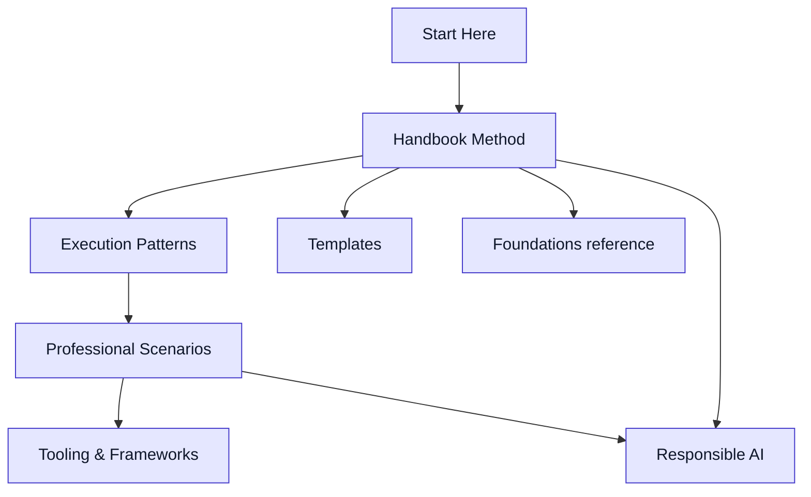

# The GenAI & LLM Handbook Map

:::info[Visual Guide]
This map provides a visual overview of how the different components of the GenAI & LLM Handbook connect, guiding your learning and application.
:::

## Overview

The GenAI & LLM Handbook is a layered system:

-   **Core Skills** (Logic, Language, Systems, Sentences) are the human capabilities.
-   **Fundamentals** provide the necessary theoretical background on GenAI/LLMs.
-   **Method** (The GenAI & LLM Handbook Loop + artifacts) turns intent into executable language.
-   **Execution Patterns** are reusable recipes for common tasks.
-   **Professional Scenarios** show real-world application for different roles.
-   **Guardrails & Governance** ensure safe and compliant operation.
-   **Evaluation** provides objective measurement and feedback.
-   **Tooling** covers how to interact with AI models (CLIs, IDEs, frameworks).

---

## Visual Flow

> Mermaid source: `assets/diagrams/genai-llm-scenario-map.mmd`

---

## How it All Connects

| Section                      | Focus                                     | Key Documents                                                                                     |
| :--------------------------- | :---------------------------------------- | :------------------------------------------------------------------------------------------------ |
| **Start Here**               | What it is, who it’s for                 | /docs/00-handbook-introduction/what-is-genai-llm, /docs/00-handbook-introduction/who-this-is-for |
| **Handbook Method**          | Loop and artifacts                        | /docs/01-handbook-method/the-genai-llm-loop                                                       |
| **Execution Patterns**       | Apply to common tasks                     | /docs/02-execution-patterns/00-pattern-index                                                |
| **Professional Scenarios**   | Role/industry use cases                   | /docs/03-professional-scenarios                                              |
| **Tooling**                  | How to interact with AI models            | /docs/04-tooling-and-frameworks/00-tooling-index                                                |
| **Responsible AI**           | Safety, compliance, accountability        | /docs/05-responsible-ai/index                                             |
| **Foundations**              | Reference background                      | /docs/foundations/02-llm-deep-dive/fundamentals/00-fundamentals-index                                           |
| **Templates**                | Reusable artifacts for common tasks       | /docs/06-templates/00-templates-index                                                           |

---

## Next Steps

Explore the foundational concepts of Generative AI in [Introduction to Generative AI](../foundations/01-generative-ai-introduction/introduction.md).

## Related Diagrams

-   Visual: `assets/diagrams/genai-llm-loop.mmd`
-   Visual: `assets/diagrams/genai-llm-skill-matrix.mmd`
