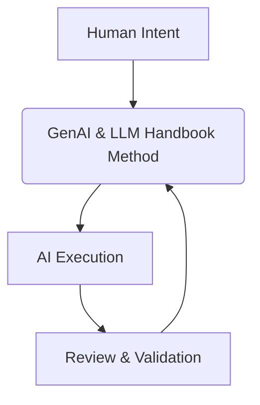

# How to Use This Repository

:::info[Your Learning Path]
This repository is designed to be a practical guide for using Generative AI and LLMs in AI-assisted development. Choose your path based on your role and current needs.
:::

## Overview

The GenAI & LLM Handbook is a professional practice. This repo supports:

-   **Learning the Core Principles**: Understanding _why_ GenAI & LLM Handbook works.
-   **Applying Patterns**: Learning _how_ to apply GenAI & LLM Handbook to common tasks.
-   **Deep Dives**: Exploring specific technical aspects and scenarios.
-   **Contributing**: Extending the repository with your own learnings and patterns.

---

## Repository Structure (Action-First)

- **Start Here** — What it is, who it’s for, how to navigate.
- **Handbook Method** — Loop, artifacts, core skills, evaluation library.
- **Execution Patterns** — Reusable recipes for common tasks.
- **Professional Scenarios** — Role/industry application.
- **Tooling & Frameworks** — CLI/IDE, agents, frameworks, local-first.
- **Responsible AI** — Safety, governance, risk.
- **Foundations** — Reference background on GenAI/LLM/NLP.
- **Templates** — Canonical artifacts and checklists.
- **Meta** — Agents, changelog, license.

---

## Recommended Learning Paths

### If you are new to the GenAI & LLM Handbook:

1. **What it is**: /docs/00-handbook-introduction/what-is-genai-llm
2. **Who this is for**: /docs/00-handbook-introduction/who-this-is-for
3. **The Handbook Map**: /docs/00-handbook-introduction/genai-llm-map

### If you want to apply the GenAI & LLM Handbook immediately:

1. **The Handbook Loop**: /docs/01-handbook-method/the-genai-llm-loop
2. Pick an **Execution Pattern**: /docs/02-execution-patterns/00-pattern-index
3. Use **Templates**: /docs/06-templates/00-templates-index

### If you want to master the GenAI & LLM Handbook:

1. **Core Skills**: /docs/01-handbook-method/core-skills/00-core-skills-overview
2. **Handbook Method (deep dive)**: /docs/01-handbook-method/the-genai-llm-loop
3. **Professional Scenarios**: /docs/03-professional-scenarios
4. **Responsible AI**: /docs/05-responsible-ai/index

## Quick Paths (choose your intent)

| Intent                    | Go here first                                         | Then…                                               |
| :------------------------ | :---------------------------------------------------- | :-------------------------------------------------- |
| New to the handbook       | /docs/00-handbook-introduction/what-is-genai-llm      | Map → Scope → Prereqs → Loop                        |
| Ship something now        | /docs/01-handbook-method/the-genai-llm-loop           | Pick a pattern → Use templates → Review & verify    |
| Build confidence/governance | /docs/05-responsible-ai/index                        | Add evaluation rubrics → Apply guardrails           |
| Deepen fundamentals       | /docs/foundations/02-llm-deep-dive/fundamentals/00-fundamentals-index | Revisit core skills → Experiment safely             |

---

## The GenAI & LLM Handbook Mindset

The GenAI & LLM Handbook is best understood through application. It is a disciplined approach to managing the interaction between human intent and AI execution.

If you adapt the GenAI & LLM Handbook:

-   **You must assume AI will try to make sense of ambiguous input**, even if it makes things up.
-   **You must assume AI will take the path of least resistance** if constraints are weak.
-   **You must own the outcome.**

The GenAI & LLM Handbook assumes responsibility is non-negotiable.

---

## Visual Navigation

Open `docs/00-handbook-introduction/genai-llm-map.md` for a visual flow of how all parts of the GenAI & LLM Handbook connect into a single working system.
