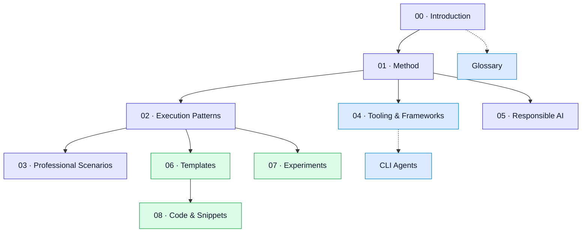

# Handbook Site Map

:::info[How to use this map]
Start here to understand what each major section covers and who should read it. Use it as a quick orientation guide.
:::

| Section | Purpose | Who should read |
| :-- | :-- | :-- |
| **00 · Handbook Introduction** | What this handbook is, who it serves, scope, prerequisites, style, glossary, map. | New readers; anyone orienting. |
| **01 · Handbook Method** | Core loop, artifacts (intent/constraints/delegation), techniques (prompting, RAG), evaluation. | Practitioners running AI-assisted work; leads setting process. |
| **02 · Execution Patterns** | Recipes for common tasks (scaffold, refactor, debug, docs, releases). | Engineers/tech writers applying the method day-to-day. |
| **03 · Professional Scenarios** | Role- and domain-focused case studies. | PMs, leads, cross-functional partners. |
| **04 · Tooling & Frameworks** | IDE/CLI workflows, LLM orchestration frameworks, local-first inference. | Engineers choosing tools; enablement teams. |
| **05 · Responsible AI** | Safety, bias, privacy, governance, red teaming. | Security/compliance, leads, anyone shipping AI features. |
| **Foundations (Reference)** | GenAI/LLM theory, NLP basics, sequential models, transformers. | Readers needing background or refreshers. |
| **06 · Templates** | Copy/paste specs, prompts, runbooks, CI snippets. | Everyone—start here for artifacts. |
| **07 · Experiments** | Hands-on projects/demos. | Builders exploring patterns locally. |
| **08 · Code & Snippets** | Runnable setup, RAG/eval/safety snippets, skeleton projects. | Engineers, power users. |
| **CLI Agents** | Guardrails for terminal copilots. | Anyone using CLI agents here. |
| **Changelog** | Project-level changes. | Everyone. |

## Visual map

## Quick navigation

- Start: `/docs/00-handbook-introduction/what-is-genai-llm`
- Method: `/docs/01-handbook-method/01-overview`
- Patterns: `/docs/02-execution-patterns/00-pattern-index`
- Scenarios: `/docs/03-professional-scenarios/00-scenarios-index`
- Tooling & Frameworks: `/docs/04-tooling-and-frameworks/00-tooling-index`
- Responsible AI: `/docs/05-responsible-ai/`
- Templates: `/docs/06-templates/00-templates-index`
- Code & Snippets: `/docs/08-code-and-snippets/`
- Experiments: `/docs/experiments/00-index`
- Foundations: `/docs/foundations/02-llm-deep-dive`

## Tips

- Each section has a README/landing page; use sidebars for detail.
- Use search for specific terms; use Templates/Code & Snippets for fast starts.
