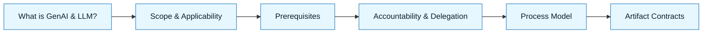

# Standard Core (The GenAI & LLM Handbook)

:::info[Value Proposition]
Use this as the fast entry point to the normative GenAI & LLM Handbook standard. These are the minimal documents required to apply the GenAI & LLM Handbook correctly.
:::

## Overview

The GenAI & LLM Handbook standard is comprehensive, but you don't need to read every document to start applying it. This "Standard Core" provides a curated list of essential documents that, when understood and applied, form the bedrock of effective and safe GenAI & LLM Handbook practice.

**Goal**: Provide a minimal, high-impact set of documents for quick adoption of the GenAI & LLM Handbook.
**Anti-pattern**: Feeling overwhelmed by the volume of content and not knowing where to start.

---

## When to Use

| ✅ Use This Pattern When...           | 🚫 Do Not Use When...                     |
| :------------------------------------ | :---------------------------------------- |
| Quickly onboarding to the GenAI & LLM Handbook | You need to deeply understand every nuance of the framework |
| Requiring a compliance checklist for GenAI projects | You are only interested in a specific execution pattern |
| Establishing team-wide consistency for AI-assisted work (GenAI & LLM Handbook) | You are purely exploring LLM capabilities without a defined outcome |

---

## Standard Core Documents

| Document                                                | How to use it                                                     |
| :------------------------------------------------------ | :---------------------------------------------------------------- |
| **What is GenAI & LLM**                                 | Anchor the philosophy and scope before applying the handbook      |
| **Scope and Applicability**                             | Decide when full rigor is required                                |
| **Prerequisites and Entry Criteria**                    | Confirm readiness before using the method                         |
| **Accountability and Delegation**                       | Clarify roles and responsibilities                                |
| **Handbook Loop Spec**                                  | Follow the step-by-step workflow                                  |
| **Artifact Contracts**                                  | Align on expected outputs for each step                           |

Paths:
- `/docs/00-handbook-introduction/what-is-genai-llm`
- `/docs/00-handbook-introduction/scope-and-applicability`
- `/docs/00-handbook-introduction/prerequisites-and-entry-criteria`
- `/docs/01-handbook-method/accountability-and-delegation`
- `/docs/01-handbook-method/genai-llm-loop-spec`
- `/docs/01-handbook-method/artifact-contracts`

---

## Visual Summary

---

## How to Use These Documents

1. **Read in order**: Start with "What is GenAI & LLM?" and proceed sequentially.
2. **Refer frequently**: These documents are foundational. Revisit them often as you apply the GenAI & LLM Handbook.
3.  **Cross-reference**: Each document contains links to related content for deeper dives.

---

## Next Steps

Review the other core documents for a deeper understanding of the GenAI & LLM Handbook's principles and practices.
