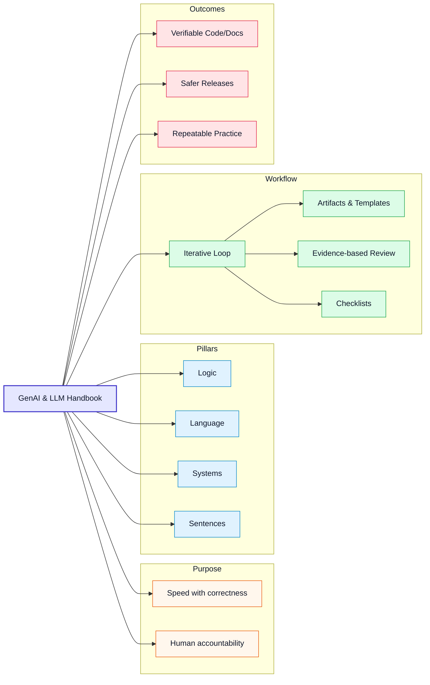

# GenAI & LLM Handbook: What It Is

:::info[Value Proposition]
The GenAI & LLM Handbook is for people who want the speed of GenAI **without giving up clarity, correctness, or responsibility.**
:::

## Overview

**The GenAI & LLM Handbook** is a professional framework for AI-assisted development, made practical. It focuses on building software, systems, and content using natural language, with AI as an execution partner. It treats language as a **technical interface**, not a chat prompt.

At its core, the GenAI & LLM Handbook acknowledges that while AI is excellent at generating plausible outputs, it lacks human judgment, context, and accountability. Most AI failures are not model failures. They are **human specification failures**. The GenAI & LLM Handbook exists to fix that.

:::info[Scan at a Glance]
- **Goal:** Faster AI-assisted delivery **with** clarity, correctness, and accountability.
- **Guarantee:** Language is treated as a spec; every output is reviewable and evidence-backed.
- **Pillars:** Logic · Language · Systems · Sentences.
- **Shape:** An iterative Loop with artifacts, templates, and checklists.
:::

---

## What the GenAI & LLM Handbook Is (and Is Not)

| The GenAI & LLM Handbook Is                                                                                                      | The GenAI & LLM Handbook Is Not                                                                                                  |
| :-------------------------------------------------------------------------------------------------------------------------------- | :-------------------------------------------------------------------------------------------------------------------------------- |
| - A repeatable method for professional AI-assisted development.                                                                 | - A collection of "prompt engineering" tricks.                                                                                  |
| - A framework for defining intent, constraints, and acceptance criteria.                                                        | - A substitute for human judgment, skill, or accountability.                                                                    |
| - Focused on producing verifiable artifacts (code, docs, designs).                                                              | - A way to generate software without understanding the problem.                                                                 |
| - A system for evidence-based review and interrogation of AI outputs.                                                           | - A tool for automating away critical thinking.                                                                                 |
| - Designed to keep humans in command, AI as a disciplined tool.                                                                 | - Magic. It amplifies your discipline, or your lack thereof.                                                                    |
| - A way to reduce risk and improve quality in AI-assisted workflows.                                                            | - A replacement for fundamental engineering practices (e.g., testing, code review, architectural design).                       |

The GenAI & LLM Handbook formalizes this into a repeatable method.

:::info[Core Philosophy]
The handbook is a force multiplier for disciplined professionals. It will not fix a lack of rigor; it will expose it. The goal is to make your interaction with AI deliberate, auditable, and effective.
:::

---

## How it Works: The GenAI & LLM Handbook Method

The GenAI & LLM Handbook defines an iterative “Loop” that guides AI-assisted work from discovery to acceptance and release. It is supported by core skills (Logic, Language, Systems, Sentences) and enforced by artifacts and templates.

- Process specification: `/docs/01-handbook-method/genai-llm-loop-spec`
- Artifact contracts: `/docs/01-handbook-method/artifact-contracts`
- Accountability and delegation: `/docs/01-handbook-method/accountability-and-delegation`

:::tip[Highlight: Why the Loop?]
The Loop bakes in **intent**, **constraints**, and **verification** so AI outputs stay aligned with user needs and governance requirements.
:::

---

## Next Step

Proceed to: **/docs/00-handbook-introduction/who-this-is-for**
