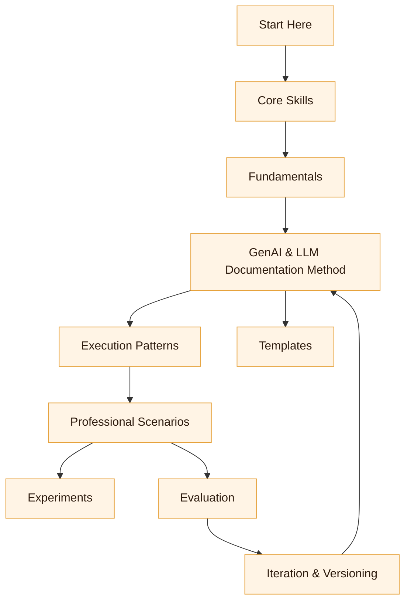

# The GenAI & LLM Documentation Map

:::info[Visual Guide]
This map provides a visual overview of how the different components of GenAI & LLM Documentation connect, guiding your learning and application.
:::

## Overview

GenAI & LLM Documentation is a layered system:

-   **Core Skills** (Logic, Language, Systems, Sentences) are the human capabilities.
-   **Fundamentals** provide the necessary theoretical background on GenAI/LLMs.
-   **Method** (GenAI & LLM Documentation Loop + artifacts) turns intent into executable language.
-   **Execution Patterns** are reusable recipes for common tasks.
-   **Professional Scenarios** show real-world application for different roles.
-   **Guardrails & Governance** ensure safe and compliant operation.
-   **Evaluation** provides objective measurement and feedback.
-   **Tooling** covers how to interact with AI models (CLIs, IDEs, frameworks).

---

## Visual Flow

> Mermaid source: `assets/diagrams/genai-llm-scenario-map.mmd`

---

## How it All Connects

| Section                      | Focus                                     | Key Documents                                                                                     |
| :--------------------------- | :---------------------------------------- | :------------------------------------------------------------------------------------------------ |
| **Start Here**               | What is GenAI & LLM Documentation? Who is it for? | `00-what-is-genai-llm.md`, `01-who-this-is-for.md`                                                 |
| **Core Skills**              | The human foundation for AI-assisted work | `../01-core-skills/00-core-skills-overview.md`                                                    |
| **Fundamentals**             | Essential GenAI/LLM theory                | `../02-genai-llm-fundamentals/00-fundamentals-index.md`                                           |
| **GenAI & LLM Documentation Method** | How do the artifacts fit together?    | `../03-method/00-the-genai-llm-loop.md`                                                       |
| **Execution Patterns**       | How do I apply GenAI & LLM Documentation to tasks? | `../04-patterns/00-pattern-index.md`                                                |
| **Professional Scenarios**   | Real-world use cases by role              | `../05-scenarios/00-scenarios-index.md`                                              |
| **Guardrails & Governance**  | Safety, compliance, accountability        | `../07-guardrails/guardrails-index.md`                                             |
| **Evaluation**               | Measuring quality and effectiveness       | `../08-evaluation/00-eval-overview.md`                                                            |
| **Templates**                | Reusable artifacts for common tasks       | `../09-templates/00-templates-index.md`                                                           |
| **Tooling**                  | How to interact with AI models            | `../06-tooling/00-tooling-index.md`                                                |
| **Experiments**              | What happened in practice?            | External: [Experiments (repo)](https://github.com/pruning-my-pothos/GenAI-LLM-Docs/tree/main/experiments) |

---

## Related Diagrams

-   Visual: `assets/diagrams/genai-llm-loop.mmd`
-   Visual: `assets/diagrams/genai-llm-skill-matrix.mmd`

---

## Last Reviewed / Last Updated

- Last reviewed: 2025-12-28
- Version: 0.1.0