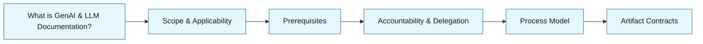

# Standard Core (GenAI & LLM Documentation)

:::info[Value Proposition]
Use this as the fast entry point to the normative GenAI & LLM Documentation standard. These are the minimal documents required to apply GenAI & LLM Documentation correctly.
:::

## Overview

The GenAI & LLM Documentation standard is comprehensive, but you don't need to read every document to start applying it. This "Standard Core" provides a curated list of essential documents that, when understood and applied, form the bedrock of effective and safe GenAI & LLM Documentation practice.

**Goal**: Provide a minimal, high-impact set of documents for quick adoption of GenAI & LLM Documentation.
**Anti-pattern**: Feeling overwhelmed by the volume of documentation and not knowing where to start.

---

## When to Use

| ✅ Use This Pattern When...           | 🚫 Do Not Use When...                     |
| :------------------------------------ | :---------------------------------------- |
| Quickly onboarding to GenAI & LLM Documentation | You need to deeply understand every nuance of the framework |
| Requiring a compliance checklist for GenAI projects | You are only interested in a specific execution pattern |
| Establishing team-wide consistency for AI-assisted work | You are purely exploring LLM capabilities without a defined outcome |

---

## Standard Core Documents

-   **What is GenAI & LLM Documentation**: `docs/00-start-here/00-what-is-genai-llm.md` (Explains the core philosophy and approach)
-   **Scope and Applicability**: `docs/00-start-here/06-scope-and-applicability.md` (Defines when to apply GenAI & LLM Documentation)
-   **Prerequisites and Entry Criteria**: `docs/00-start-here/07-prerequisites-and-entry-criteria.md` (Ensures you have the necessary skills)
-   **Accountability and Delegation**: `docs/03-method/10-accountability-and-delegation.md` (Clarifies human roles and responsibilities)
-   **GenAI & LLM Documentation Process Model (Loop Spec)**: `docs/03-method/11-genai-llm-loop-spec.md` (The step-by-step workflow)
-   **Artifact Contracts**: `docs/03-method/12-artifact-contracts.md` (Defines the outputs of each step)

---

## Visual Summary

---

## How to Use These Documents

1.  **Read in order**: Start with "What is GenAI & LLM Documentation?" and proceed sequentially.
2.  **Refer frequently**: These documents are foundational. Revisit them often as you apply GenAI & LLM Documentation.
3.  **Cross-reference**: Each document contains links to related content for deeper dives.

---

## Last Reviewed / Last Updated

- Last reviewed: 2025-12-28
- Version: 0.1.0