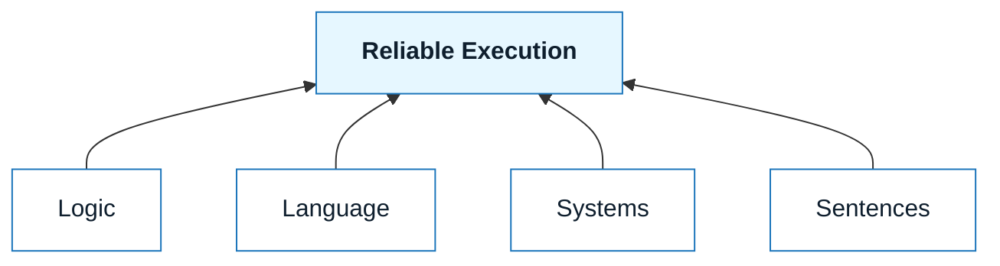

# What is NNLP?

:::info[The Core Promise]
NNLP is for people who want the speed of GenAI **without giving up clarity, correctness, or responsibility.**
:::

## Status

An **open community standard** for professional, AI-assisted work.

## Quick Definition

**NNLP (Nuanced Natural Language Programming)** is a professional framework for building software, documentation, and systems using natural language, with AI as an execution partner. It treats language as a **technical interface**, not a chat prompt.

## Scope (High Level)

Applies to AI-assisted work that affects users, systems, operations, compliance, or business outcomes. Excludes hobby/demo usage with no impact.

## Why It Matters

Natural language is now executable. That changes how we build, but it doesn’t remove the need for discipline.

- Ambiguity becomes bugs.
- Missing constraints become scope creep.
- Unstated assumptions become regressions.

Most AI failures are not model failures. They are **human specification failures**. NNLP exists to fix that.

## What NNLP Is (and Is Not)

- **NNLP Is**
  - A **professional framework**
  - Language as a **precise interface**
  - **Human-directed**, AI-assisted
  - Grounded in **logic and systems**

- **NNLP Is Not**
  - Prompt engineering tricks
  - No-code shortcuts
  - Tool hype or silver bullets
  - A replacement for judgment or review

## The Core Idea

Natural language becomes executable only when it is grounded in:

- **Logic** — _cause/effect, invariants, dependencies_
- **Language discipline** — _explicit intent and constraints_
- **Systems thinking** — _boundaries, integrations, failure modes_
- **Sentence-level precision** — _one instruction per sentence_

NNLP formalizes this into a repeatable method.

Core idea diagram: Logic, Language, Systems, and Sentences combine to produce Reliable Execution.

## Who NNLP Is For (Signals You’ll Benefit)

- **Engineers and builders** using AI-assisted development who want _fewer regressions_.
- **Product and UX practitioners** translating ambiguity into _specs and acceptance criteria_.
- **Technical writers and enablement teams** using AI _responsibly_.
- **Tech leads and architects** accountable for _long-term system health_.
- **Solo builders** who want habits that _scale_.

If you want shortcuts, this isn’t it. If you want leverage without abdication, it is.

## Forward Links (Normative)

- Scope and applicability: `docs/00-start-here/06-scope-and-applicability.md`
- Prerequisites and entry criteria: `docs/00-start-here/07-prerequisites-and-entry-criteria.md`
- Process specification: `docs/03-nnlp-method/11-nnlp-loop-spec.md`
- Artifact contracts: `docs/03-nnlp-method/12-artifact-contracts.md`
- Accountability and delegation: `docs/03-nnlp-method/10-accountability-and-delegation.md`

## Tone and Intent

Professional, standard-like, and directive. This doc defines the standard’s boundary and links to the normative core; tutorials, tooling, and scenarios live downstream.
