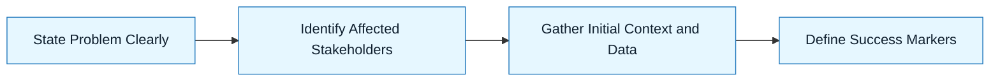

:::info[Value Proposition]
Clarify the problem space, identify stakeholders, and gather essential context without proposing solutions. This artifact ensures a shared understanding of _what_ problem needs solving before jumping to _how_ to solve it with AI.
:::

## Overview

This is the first step in the Handbook Loop. Its purpose is to lay a solid foundation by thoroughly understanding the problem, its impact, and who it affects, before any AI generation begins. This prevents AI from solving the wrong problem or generating irrelevant solutions. It sets the stage for a precise Intent Spec.

**Goal**: Achieve a shared, objective understanding of the problem.
**Anti-pattern**: Jumping directly from a vague idea to an AI prompt, leading to solutions that miss the mark.

---

## When to Use

| ✅ Use This Pattern When...           | 🚫 Do Not Use When...                     |
| :------------------------------------ | :---------------------------------------- |
| Starting any new feature or project   | You already have a clear, documented problem statement |
| Clarifying vague stakeholder requests | The problem is purely technical and well-defined (e.g., "fix a known bug") |
| Aligning diverse team perspectives    | You are optimizing an existing, well-understood workflow |

---

## The Pattern (Step-by-Step)

This step guides you through defining the core problem, its context, and the desired outcomes before any solutioning begins.

### Step 1: State the Problem Clearly

Articulate the core problem from a user or business perspective. Focus on symptoms and impact, not on potential solutions.

> **Practical Insight**: Use the "As a [user type], I want to [action], so that [benefit]" format to center on user needs. For example: "As a dashboard user, I am frustrated by slow loading times, which leads to a poor user experience."

### Step 2: Identify Affected Stakeholders

Determine who is impacted by this problem. List all relevant user groups, internal teams, or systems.

> "Who are the users? Who are the business stakeholders? What systems are involved?"

### Step 3: Gather Initial Context and Data

Collect existing information about the problem. This includes analytics, user feedback, error logs, or business requirements.

> "What do the analytics say? Is there user feedback? What do logs or system metrics indicate?"

### Step 4: Define Success Markers (Solution-Agnostic)

How will you know the problem is solved, regardless of the solution? Focus on measurable outcomes that directly address the problem.

> "Dashboard loading times should be under 2 seconds for 95% of users. User satisfaction with the dashboard should increase by 15%."



---

## Practical Example: Discovery Brief for Improving Search Functionality

**Objective**: Improve the effectiveness of the product search functionality.

**Discovery Brief:**

```markdown
**1. Problem Statement:**
"As a user, I struggle to find relevant products using the search bar, which leads to frustration and missed purchase opportunities."

**2. Affected Stakeholders:**
-   **End-Users**: Experience poor search results, leading to dissatisfaction.
-   **Product Team**: Impacted by low search conversion rates and user churn.
-   **Business**: Lost revenue due to users not finding desired products.
-   **Support Team**: High volume of inquiries related to product discoverability.

**3. Initial Context and Data:**
-   **Analytics**: Search logs show high bounce rates (users leave after searching) and low conversion rates from search results. Many searches return "no results found" for products that actually exist.
-   **User Feedback**: Common complaints about search not understanding synonyms, misspellings, or natural language queries.
-   **Competitor Analysis**: Competitors have more sophisticated search capabilities (e.g., faceted search, recommendation engine integration).

**4. Success Markers (without solutions):**
-   Increase search-to-purchase conversion rate by 10%.
-   Reduce "no results found" instances by 20%.
-   Improve user satisfaction with search functionality (measured via post-search survey) by 15%.
```

---

## Common Pitfalls

| Pitfall                   | Impact                                   | Correction                                     |
| :------------------------ | :--------------------------------------- | :--------------------------------------------- |
| **Premature Solutioning** | Locking into an implementation before understanding the problem. | Focus solely on the "what" and "why" of the problem; explicitly state non-goals. |
| **Ignoring Data**         | Relying on assumptions instead of facts. | Actively seek out analytics, user feedback, and existing system data to ground problem statements. |
| **Missing Stakeholders**  | Building solutions that don't address key user needs or business impacts. | Interview a diverse set of stakeholders during discovery. |
| **Vague Problem Statement** | AI/humans attempt to solve an ill-defined issue. | Use concrete, observable symptoms and measurable impact; leverage user story formats. |

---

## Quick Links

- Handbook Method: [Overview](/docs/01-handbook-method/01-overview)
- Discovery Brief Template: [Template](/docs/06-templates/discovery-brief-template)

## Next Step

Proceed to [Model Selection](/docs/01-handbook-method/03-model-selection).
