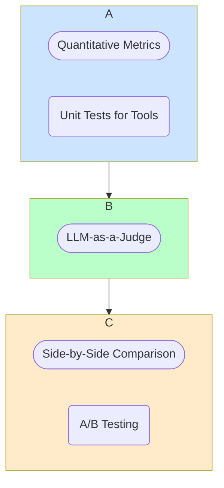

# Evaluating Generative AI Systems

One of the most significant challenges in building with Large Language Models is evaluation. Unlike traditional software where you can often write deterministic tests (e.g., "does `2 + 2` equal `4`?"), the output of generative models is often non-deterministic and subjective.

How do you measure the "quality" of a generated summary, a piece of code, or a conversational response? This section introduces frameworks and techniques for evaluating the performance and reliability of your GenAI applications.

## The Challenge of Generative AI Evaluation

-   **Subjectivity:** There is often no single "correct" answer. The quality of a response can depend on tone, style, relevance, and other subjective factors.
-   **Non-Determinism:** Even with the same prompt, a model might produce slightly different outputs, making direct comparisons difficult.
-   **"Unknown Unknowns":** It is impossible to anticipate all the possible inputs and failure modes of a powerful language model.

:::danger[There is No Single Metric]
The most important principle in LLM evaluation is that there is **no single metric** that can tell you if your system is "good." A robust evaluation strategy must be multi-faceted, combining automated, quantitative metrics with qualitative, human-led review. Relying on any single number can be misleading and dangerous.
:::

## The Evaluation Funnel

A good evaluation strategy can be thought of as a funnel. At the top, you have broad, cheap, automated tests for every change. At the bottom, you have narrow, expensive, human-led tests for major releases.

This section provides a library of techniques for each stage of the funnel.

### 1. [Quantitative Metrics](./metrics-for-llms.md)
For some tasks, it's possible to use automated, quantitative metrics. These are often based on comparing the model's output to a "ground truth" reference answer and are useful for rapid, directional feedback during development.

### 2. [AI-Assisted Evaluation](./ai-assisted-evaluation.md)
A powerful emerging technique is to use another, often more powerful, LLM to evaluate the output of your primary model. This provides a scalable way to get nuanced, qualitative feedback that approximates human judgment.

### 3. [Human Evaluation Frameworks](./human-evaluation-frameworks.md)
Ultimately, the most reliable way to measure the quality of a system designed for humans is to have humans evaluate it. This is the gold standard for evaluation and is crucial for verifying quality before and after production releases.
