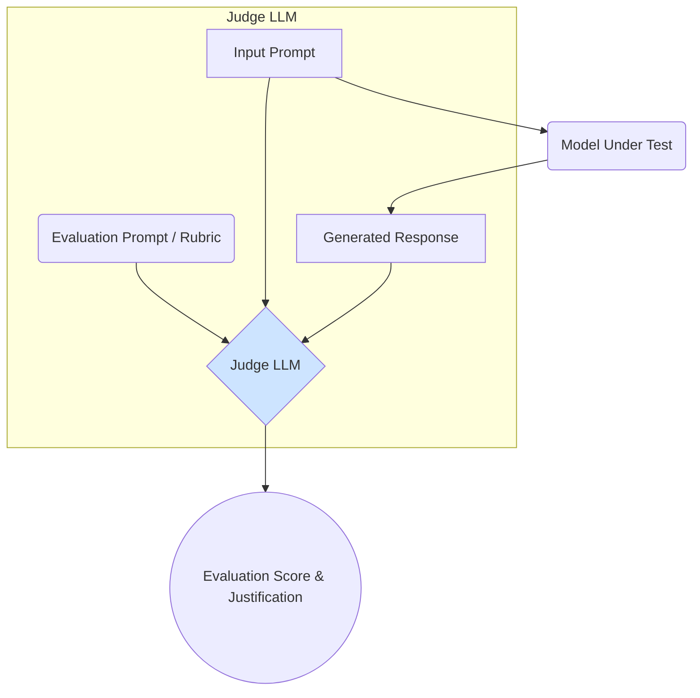

# AI-Assisted Evaluation

One of the most powerful and scalable methods for evaluating the quality of LLM responses is to use another, more powerful LLM as a judge. This technique, known as **AI-assisted evaluation** or **LLM-as-a-judge**, provides a way to get nuanced, qualitative feedback at a scale that would be impossible with human evaluators alone.

This approach complements the use of [quantitative metrics](./metrics-for-llms.md) and can serve as a scalable proxy for human evaluation. For a broader context, see the [Introduction to Evaluation](/docs/01-handbook-method/08-evaluation).

## The Core Concept

The idea is simple: you present a powerful "judge" LLM (like GPT-4 or Claude 3 Opus) with the original prompt, the response from the model you are testing, and sometimes a reference answer. You then ask the judge LLM to score the response based on a specific rubric.



## Key Components of AI-Assisted Evaluation

### 1. The "Judge" LLM
The success of this method hinges on the quality of the judge. The judge model should be significantly more capable than the model being evaluated. It needs to have strong reasoning and instruction-following abilities to reliably apply a rubric.

### 2. The Evaluation Prompt and Rubric
This is the most critical component to design. Your prompt to the judge model must be clear, detailed, and unambiguous. It should include:

-   **The Context:** The original input prompt given to the test model.
-   **The Response:** The output from the model you are evaluating.
-   **A Reference Answer (Optional):** A ground-truth answer, if available.
-   **The Rubric:** A clear set of criteria for the evaluation. This could include aspects like:
    -   **Relevance:** Is the response on-topic and relevant to the prompt?
    -   **Accuracy:** Is the information factually correct?
    -   **Conciseness:** Is the response succinct and to the point?
    -   **Helpfulness:** Does the response directly address the user's underlying goal?
    -   **Style/Tone:** Does the response adhere to a specific persona or style?
-   **The Output Format:** Instructions for the judge on how to format its response (e.g., provide a score from 1-5 for each category and a detailed written justification).

### Example Evaluation Prompt

```text
You are an expert evaluator. Your task is to assess the quality of an AI-generated response to a user's question.

**User Question:**
"What are the main differences between RAG and fine-tuning?"

**Reference Answer (Ground Truth):**
"RAG provides new knowledge by adding external documents to the prompt, while fine-tuning adapts the model's internal weights to change its behavior or style. RAG is for knowledge, fine-tuning is for behavior."

**AI Response to Evaluate:**
"RAG and fine-tuning are both ways to make models better. RAG gives them documents to read, and fine-tuning teaches them new things."

**Evaluation Task:**
Please evaluate the AI Response on a scale of 1 to 5 for the following criteria. Provide a brief justification for each score.

1.  **Correctness:** (1=Completely Incorrect, 5=Completely Correct)
2.  **Completeness:** (1=Missing all key points, 5=Includes all key points)

**Output Format:**
{
  "scores": {
    "correctness": <score>,
    "completeness": <score>
  },
  "justification": "<your detailed reasoning>"
}
```

## Benefits and Limitations

### Benefits
-   **Scalability:** Allows you to evaluate thousands of responses much faster and cheaper than with human evaluators.
-   **Consistency:** A single judge model with a fixed prompt will be more consistent than multiple human raters with varying levels of training and attention.
-   **Nuance:** Can capture more nuanced aspects of quality (like tone and style) than simple [quantitative metrics](./metrics-for-llms.md).

### Limitations
-   **Judge Bias:** The judge LLM has its own biases (e.g., it may prefer longer, more verbose answers) that can skew the results.
-   **Cost:** While cheaper than humans, running evaluations with a powerful judge model can still be expensive.
-   **Accuracy:** The judge is not infallible and can make mistakes, especially on highly complex or domain-specific topics.

:::warning[Beware the Biased Judge]
The most significant risk in AI-assisted evaluation is that the judge model's own biases will influence the scores. For example, if the judge was fine-tuned by a specific company, it might unfairly penalize responses that don't match that company's preferred style. It's crucial to be aware of this and to periodically calibrate your AI judge against human evaluators.
:::

## Next Steps

AI-assisted evaluation is a powerful proxy for human feedback, but it is not a replacement for it. The ultimate test is how real humans perceive your model's quality.

- **[Human Evaluation Frameworks](./human-evaluation-frameworks.md):** Learn about the "gold standard" methods for evaluating LLM quality.
