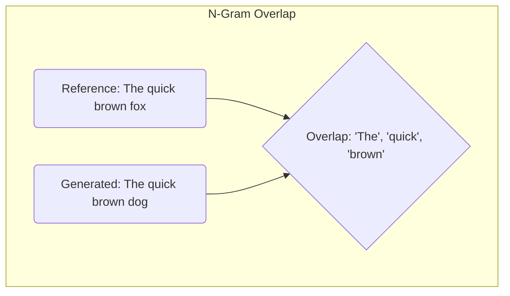

# Quantitative Metrics for LLMs

While human judgment remains the gold standard, quantitative, automated metrics are essential for rapidly evaluating model performance during development, especially for tasks like summarization and translation where reference answers are available.

This guide provides an overview of common metrics used to evaluate the output of LLMs. For a higher-level overview of evaluation strategy, see the [Introduction to Evaluation](/docs/01-handbook-method/08-evaluation).

## 1. N-gram Based Metrics (BLEU, ROUGE)

These metrics work by comparing the n-grams (sequences of n words) in the model-generated text with the n-grams in a human-written reference text. They are purely based on **lexical overlap**.



:::note[Precision vs. Recall]
- **Precision** (used by BLEU) asks: Of all the words in the *generated* text, how many were also in the *reference* text? It's a measure of quality/correctness.
- **Recall** (used by ROUGE) asks: Of all the words in the *reference* text, how many did the *generated* text manage to include? It's a measure of coverage/completeness.
:::

### BLEU (Bilingual Evaluation Understudy)
BLEU was originally designed for machine translation. It measures **precision**: what fraction of the n-grams in the generated text are also present in the reference text?

-   **Focus:** Quality of the generated text. A high BLEU score suggests the generated text is fluent and contains phrases from the reference.
-   **Drawback:** It penalizes responses that are syntactically different but semantically similar. It also doesn't measure recall, so a very short but accurate response can get a high score.

### ROUGE (Recall-Oriented Understudy for Gisting Evaluation)
ROUGE was designed for summarization. It measures **recall**: what fraction of the n-grams in the reference text are also present in the generated text?

-   **Focus:** Coverage of the reference text. A high ROUGE score suggests the generated text captures the key points of the reference.
-   **Common Variants:**
    -   **ROUGE-N:** Measures overlap of n-grams.
    -   **ROUGE-L:** Measures the longest common subsequence, which is more flexible about word order.
-   **Drawback:** Like BLEU, it's based on lexical overlap and can fail to capture semantic similarity.

**When to use them:** BLEU and ROUGE are fast and cheap to compute. They are useful for getting a quick, directional sense of a model's performance on tasks where there is a "correct" reference answer. However, they should not be the only metric you use.

## 2. Embedding-based Metrics (BERTScore)

Modern metrics use contextual embeddings to compare the **semantic similarity** of the generated and reference texts, which often aligns better with human judgment.

```mermaid
graph TD
    subgraph Semantic Similarity
        A[Embedding of "canine"] --> C{Similar Vector}
        B[Embedding of "dog"] --> C
    end
```

### BERTScore
BERTScore uses the contextual embeddings from a BERT-like model to compute a similarity score between tokens in the generated text and the reference text.

-   **How it works:**
    1.  It generates embeddings for each token in both the generated and reference texts.
    2.  It computes the cosine similarity between each pair of tokens.
    3.  It finds the best possible matching for each token and calculates precision, recall, and an F1 score based on these similarity scores.

-   **Advantages:**
    -   **Semantic Similarity:** It can recognize that "the canine" and "the dog" are semantically similar, even though their words are different.
    -   **Correlates well with Human Judgment:** Studies have shown that BERTScore often correlates better with human ratings of quality than BLEU or ROUGE.
-   **Drawbacks:**
    -   **Slower to compute:** It requires running a separate, powerful model to generate the embeddings.
    -   **Can miss factual errors:** If a generated sentence is semantically plausible but factually incorrect, BERTScore might still give it a high score.

## Conclusion

| Metric | Measures | Pros | Cons |
| :--- | :--- | :--- | :--- |
| **BLEU** | Precision | Fast, good for fluency | Poor at semantics, can be gamed |
| **ROUGE**| Recall | Fast, good for coverage | Poor at semantics |
| **BERTScore**| Semantic Similarity | Good at semantics, correlates with humans | Slower, can miss factual errors |

A good quantitative evaluation strategy often involves using a combination of these metrics.

## Next Steps

While quantitative metrics are fast, they lack the nuance to capture many aspects of a "good" response. AI-assisted evaluation offers a scalable way to get closer to human-level feedback.

- **[AI-Assisted Evaluation](./ai-assisted-evaluation.md):** Learn how to use an LLM as a judge to get scalable, qualitative feedback.
