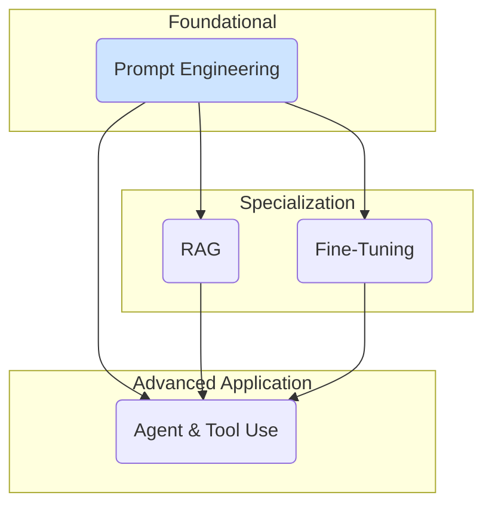

# Core Skills for GenAI Development

Beyond a conceptual understanding of how Large Language Models work, building effective and robust applications requires a set of practical, hands-on skills. This section provides an overview of the most critical skills you will need to master.

These skills form the practitioner's toolkit, enabling you to move from a basic prototype to a production-ready application.

---

### 1. [Prompt Engineering](./advanced-prompt-engineering.md)
Prompt engineering is the art and science of designing effective inputs (prompts) to elicit the desired outputs from a language model. Since the model's behavior is highly sensitive to the prompt, this is arguably the most fundamental skill for working with LLMs.

### 2. [Retrieval-Augmented Generation (RAG)](./rag-implementation-patterns.md)
LLMs are limited by the knowledge contained in their training data. RAG is a powerful technique to augment LLMs with external, real-time knowledge. It involves retrieving relevant documents or data from an external source and adding that information to the prompt.

### 3. [Fine-Tuning](./fine-tuning-walkthrough.md)
While pre-trained models are very capable, they can be adapted to specific domains or tasks through fine-tuning. This involves further training the model on a smaller, curated dataset to change its behavior or style.

### 4. [Building LLM Agents](./building-llm-agents.md)
The true power of LLMs is unlocked when they can interact with the outside world. This involves creating "agents" that can use external tools (like APIs or a code interpreter) to perform actions, with the LLM acting as the "brain."

:::tip[Combine Your Skills]
These skills are not mutually exclusive; they are building blocks that are often used together. For example, a powerful agent might use RAG to get information, which is then fed into a carefully engineered prompt. That entire agent might also be based on a model that was fine-tuned for a specific industry.
:::

Mastering these skills will allow you to build sophisticated applications that are accurate, up-to-date, and capable of performing complex, multi-step tasks.
