# Advanced Prompt Engineering

While basic prompts can yield impressive results, advanced techniques are necessary to unlock the full potential of Large Language Models and to build reliable applications. This guide covers several powerful methods for designing more effective prompts.

For a basic overview, refer to the [Core Skills Introduction](/docs/01-handbook-method/core-skills).

## 1. Few-Shot Prompting

Few-shot prompting is a technique where you provide the model with several examples of the task you want it to perform within the prompt itself. This helps the model understand the task, the expected format, and the desired level of quality.

**Example: Sentiment Classification**

```text
Classify the sentiment of the following movie reviews as 'Positive', 'Negative', or 'Neutral'.

Review: "I could watch this all day!"
Sentiment: Positive

Review: "The plot was a bit slow."
Sentiment: Neutral

Review: "I would not recommend this movie."
Sentiment: Negative

Review: "The acting was phenomenal and the story was gripping."
Sentiment:
```

By providing examples, you are "in-context learning" the model on the fly, which significantly improves its accuracy and reliability for specific tasks.

## 2. Chain-of-Thought (CoT) Prompting

Chain-of-Thought prompting encourages the model to "think step by step" to solve complex reasoning problems. Instead of asking for just the final answer, you ask the model to explain its reasoning process first. This simple trick has been shown to dramatically improve performance on arithmetic, commonsense, and symbolic reasoning tasks.

**Example: A Simple Math Problem**

**Standard Prompt:**
```text
Q: A juggler has 15 balls. They buy two more cans of 3 balls each. How many balls do they have now?
A:
```
*(The model might incorrectly guess an answer).*

**Chain-of-Thought Prompt:**
```text
Q: A juggler has 15 balls. They buy two more cans of 3 balls each. How many balls do they have now?
A: Let's think step by step.
The juggler starts with 15 balls.
They buy two cans of 3 balls each, which is 2 * 3 = 6 new balls.
So, the total number of balls is 15 + 6 = 21.
The answer is 21.
```
By asking the model to reason first, it's more likely to arrive at the correct answer.

```mermaid
graph TD
    A(Start with a Complex Problem) --> B{Prompt for Step-by-Step Reasoning};
    B --> C(Model Generates Intermediate Thoughts);
    C --> D(Model Arrives at Final Answer);
    
    style B fill:#cde4ff
```



:::warning[Lost in the Middle]
Be careful with very long and complex prompts. Research has shown that models can sometimes ignore or "forget" instructions that are placed in the middle of a long context window. It's often best to put the most critical instructions at the very beginning or very end of your prompt.
:::

## 3. Enforcing Structured Output

For many applications, you need the model to produce output in a specific, machine-readable format, such as JSON. You can achieve this by specifying the format in the prompt and providing an example.

**Example: JSON Output**

```text
Extract the following entities from the user's request: 'name', 'company', and 'date'. Respond only with a valid JSON object.

Request: "Hi, my name is Jane Doe and I work at Acme Inc. I'd like to schedule a meeting for this Friday."

JSON:
{
  "name": "Jane Doe",
  "company": "Acme Inc.",
  "date": "this Friday"
}

Request: "John Smith from XYZ Corp needs to reschedule his appointment to next Monday."

JSON:
```

This technique is crucial for integrating LLMs with other software and APIs, as it makes the model's output predictable and parsable.

## 4. The "Persona" Pattern

You can significantly influence the tone, style, and expertise of the model's output by assigning it a persona.

**Example: Code Review**

```text
You are an expert software engineer specializing in Python. You are conducting a code review. Please review the following code, identify any potential bugs or style issues, and suggest improvements. Do not be overly harsh; be constructive and helpful.

[... a block of Python code ...]
```
This primes the model to provide a more focused, high-quality response in the desired domain and style.

## Next Steps

Mastering these prompt engineering techniques is key to building robust applications. To learn how to automate the process of providing relevant context in your prompts, explore RAG.

- **[Retrieval-Augmented Generation (RAG)](./rag-implementation-patterns.md):** Learn how to automatically inject external knowledge into your prompts.
