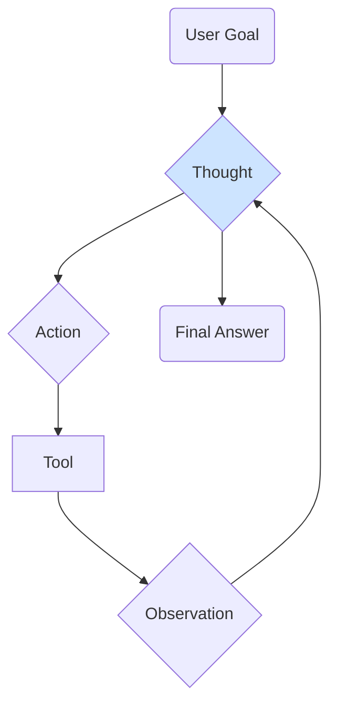

# Building LLM Agents

Beyond simple text generation, the true power of Large Language Models is unlocked when they are used as the reasoning engine for an **agent**. An LLM agent is a system that can take actions, use tools, and interact with its environment to accomplish complex tasks.

This topic combines several of the concepts discussed in the [Core Skills Introduction](/docs/01-handbook-method/core-skills).

## What is an Agent?

An agent is more than just a model that responds to a prompt. An agent:
1.  Has a **goal** or objective.
2.  Can **reason** about how to achieve that goal.
3.  Can use a set of **tools** to take actions in an environment.
4.  Can observe the results of its actions and **adjust its plan**.

Think of the LLM as the "brain" of the agent, and the tools as its "hands and eyes."

## Core Components of an LLM Agent

### 1. The LLM (The "Brain")
The core of the agent is a powerful Large Language Model that is good at reasoning and instruction following. The LLM is responsible for:
-   Understanding the user's high-level goal.
-   Breaking the goal down into smaller, actionable steps.
-   Deciding which tool to use for each step.
-   Processing the results of tool use and planning the next step.

### 2. Tools (The "Hands and Eyes")
Tools are functions or APIs that the agent can call to interact with the outside world. Tools make the agent powerful by overcoming the inherent limitations of the LLM.

**Common Tool Examples:**
-   **Web Search:** To get real-time information.
-   **Calculator:** To perform accurate mathematical calculations.
-   **Code Interpreter:** To run code in a sandboxed environment.
-   **Database Access:** To query a private database for information.
-   **Third-Party APIs:** To send an email, book a flight, or interact with any other software system.

Each tool must have a clear name and a description that the LLM can understand.

### 3. Memory
Memory allows an agent to remember past interactions and the results of previous actions. This is crucial for carrying out multi-step tasks.

**Types of Memory:**
-   **Short-Term Memory:** The context window of the LLM, which remembers the conversation so far.
-   **Long-Term Memory:** A more permanent storage, often implemented using a vector database, where the agent can store and retrieve key information or past conversations.

## The ReAct Framework: Reason + Act

One of the most popular and effective frameworks for building agents is **ReAct**. In the ReAct framework, the LLM is prompted to generate a response that follows a specific `Thought -> Action -> Observation` loop.

1.  **Thought:** The LLM thinks about the current goal and decides what to do next. It articulates its reasoning.
2.  **Action:** The LLM decides which tool to use and what input to provide to that tool.
3.  **Observation:** The system executes the tool with the provided input and returns the result to the LLM.

The LLM then repeats this loop, using the new observation to inform its next thought, until it has achieved the final goal.

### Example ReAct Loop

**User Goal:** "What is the capital of France, and what is its current population?"

1.  **Thought:** I need to find the capital of France first. The best tool for this is the Web Search tool.
    **Action:** `search(query="capital of France")`
2.  **Observation:** [Result of web search: "The capital of France is Paris."]

3.  **Thought:** I have found the capital, which is Paris. Now I need to find the current population of Paris. I will use the Web Search tool again.
    **Action:** `search(query="current population of Paris")`
4.  **Observation:** [Result of web search: "The population of Paris as of 2024 is approximately 2.1 million."]

5.  **Thought:** I have now found both pieces of information: the capital is Paris and the population is 2.1 million. I can now provide the final answer to the user.
    **Final Answer:** The capital of France is Paris, and its current population is approximately 2.1 million.

:::tip[Agent Frameworks]
You don't have to build these loops from scratch! Frameworks like **LangChain**, **LlamaIndex**, and **AutoGen** provide powerful, high-level abstractions for building and customizing agents with tools and memory.
:::

## Next Steps

Building an agent is a major step, but just as important is evaluating its performance. Agent evaluation presents unique challenges compared to simpler LLM outputs.

- **[Evaluating Generative AI Systems](/docs/01-handbook-method/08-evaluation):** Learn about the frameworks and metrics used to evaluate complex, multi-step AI systems.
