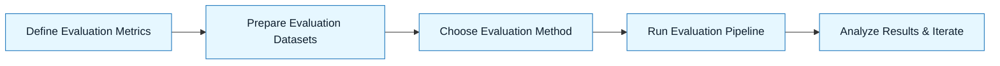

:::info[Value Proposition]
Systematically measure the quality, performance, and reliability of AI-generated outputs against predefined criteria. A robust evaluation strategy is critical for verifying that AI outputs meet Intent and Constraint Specifications, ensuring continuous improvement and safe deployment.
:::

## Overview

Evaluation in the GenAI & LLM Handbook is the process of objectively assessing whether AI-assisted work meets its intended purpose and adheres to all specified constraints. This goes beyond simple acceptance criteria; it involves establishing metrics, designing test cases, and implementing automated or human-in-the-loop processes to score AI outputs. Effective evaluation helps in selecting the right models, refining prompts, and building trust in AI-powered solutions.

**Goal**: Objectively measure the performance and quality of AI-generated outputs, enabling informed decisions for iteration, acceptance, and deployment.
**Anti-pattern**: Relying on subjective "looks good" assessment, leading to inconsistent quality, hidden flaws, and an inability to systematically improve AI performance.

---

## When to Use

| ✅ Use This Pattern When...                                 | 🚫 Do Not Use When...                                  |
| :--------------------------------------------------------- | :----------------------------------------------------- |
| Selecting or comparing different LLMs or prompting strategies | The task is purely human-driven and does not involve AI output |
| Continuously monitoring the performance of deployed LLM applications | You are brainstorming or exploring concepts with no expectation of measurable output quality |
| Needing to justify the business value or technical efficacy of an AI solution | The evaluation requires a highly subjective aesthetic judgment that cannot be quantified |
| Debugging unexpected AI behavior or hallucinations         | The primary goal is to generate new ideas without validation |

---

## Prerequisites

:::warning[Before you start]
A clear **Intent Spec** and **Acceptance Criteria** are foundational. Without defined "done," you cannot measure success.
:::

-   **Artifacts**: Intent Spec, Acceptance Criteria, AI-generated output.
-   **Context**: Understanding of the task domain, potential failure modes, and available evaluation tools/metrics.

---

## The Pattern (Step-by-Step)

### Step 1: Define Evaluation Metrics

Translate your Acceptance Criteria into specific, measurable metrics. These can be quantitative (e.g., accuracy, ROUGE score) or qualitative (e.g., human preference scores, rubric-based grading).

> **Practical Insight**: For code generation, metrics might include "compiles without error," "passes unit tests," "adheres to style guide," "security vulnerability count."

### Step 2: Prepare Evaluation Datasets

Create a representative dataset of inputs (prompts) and corresponding ground truth (expected outputs). This dataset is used to run repeatable tests.

> "Assemble 100 diverse prompts related to user authentication, along with manually verified correct code snippets, to form our evaluation dataset."

### Step 3: Choose Evaluation Method

Decide between automated evaluation (using metrics and ground truth) or human-in-the-loop evaluation (using rubrics, preference ranking). Often, a hybrid approach is best.

> "Use automated unit tests for functional correctness. Employ human review with the Quality Rubric Template for code style and security adherence."

### Step 4: Run Evaluation Pipeline

Execute your chosen LLM (or prompting strategy) against the evaluation dataset and collect the outputs. Then, apply your chosen evaluation methods to score the outputs.

> "Run the `generate_auth_code` function using `GPT-4` against the 100-prompt dataset. Log metrics for compilation success, test pass rate, and have 3 engineers score outputs via the Quality Rubric."

### Step 5: Analyze Results and Iterate

Review evaluation scores to identify strengths, weaknesses, and areas for improvement. Use these insights to refine prompts, update specifications, or select different models.

> "Analysis shows low scores for edge case handling. Update the Constraint Spec to include more detailed error handling requirements, then re-evaluate."

---

## Practical Example: Evaluating a Code Generation LLM

**Objective**: Evaluate an LLM's ability to generate a `UserService` class adhering to specific TypeScript standards.

**Evaluation Process:**

1.  **Metrics**:
    -   **Compiles**: (Boolean) Does the generated TypeScript code compile?
    -   **Passes Unit Tests**: (Boolean) Does the generated code pass a predefined suite of functional unit tests?
    -   **Style Adherence**: (Score 1-3) Graded by human using a Quality Rubric on code style (ESLint adherence, JSDoc presence).
    -   **Security**: (Score 1-3) Graded by human using a Quality Rubric on potential security vulnerabilities (e.g., proper password hashing usage).

2.  **Dataset**: 20 unique `Intent Spec` and `Constraint Spec` pairs for various `UserService` functionalities (e.g., `createUser`, `getUserById`, `updatePassword`).

3.  **Method**: Automated compilation and unit test execution. Human review using the Quality Rubric Template for style and security.

4.  **Pipeline**:
    -   For each `Intent/Constraint` pair:
        -   Send to LLM for code generation.
        -   Attempt compilation.
        -   Run associated unit tests.
        -   Record compilation status and test results.
        -   Pass generated code to 3 human reviewers for rubric scoring.

5.  **Results**: Aggregate scores. Identify trends (e.g., "model struggles with complex SQL generation in ORM constraints").

---

## Common Pitfalls

| Pitfall                   | Impact                                   | Correction                                     |
| :------------------------ | :--------------------------------------- | :--------------------------------------------- |
| **Vague Metrics**         | Unable to objectively compare or improve. | Ensure metrics are SMART (Specific, Measurable, Achievable, Relevant, Time-bound). |
| **Unrepresentative Datasets** | Model performs well on tests, but poorly in production. | Use diverse, production-like prompts and edge cases in your evaluation dataset. |
| **Ignoring Human-in-the-Loop** | Automated metrics miss subtle quality issues, contextual nuances, or ethical concerns. | Incorporate human review with structured rubrics for critical quality dimensions. |
| **Over-optimizing for a Single Metric** | Improving one metric at the expense of others (e.g., accuracy but high cost). | Use a balanced scorecard of metrics, considering performance, cost, and quality. |

---

## Quick Links

- Handbook Method: [Overview](/docs/01-handbook-method/01-overview)
- Acceptance Criteria: [Handbook Method](/docs/01-handbook-method/acceptance-criteria)
- Quality Rubric Template: [Template](/docs/06-templates/quality-rubric-template)
- Evaluation Overview: [08-evaluation](/docs/01-handbook-method/08-evaluation/00-eval-overview)

## Next Step

Explore [Fine-tuning](/docs/01-handbook-method/fine-tuning) strategies based on your evaluation results.
