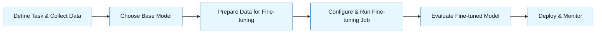

:::info[Value Proposition]
Adapt pre-trained Large Language Models (LLMs) to perform specific tasks or adhere to particular styles more effectively by fine-tuning them on your own datasets. This technique significantly improves model performance and accuracy for specialized use cases, reducing the need for complex prompt engineering and ensuring more consistent outputs within your GenAI & LLM Documentation workflow.
:::

## Overview

While prompt engineering helps guide general-purpose LLMs, fine-tuning takes customization a step further. It involves training a pre-trained LLM on a smaller, task-specific dataset, causing the model to learn the nuances, terminology, and patterns relevant to your domain or desired output style. Fine-tuning can lead to superior performance, faster inference, and lower costs compared to constantly prompting a larger, general-purpose model, especially for repetitive or highly specialized tasks.

**Goal**: Optimize an LLM's performance for a specific task or domain by adapting it with a custom dataset.
**Anti-pattern**: Relying on prompt engineering alone for highly specialized tasks where fine-tuning would yield significantly better and more consistent results, or attempting to fine-tune a model without a high-quality, task-specific dataset.

---

## When to Use

| ✅ Use This Pattern When...                                 | 🚫 Do Not Use When...                                  |
| :--------------------------------------------------------- | :----------------------------------------------------- |
| Needing to achieve high accuracy on a specific, narrow task | The task can be reliably solved with effective prompt engineering alone |
| Ensuring the LLM adheres to a specific tone of voice, brand guide, or code style | Your custom dataset is small, low-quality, or not representative of the task |
| Reducing inference latency and cost for repetitive tasks   | The LLM's knowledge needs to be constantly up-to-date with new facts (RAG is better) |
| Moving from prompt engineering to a more production-ready, robust solution | You are training a foundational model from scratch (this is pre-training) |

---

## Prerequisites

:::warning[Before you start]
A high-quality, task-specific dataset is the most critical prerequisite for successful fine-tuning. "Garbage in, garbage out" applies here.
:::

-   **Artifacts**: A high-quality dataset of input-output pairs (for supervised fine-tuning) or preferences (for RLHF).
-   **Context**: A clear understanding of the target task, desired output format, and evaluation metrics. Access to compute resources (GPUs) for training.

---

## The Pattern (Step-by-Step)

### Step 1: Define Task & Collect Data

Clearly define the task you want the LLM to perform. Collect a high-quality dataset of examples (e.g., questions and their ideal answers, code problems and their solutions, text in your desired style).

> **Practical Insight**: Aim for diversity and accuracy in your dataset. A few hundred to a few thousand high-quality examples can be very effective.

### Step 2: Choose Base Model

Select a pre-trained LLM that provides a good starting point. Consider its size, capabilities, and whether it supports fine-tuning.

> "We will fine-tune `Mistral-7B` as it offers a good balance of performance and resource requirements for our internal code generation task."

### Step 3: Prepare Data for Fine-tuning

Format your dataset according to the requirements of the chosen fine-tuning platform or framework. This often involves specific JSONL formats.

> "Transform our code example dataset into `{"prompt": "...", "completion": "..."}` JSONL pairs. Ensure inputs are cleaned and standardized."

### Step 4: Configure & Run Fine-tuning Job

Set hyperparameters (learning rate, epochs, batch size), select a fine-tuning method (e.g., full fine-tuning, LoRA/QLoRA for PEFT), and launch the training job on your chosen platform (e.g., OpenAI API, Hugging Face, custom GPU cluster).

> "Use LoRA fine-tuning for 3 epochs with a learning rate of `2e-5`. Monitor validation loss and accuracy."

### Step 5: Evaluate Fine-tuned Model

Rigorously evaluate the fine-tuned model against your predefined metrics and Acceptance Criteria. Compare its performance to the base model and any prompt-engineered alternatives.

> "Deploy the fine-tuned model and run it against our `UserService` evaluation dataset. Verify code correctness, style adherence, and latency improvements."

### Step 6: Deploy & Monitor

If the fine-tuned model meets your criteria, deploy it to your inference environment. Continuously monitor its performance in production, especially for model drift or regressions.

---

## Practical Example: Fine-tuning for Consistent Code Style

**Objective**: Fine-tune an LLM to generate Python code that strictly adheres to our internal code style guide (e.g., PEP8 + specific internal conventions).

**Fine-tuning Process:**

1.  **Define Task & Collect Data**:
    -   Task: Generate Python functions that match our internal style.
    -   Data: 500 examples of Python functions (problem description as input, internal-style function as output). Each example is a `{"prompt": "Generate a Python function to [task]", "completion": "def example_func(...)"}` pair.

2.  **Choose Base Model**: `CodeLlama-7B` (or similar code-focused model).

3.  **Prepare Data**: Ensure data is cleaned, formatted into JSONL, and uploaded to the fine-tuning platform.

4.  **Configure & Run**: Use a LoRA fine-tuning method.

5.  **Evaluate**:
    -   Metrics: PEP8 compliance score (via `flake8`), adherence to custom style rules (via automated script), human review (1-3 score) for readability.
    -   Dataset: 50 new prompts for code generation.

6.  **Deploy & Monitor**: Deploy the fine-tuned `CodeLlama-7B-LoRA` model internally. Monitor its code generation against new pull requests for style deviations.

---

## Common Pitfalls

| Pitfall                   | Impact                                   | Correction                                     |
| :------------------------ | :--------------------------------------- | :--------------------------------------------- |
| **Low-Quality Data**      | Model learns incorrect patterns, amplifies biases, or performs poorly. | Invest heavily in data cleaning, curation, and human labeling. |
| **Insufficient Data**     | Model fails to generalize, overfits, or doesn't improve significantly. | Start with a few hundred high-quality examples; expand if needed. |
| **Over-fine-tuning**      | Model loses its general capabilities (catastrophic forgetting) or becomes overly rigid. | Use appropriate fine-tuning methods (e.g., LoRA), monitor validation loss, and stop early. |
| **Ignoring Evaluation**   | Deploying a fine-tuned model that doesn't actually improve performance. | Rigorously evaluate against a separate test set, compare to baseline and prompt-engineered versions. |

---

## Quick Links

- Handbook Method: [Overview](/docs/01-handbook-method/01-overview)
- Evaluation: [Handbook Method](/docs/01-handbook-method/evaluation)
- Prompt Engineering: [Handbook Method](/docs/01-handbook-method/prompt-engineering)
- Model Selection: [Handbook Method](/docs/01-handbook-method/03-model-selection)

## Next Step

Explore [Instruction Tuning](/docs/01-handbook-method/instruction-tuning) as another technique for model customization.
