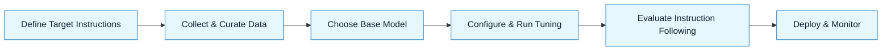

:::info[Value Proposition]
Enhance a Large Language Model's (LLM) ability to understand and follow instructions precisely. Instruction tuning involves training an LLM on a dataset of instruction-response pairs, making it more steerable and reliable for producing desired outputs, which is crucial for the structured approach of GenAI & LLM Handbook.
:::

## Overview

Instruction tuning (also known as instruction following fine-tuning) is a specific type of fine-tuning where an LLM is trained on a dataset consisting of various tasks described in natural language (instructions) and their corresponding ideal responses. This process significantly improves the model's ability to generalize to new, unseen instructions and follow zero-shot or few-shot prompts more effectively. For GenAI & LLM Handbook, instruction-tuned models are invaluable as they are better at interpreting Intent Specs, Constraint Specs, and Generation Requests, leading to more accurate and compliant AI outputs.

**Goal**: Improve an LLM's capacity to understand, interpret, and accurately execute natural language instructions, making it a more reliable AI assistant.
**Anti-pattern**: Relying solely on base models for complex instruction-following tasks, leading to frequent misinterpretations, generic outputs, or a high degree of prompt engineering effort for each new task.

---

## When to Use

| Good fit (use when...)                                 | Avoid (not a fit when...)                                  |
| :--------------------------------------------------------- | :----------------------------------------------------- |
| Developing LLM applications that rely heavily on complex natural language instructions | The task requires simple text completion or generation without specific instruction following |
| Needing LLMs to generalize to a wide variety of unseen tasks from new instructions | Your dataset is primarily for factual knowledge injection (RAG is generally better for this) |
| Aiming to reduce the prompt engineering burden for diverse tasks | You are training a foundational model from scratch (this is pre-training) |
| Fine-tuning an LLM to follow specific internal guidelines or formats (e.g., code style, documentation structure) | The model's primary limitation is outdated information (RAG is typically better for this) |

---

## Prerequisites

:::warning[Before you start]
A high-quality, diverse dataset of instruction-response pairs is the cornerstone of effective instruction tuning.
:::

-   **Artifacts**: A dataset of `(instruction, input, output)` triplets, where `instruction` is a natural language task description, `input` is optional context, and `output` is the desired response.
-   **Context**: A clear understanding of the target instructions and desired response formats. Access to compute resources (GPUs) for training.

---

## The Pattern (Step-by-Step)

### Step 1: Define Target Instructions

Identify the types of instructions you want the LLM to excel at. These could range from "Summarize this document" to "Generate a React component given these specs."

> **Practical Insight**: Collect examples of your Intent Specs and Generation Requests, paired with their ideal AI outputs, to form the basis of your instruction-tuning dataset.

### Step 2: Collect & Curate Instruction-Response Data

Assemble a diverse dataset of instruction-response pairs. This can involve:
-   Human labeling: Manually creating instructions and ideal responses.
-   Existing datasets: Using publicly available instruction-tuning datasets.
-   Synthetic data generation: Using a more powerful LLM to generate instruction-response pairs.

### Step 3: Choose Base Model

Select a pre-trained LLM that provides a good foundation. Consider models that have already undergone some initial instruction tuning (e.g., Llama 2-chat, GPT-3.5-turbo).

> "We will instruction-tune `Llama-7B-base` because it's a capable model that can be further aligned to our specific internal instructions."

### Step 4: Configure & Run Instruction Tuning Job

Use a fine-tuning platform or framework to train the LLM on your instruction-response dataset. This process is very similar to supervised fine-tuning.

> "Apply instruction tuning for 2 epochs, ensuring the model's loss decreases and it learns to follow instructions more accurately."

### Step 5: Evaluate Instruction Following

Rigorously evaluate the instruction-tuned model's ability to follow new, unseen instructions. Measure metrics like adherence to format, task completion success, and reduction in misinterpretations.

> "Test the instruction-tuned model against a set of 50 novel Generation Requests. Score its output on a 1-5 scale for instruction adherence using our Quality Rubric."

### Step 6: Deploy & Monitor

If the instruction-tuned model meets your evaluation criteria, deploy it. Continuously monitor its performance and collect feedback to identify new instructions for further tuning.

---

## Practical Example: Instruction Tuning for Code Review Feedback

**Objective**: Instruction-tune an LLM to provide code review feedback that strictly follows our internal style guide and review checklist.

**Instruction Tuning Process:**

1.  **Define Target Instructions**: The LLM should take a code snippet and a prompt like "Review this Python code for style and best practices" and output structured feedback adhering to our style guide sections.
2.  **Collect & Curate Data**:
    -   Input: 200 pairs of `(Python code snippet, code review instruction)`.
    -   Output: Manually written code review feedback following the internal style guide and checklist, structured as JSON (e.g., `{"summary": "...", "suggestions": [...]}`).
3.  **Choose Base Model**: `CodeLlama-7B-Instruct`.
4.  **Configure & Run Tuning**: Use a fine-tuning platform (e.g., Google AI Platform, Hugging Face) to fine-tune on the instruction-response dataset.
5.  **Evaluate**:
    -   Metrics: Compare AI-generated feedback JSON to human-generated ground truth (ROUGE-L, F1 for entity extraction). Human review for style guide adherence (using a Quality Rubric).
    -   Dataset: 50 new Python code snippets for review.
6.  **Deploy & Monitor**: Deploy the instruction-tuned model as an internal API for code review assistance. Monitor feedback quality and compliance.

---

## Common Pitfalls

| Pitfall                   | Impact                                   | Correction                                     |
| :------------------------ | :--------------------------------------- | :--------------------------------------------- |
| **Low-Quality Instruction Data** | Model fails to learn proper instruction following or generates noisy responses. | Invest in high-quality, diverse instruction-response pairs; ensure instructions are clear and consistent. |
| **Insufficient Data Diversity** | Model overfits to specific instructions and struggles with novel ones. | Include a wide variety of instruction types and domains in your dataset. |
| **Ignoring Prompt Engineering** | Expecting fine-tuning to fix poorly formulated prompts entirely. | Instruction tuning enhances, but doesn't replace, the need for clear prompt engineering. |
| **Ethical & Bias Risks**  | Model learns and propagates biases present in the instruction-tuning dataset. | Carefully audit your instruction-response data for biases; implement safety checks and human review. |

---

## Quick Links

- Handbook Method: [Overview](/docs/01-handbook-method/01-overview)
- Fine-tuning: [Handbook Method](/docs/01-handbook-method/fine-tuning)
- Prompt Engineering: [Handbook Method](/docs/01-handbook-method/prompt-engineering)
- Evaluation: [Handbook Method](/docs/01-handbook-method/evaluation)

## Next Step

Explore [Intent Spec](/docs/01-handbook-method/intent-spec) for defining desired outcomes.
