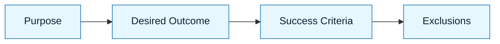

:::info[Value Proposition]
Clearly define the desired outcome and success criteria for an AI-assisted task. This prevents scope creep, focuses AI generation, and provides a clear benchmark for evaluating outputs.
:::

## Overview

The Intent Spec (Intent Specification) is a foundational artifact in the GenAI & LLM Handbook Loop. It articulates _what_ needs to be achieved and _why_ it matters, without dictating _how_ it should be implemented. By clearly stating the purpose, desired outcome, and measurable success criteria, the Intent Spec acts as a compass for AI and a clear objective for human review.

**Goal**: Define a clear, measurable, and testable statement of purpose for an AI-assisted task.
**Anti-pattern**: Vague objectives like "make it better" or "improve performance," which lead to AI guessing at the underlying problem.

---

## When to Use

| ✅ Use This Pattern When...           | 🚫 Do Not Use When...                     |
| :------------------------------------ | :---------------------------------------- |
| Starting any new AI-assisted task     | You are purely exploring an AI's capabilities for fun |
| Delegating a feature to an AI agent   | The task is a simple bug fix with a known solution |
| Clarifying stakeholder requirements   | You already have a full technical specification |

---

## Prerequisites

:::warning[Before you start]
A completed **Discovery Brief** is often a prerequisite, ensuring the problem itself is well-understood before defining intent.
:::

-   **Artifacts**: Discovery Brief (optional but recommended).
-   **Context**: Understanding of the business problem or user need this task aims to solve.

---

---

## The Pattern (Step-by-Step)

### Step 1: State the Purpose

Clearly articulate the primary goal of the task. What problem are you solving, or what value are you creating?

> **Practical Insight**: Use a single, concise sentence if possible. "The purpose is to allow users to securely log into the application."

### Step 2: Define Desired Outcome

Describe the specific, observable result you want from the AI's work. What will be different after this task is completed?

> "Users will be able to submit their credentials and receive a valid authentication token upon successful login."

### Step 3: Specify Success Criteria (Measurable)

How will you know the task is successful? These should be quantitative or qualitative metrics that can be verified.

> "Login attempts with valid credentials must succeed 100% of the time. Failed login attempts must result in an appropriate error message and status code. Password hashing must meet security standards."

### Step 4: List Explicit Exclusions/Non-Goals

What is explicitly *not* part of this task? This prevents scope creep and focuses the AI.

> "This task does not include user registration, password reset functionality, or multi-factor authentication."



---

---

## Practical Example: Intent Spec for a User Profile Microservice

**Objective**: Create a new user profile microservice.

**Intent Spec:**

```markdown
**Purpose:** To provide a dedicated, scalable service for managing user profile information.

**Desired Outcome:**
A new microservice exposing a RESTful API for CRUD operations on user profiles. This service will store user-specific data (e.g., name, email, avatar URL, preferences) and be accessible by other internal services.

**Success Criteria:**
-   The microservice API must expose endpoints for creating, retrieving, updating, and deleting user profiles.
-   Each operation must return appropriate HTTP status codes (2xx for success, 4xx for client errors, 5xx for server errors).
-   User profiles must be uniquely identifiable by a UUID.
-   The service must integrate with our existing authentication gateway for secure access.
-   Response times for profile retrieval should be under 100ms (p95).

**Explicit Exclusions/Non-Goals:**
-   User authentication (handled by separate service).
-   User registration flow.
-   Integration with external social media profiles.
-   Real-time notifications on profile changes.
```

---

## Common Pitfalls

| Pitfall                       | Impact                                   | Correction                                     |
| :---------------------------- | :--------------------------------------- | :--------------------------------------------- |
| **Vague Intent**              | AI generates generic or irrelevant outputs. | Use specific, measurable language.             |
| **Mixing Intent with Implementation** | AI makes technical decisions based on assumptions. | Focus solely on *what* to achieve, not *how*. |
| **Implicit Exclusions**       | AI performs work you didn't want.        | Explicitly state what is out of scope.         |

---

## Quick Links

- Handbook Method: [Overview](/docs/01-handbook-method/01-overview)
- Discovery Brief: [Handbook Method](/docs/01-handbook-method/discovery-brief)
- Constraint Spec: [Handbook Method](/docs/01-handbook-method/constraint-spec)
- Intent Spec Template: [Template](/docs/06-templates/intent-spec-template)

## Next Step

Proceed to [Constraint Spec](/docs/01-handbook-method/constraint-spec) to define boundaries.
