:::info[Value Proposition]
Understand and proactively address the unique risks and production challenges associated with deploying Generative AI (GenAI) and Large Language Models (LLMs). This knowledge empowers teams to build robust, responsible, and resilient AI systems that meet business objectives and societal expectations.
:::

## Overview

Deploying LLMs into production brings forth a new class of risks and operational complexities not typically encountered in traditional software development. These range from model-specific issues like hallucinations and bias to systemic challenges in observability, cost management, and security. Proactive identification and mitigation of these challenges are paramount for successful and responsible AI integration. This document provides an overview of common risks and outlines strategies to address them within the GenAI & LLM Handbook framework.

**Goal**: Equip teams with an understanding of key risks and production challenges in LLM deployments, fostering a proactive and responsible approach to AI development.
**Anti-pattern**: Ignoring LLM-specific risks, assuming traditional software development practices are sufficient, leading to unexpected failures, security breaches, or ethical dilemmas.

---

## Key Risks and Challenges

### 1. Model Behavior Risks

-   **Hallucinations**: LLMs generating factually incorrect or nonsensical information.
-   **Bias**: Models reflecting and amplifying biases present in their training data, leading to unfair or discriminatory outputs.
-   **Toxicity/Harmful Content**: Generating offensive, inappropriate, or dangerous content.
-   **Misinterpretation**: Failing to correctly understand complex instructions or context.
-   **Model Drift**: Performance degradation over time due to changes in real-world data distributions or underlying model updates.

### 2. Operational & Production Challenges

-   **Cost Management**: Unpredictable and potentially high inference costs due to token usage.
-   **Latency & Throughput**: Meeting real-time performance requirements, especially for interactive applications.
-   **Scalability**: Scaling LLM inference infrastructure to handle fluctuating demand.
-   **Observability & Debugging**: Difficulty in tracing and debugging multi-step LLM chains and agentic behaviors.
-   **Version Control & Reproducibility**: Managing prompt versions, model versions, and ensuring reproducible results.

### 3. Security & Privacy Risks

-   **Prompt Injection**: Malicious users manipulating prompts to bypass safety mechanisms or extract sensitive information.
-   **Data Leakage**: LLMs unintentionally revealing sensitive information from their training data or RAG context.
-   **Supply Chain Risks**: Dependencies on third-party models or data, and their associated vulnerabilities.
-   **Access Control**: Ensuring only authorized users/systems can access LLM capabilities.

### 4. Ethical & Governance Risks

-   **Accountability**: Who is responsible for AI-generated errors or harms?
-   **Fairness & Equity**: Ensuring AI systems do not perpetuate or exacerbate societal inequalities.
-   **Transparency & Explainability**: Understanding why an LLM produced a particular output.
-   **Legal & Regulatory Compliance**: Adhering to evolving AI-specific laws and data privacy regulations.

```mermaid
graph TD
    subgraph Risks
        A[Hallucinations] --> B[Bias]
        B --> C[Toxicity]
        C --> D[Misinterpretation]
        D --> E[Model Drift]
        E --> F[Cost]
        F --> G[Latency]
        G --> H[Scalability]
        H --> I[Observability]
        I --> J[Prompt Injection]
        J --> K[Data Leakage]
        K --> L[Accountability]
        L --> M[Fairness]
    end

    classDef step fill:#E6F7FF,stroke:#1B75BB,color:#0F1F2E;
    class A,B,C,D,E,F,G,H,I,J,K,L,M step;
```

---

## Mitigation Strategies (Leveraging the Handbook Loop)

The GenAI & LLM Handbook Loop explicitly addresses many of these challenges:

-   **Discovery Brief & Intent Spec**: Clarifies purpose, reduces misinterpretation, and helps define responsible use cases.
-   **Constraint Spec**: Proactively defines technical, security, and ethical guardrails (e.g., "MUST NOT generate PII," "MUST use only verified tools").
-   **Delegation Contract**: Limits AI's actions, preventing overreach and unintended side effects.
-   **Generation Request**: Structured prompting reduces ambiguity and guides towards desired outputs.
-   **Review & Interrogation**: Systematic verification identifies hallucinations, bias, and security flaws before acceptance.
-   **Acceptance Criteria**: Objective measures to confirm quality, performance, and compliance.
-   **Iteration & Release**: Continuous learning and adaptation to address new risks and improve system resilience.

---

## Common Pitfalls

| Pitfall                   | Impact                                   | Correction                                     |
| :------------------------ | :--------------------------------------- | :--------------------------------------------- |
| **Ignoring AI-Specific Risks** | Unexpected failures, data breaches, ethical harms. | Proactively threat model for LLM-specific risks (e.g., prompt injection). |
| **Lack of Observability** | Inability to debug, optimize, or understand AI behavior in production. | Implement comprehensive logging, metrics, and tracing for LLM applications. |
| **Assuming Static Performance** | Model performance degrades over time without detection. | Implement continuous evaluation and monitoring for model drift. |
| **Underestimating Cost**  | Uncontrolled cloud spend or resource drain. | Implement cost tracking, token limits, and utilize smaller/optimized models where appropriate. |

---

## Quick Links

- Handbook Method: [Overview](/docs/01-handbook-method/01-overview)
- Threat Model Lite: [Responsible AI](/docs/05-responsible-ai/threat-model-lite)
- Observability & Tracing: [LLM Frameworks](/docs/04-tooling-and-frameworks/02-llm-frameworks/06-observability-and-tracing)
- Governance and Accountability: [Responsible AI](/docs/05-responsible-ai/governance-and-accountability)

## Next Step

Learn about [Testing Tools](/docs/01-handbook-method/testing-tools) for further quality assurance.
