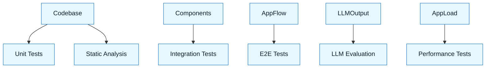

:::info[Value Proposition]
Utilize a range of testing tools to verify the correctness, quality, and performance of AI-generated code and LLM-powered applications. This ensures that AI outputs meet stringent quality standards and integrate seamlessly into existing development and deployment pipelines.
:::

## Overview

Testing is an indispensable part of software development, and its importance is amplified in the context of AI-assisted development. AI-generated code, while rapidly produced, requires rigorous validation to ensure it's free of bugs, security vulnerabilities, and adheres to specifications. LLM-powered applications, with their probabilistic nature, demand even more sophisticated testing to evaluate their behavior, accuracy, and alignment with user intent. This document explores various testing tools and methodologies for validating GenAI & LLM Handbook outputs.

**Goal**: Equip teams with the knowledge and tools to effectively test AI-generated code and LLM applications, thereby increasing confidence in AI-assisted development.
**Anti-pattern**: Relying solely on manual inspection of AI outputs, leading to overlooked bugs, security flaws, and inconsistent quality.

---

## Key Testing Tools and Methodologies

### 1. Unit Testing Frameworks

-   **Purpose**: Test individual functions or methods in isolation. Essential for verifying the functional correctness of AI-generated code snippets.
-   **Examples**: Jest (JavaScript/TypeScript), Pytest (Python), JUnit (Java).
-   **Integration with AI**: AI can generate these tests (`Write Tests` pattern) or help fix code when tests fail.

### 2. Static Analysis Tools (Linters, SAST)

-   **Purpose**: Analyze code without executing it, identifying potential bugs, style violations, and security vulnerabilities.
-   **Examples**: ESLint, SonarQube, Bandit, `tfsec`, `checkov`.
-   **Integration with AI**: AI can help interpret static analysis warnings, suggest fixes, or ensure generated code adheres to linting rules.

### 3. Integration & End-to-End (E2E) Testing Tools

-   **Purpose**: Test the interaction between multiple components or the entire application flow. Critical for verifying AI-generated features integrate correctly.
-   **Examples**: Cypress, Playwright, Selenium, Postman/Newman.
-   **Integration with AI**: AI can assist in writing integration tests, generating test data, or even analyzing E2E test failures.

### 4. LLM-Specific Evaluation Frameworks

-   **Purpose**: Specialized tools for evaluating LLM outputs against specific metrics like factual accuracy, coherence, fluency, toxicity, or instruction following.
-   **Examples**: Ragas, LlamaIndex's evaluation modules, LangChain Evaluation, custom evaluation scripts.
-   **Integration with AI**: AI can be used to generate test cases for other LLMs, or to score outputs (if a highly reliable model is used as an evaluator).

### 5. Performance Testing Tools

-   **Purpose**: Assess an application's responsiveness, stability, and scalability under various load conditions. Crucial for LLM applications due to varying token costs and latencies.
-   **Examples**: JMeter, k6, Locust.
-   **Integration with AI**: AI can help design load test scenarios or analyze performance reports.

---

## Integration with GenAI & LLM Handbook Workflow

### 1. Acceptance Criteria as Test Plans

Your Intent Spec and Acceptance Criteria (defined in the Handbook Loop) serve as the blueprint for your testing strategy. AI can then translate these into executable test cases.

### 2. AI for Test Generation

Leverage AI to generate various tests based on your code and specifications. This includes unit tests, integration tests, and even test data.

### 3. AI for Test Analysis

Use AI to help analyze test results, especially for complex LLM outputs where traditional assertions might not suffice. AI can identify patterns in failures or summarize qualitative feedback.

### 4. Continuous Testing

Integrate testing tools into your CI/CD pipeline. Ensure AI-generated code is automatically tested and verified before deployment.

---

## Common Pitfalls

| Pitfall                   | Impact                                   | Correction                                     |
| :------------------------ | :--------------------------------------- | :--------------------------------------------- |
| **Testing Only "Happy Paths"** | Missing critical edge cases, leading to production bugs. | Explicitly prompt AI to generate tests for edge cases, error conditions, and negative scenarios. |
| **Ignoring Non-Functional Testing** | Performance or security issues go undetected. | Integrate static analysis, performance testing, and security scanning tools into your workflow. |
| **Over-reliance on AI for Test Design** | AI-generated tests might be brittle or miss nuanced requirements. | Human QA engineers must review and refine AI-generated test plans and cases. |
| **Lack of Continuous Integration** | AI-generated code is not tested automatically. | Automate test execution within your CI/CD pipeline. |

---

## Quick Links

- Handbook Method: [Overview](/docs/01-handbook-method/01-overview)
- Evaluation: [Handbook Method](/docs/01-handbook-method/evaluation)
- Acceptance Criteria: [Handbook Method](/docs/01-handbook-method/acceptance-criteria)
- Write Tests: [Execution Pattern](/docs/02-execution-patterns/07-write-tests)

## Next Step

Explore [The GenAI & LLM Loop](/docs/01-handbook-method/the-genai-llm-loop) for a holistic view of the process.
