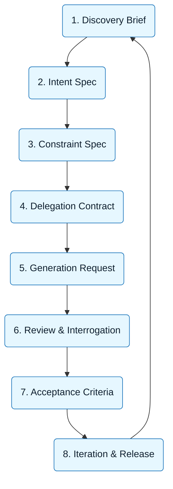
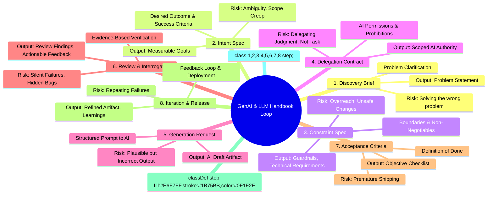

:::info[Value Proposition]
The GenAI & LLM Handbook Loop is the engine of the framework. It turns abstract intent into concrete, reviewable artifacts through a repeatable 8-step process.
:::

## Overview

The GenAI & LLM Handbook Loop defines **how work actually flows** when you use natural language to build software, documentation, or systems with AI. It is a systematic, iterative process designed to ensure clarity, correctness, and accountability. Each step produces a tangible artifact that acts as both input for the next stage and evidence for review.

**Goal**: Provide a reliable, repeatable, and auditable workflow for AI-assisted development.
**Anti-pattern**: Ad-hoc "prompt engineering" with unpredictable results and unmanageable risk.

---

## When to Use

| ✅ Use This Pattern When...           | 🚫 Do Not Use When...                     |
| :------------------------------------ | :---------------------------------------- |
| Building any AI-assisted feature      | You are exploring ideas with no clear outcome |
| Fixing bugs with AI assistance        | The task is trivial and has no impact     |
| Generating documentation or tests     | You are debugging a simple syntax error   |

---

## Prerequisites

:::warning[Before you start]
A basic understanding of the Core Skills (Logic, Language, Systems, Sentences) is crucial.
:::

- **Artifacts**: Understanding of the purpose of each artifact (Intent Spec, Constraint Spec, etc.).
- **Context**: A commitment to evidence-based review and human accountability.

GenAI & LLM Handbook assumes:

-   AI is an execution tool, not a decision-maker.
-   Human intent must be explicitly defined.
-   Outputs must be verified before acceptance.

---

---

## The GenAI & LLM Handbook Loop (At a Glance)

| Step                      | Focus                                 | Key Output                           | Risks if Skipped              |
| :------------------------ | :------------------------------------ | :----------------------------------- | :---------------------------- |
| **1. Discovery Brief**    | Problem Clarification                 | Problem Statement                    | Solving the wrong problem     |
| **2. Intent Spec**        | Desired Outcome & Success Criteria    | Measurable Goals                     | Ambiguity, Scope Creep        |
| **3. Constraint Spec**    | Boundaries & Non-Negotiables          | Guardrails, Technical Requirements   | Overreach, Unsafe Changes     |
| **4. Delegation Contract**| AI Permissions & Prohibitions         | Scoped AI Authority                  | Delegating Judgment, Not Task |
| **5. Generation Request** | Structured Prompt to AI               | AI Draft Artifact                    | Plausible but Incorrect Output |
| **6. Review & Interrogation** | Evidence-Based Verification         | Review Findings, Actionable Feedback | Silent Failures, Hidden Bugs  |
| **7. Acceptance Criteria**| Definition of Done                    | Objective Checklist                  | Premature Shipping            |
| **8. Iteration & Release**| Feedback Loop & Deployment            | Refined Artifact, Learnings          | Repeating Failures            |

---

## Visual Summary

### GenAI & LLM Handbook Loop Diagram (System View)

System view diagram of the GenAI & LLM Handbook loop: Discovery, Intent, Constraints, Delegation, Generation, Review, Acceptance, then Release/Decision, with a return to Discovery.

### GenAI & LLM Handbook Loop (Mind Map View)

Mind map view of the GenAI & LLM Handbook loop showing the eight stages branching into their key elements.

---

---

## How the GenAI & LLM Handbook Loop Prevents Failure

Traditional development often moves from problem to solution directly, then tries to fix issues during testing or deployment. When using AI, this approach is disastrous because AI can generate plausible but deeply flawed solutions very quickly.

GenAI & LLM Handbook inverts that order deliberately. It front-loads clarity and constraints, and back-loads verification and accountability:

-   **Explicit Specification**: Before AI generates anything, you define what success looks like (Intent) and what boundaries cannot be crossed (Constraints).
-   **Controlled Execution**: AI operates within the confines of the Delegation Contract and Generation Request.
-   **Rigorous Verification**: AI outputs are not accepted until they pass Review and meet Acceptance Criteria.

---

---

## GenAI & LLM Handbook is Tool-Agnostic

The GenAI & LLM Handbook Loop applies regardless of the specific AI tool you are using (e.g., GitHub Copilot, ChatGPT, Claude, Aider, Cursor). The principles remain constant: define, constrain, delegate, verify, accept.

---

## Navigating the Method

Each step of the GenAI & LLM Handbook Loop has a corresponding detailed document:

-   Method backbone: `/docs/01-handbook-method/`

1.  [Discovery Brief](/docs/01-handbook-method/discovery-brief)
2.  [Intent Spec](/docs/01-handbook-method/intent-spec)
3.  [Constraint Spec](/docs/01-handbook-method/constraint-spec)
4.  [Delegation Contract](/docs/01-handbook-method/delegation-contract)
5.  [Generation Requests](/docs/01-handbook-method/generation-requests)
6.  [Review and Interrogation](/docs/01-handbook-method/review-and-interrogation)
7.  [Acceptance Criteria](/docs/01-handbook-method/acceptance-criteria)
8.  [Iteration and Release](/docs/01-handbook-method/iteration-and-release)

---

## Quick Links

- Handbook Method: [Overview](/docs/01-handbook-method/01-overview)
- GenAI & LLM Loop Spec: [Handbook Method](/docs/01-handbook-method/genai-llm-loop-spec)
- Artifact Contracts: [Handbook Method](/docs/01-handbook-method/artifact-contracts)
- Accountbility and Delegation: [Handbook Method](/docs/01-handbook-method/accountability-and-delegation)

## Next Step

Return to the [Handbook Method Overview](/docs/01-handbook-method/01-overview) to explore the entire process.
