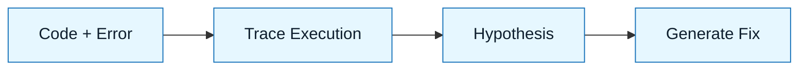

:::info[Value Proposition]
Use this pattern to debug complex logic or understand legacy code. It forces the AI to explain the code's behavior step-by-step, often revealing the bug before you even ask for a fix.
:::

## Overview

"Rubber Ducking" is a classic debugging technique where you explain your code line-by-line to an inanimate object. In GenAI & LLM Documentation, the AI acts as an **active** rubber duck.

**Goal**: Isolate the root cause of a bug or understand a complex flow.
**Anti-pattern**: "Fix this error." (Result: AI guesses blindly without understanding the state).

---

## When to Use

| ✅ Use This Pattern When...               | 🚫 Do Not Use When...                |
| :---------------------------------------- | :----------------------------------- |
| You have a stack trace but no idea why    | You need to write a new feature      |
| You are reading code you didn't write     | You are doing a large-scale refactor |
| You suspect a race condition or edge case | You know exactly what the fix is     |

---

## Prerequisites

:::warning[Before you start]
Do not paste the error log alone. You must provide the code that caused it.
:::

- **Input**: Source code + Error logs / Observed behavior.
- **Context**: What were you trying to do when it failed?

---

---

## The Pattern (Step-by-Step)

### Step 1: The Context Dump

Feed the code and the error to the model.

> "Here is `src/payment.ts` and the error log from the last run. Do not fix it yet."

### Step 2: The Walkthrough

Ask the AI to trace the execution path for the specific scenario that failed.

> "Trace the execution flow for a user with an expired card. Explain the state of the `transaction` object at each step."

_Why? This forces the model to build an internal representation of the logic flow._

### Step 3: The Interrogation

Ask specific "What if" questions to test hypotheses.

> "What happens if the API returns a 503 at line 42? Is the `catch` block reachable?"

### Step 4: The Fix

Once the logic gap is exposed, ask for the correction.

> "The error is that we don't check for `null` before accessing `transaction.id`. Generate the fix."



--- 

## Example Scenario

-   **Context**: A React component crashes only on the second render.
-   **Input**: Component code + `useEffect` logic.
-   **Process**: Asked AI to "Trace the dependency array changes between render 1 and 2."
-   **Outcome**: AI identified a stale closure in the event listener.

### Practical Example: Explaining a React Component's Lifecycle

**Objective**: Understand why a React component behaves unexpectedly on re-renders, specifically when state updates don't seem to propagate into event handlers.

**Problematic Code (`Counter.jsx`):**

```jsx
import React, { useState, useEffect } from 'react';

function Counter() {
  const [count, setCount] = useState(0);

  useEffect(() => {
    // This effect is intended to increment count every second
    const intervalId = setInterval(() => {
      setCount(count + 1); // Problem: 'count' here is always the count from the initial render
    }, 1000);

    return () => clearInterval(intervalId);
  }, []); // Empty dependency array means this effect (and its closure) runs only once

  const handleClick = () => {
    // This handler also captures 'count' from its creation scope
    console.log('Button clicked, count:', count);
  };

  return (
    <div>
      <p>Count: {count}</p>
      <button onClick={handleClick}>Log Count</button>
    </div>
  );
}

export default Counter;
```

**Step 1: The Context Dump**

**User Prompt:**
> "Here is my `Counter.jsx` component. When I click the 'Log Count' button, it always logs 'Count: 0', even after the displayed count updates. Also, the `setInterval` in `useEffect` only increments the count once, then stops. Explain why this is happening. Focus on how `count` is being captured."
```

**AI Response (Example):**
```markdown
**Explanation of the Issue:**

The problem you're observing in `Counter.jsx` is due to **stale closures** in JavaScript, specifically how `useEffect` with an empty dependency array and event handlers capture state values.

1.  **`useEffect` and `setInterval` Issue**:
    -   When `Counter` first renders, `count` is `0`.
    -   The `useEffect` runs **only once** because its dependency array `[]` is empty.
    -   Inside this `useEffect`, the `setInterval` callback `() => setCount(count + 1)` is created. **Crucially, this callback captures the value of `count` from the initial render, which is `0`.**
    -   So, every second, `setCount(0 + 1)` is called, always setting `count` to `1`. The `count` variable inside that specific `setInterval`'s closure never updates.
    -   **Correction**: To fix this, you should either include `count` in the `useEffect`'s dependency array (which would recreate the interval every time `count` changes, not ideal) or, better, use the functional update form of `setCount`: `setCount(prevCount => prevCount + 1)`. This way, the callback receives the *latest* `count` value.

2.  **`handleClick` and Stale Closure Issue**:
    -   Similarly, the `handleClick` function is defined during the initial render when `count` is `0`.
    -   When you click the button, `console.log('Button clicked, count:', count)` logs the `count` value that was captured when `handleClick` was *created*, which is `0`.
    -   Even though the displayed `count` updates on subsequent renders, the `handleClick` function itself isn't re-created with the new `count` value because it's part of the component's render scope.
    -   **Correction**: This is less of an issue for `console.log` in a simple example, but in other scenarios, you might use `useCallback` with `count` in its dependency array to ensure `handleClick` is re-created when `count` changes, or access the latest state via a ref if you need to read it without re-creating the function.

**In summary**: Both issues stem from the fact that functions (like `setInterval` callbacks and event handlers) defined within a component's render scope will "close over" the state values from the render in which they were created. If those functions aren't re-created (e.g., due to an empty `useEffect` dependency array), they will forever reference the initial state values.
```

---

## Common Pitfalls

| Pitfall                   | Impact                                   | Correction                                     |
| :------------------------ | :--------------------------------------- | :--------------------------------------------- |
| **Vague Questions**       | AI provides generic or unhelpful explanations. | Be specific about the code, the observed behavior, and what you want explained. |
| **Ignoring AI's Explanations** | Missing key insights that could solve the problem. | Read AI's explanations carefully, especially about "why" something happens. |
| **Not Providing Full Context** | AI struggles to understand the problem space. | Include all relevant code, error messages, and a description of the desired behavior. |

---

## Quick Links

- Pattern Index: [Index](/docs/02-execution-patterns/00-pattern-index)
- Debug with Evidence: [Execution Pattern](/docs/02-execution-patterns/06-debug-with-evidence)
- Iteration Log Template: [Template](/docs/06-templates/iteration-log-template)

## Next Step

Learn how to [Write Tests](/docs/02-execution-patterns/07-write-tests) for your codebase.
:::danger[Critical Risk]
Never apply AI-suggested fixes directly to production without thorough testing and understanding. Debugging AI is a partnership: you provide the evidence, AI provides hypotheses, but *you* are responsible for validation.
:::