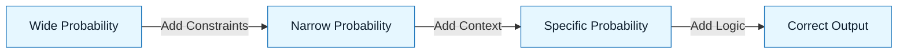

# GenAI & LLM Fundamentals

:::info[The Material Property]
You don't need to know how to build an engine to drive a car, but you do need to know that cars can't fly. This section defines the "physics" of Large Language Models so you can build safely.
:::

## Overview

In NNLP, we treat Large Language Models (LLMs) as a **raw material** for building software. Like any material (wood, steel, code), it has specific properties:

- **Strengths**: Infinite patience, pattern matching, translation, synthesis.
- **Weaknesses**: Hallucination, lack of agency, probabilistic drift, context limits.

If you fight these properties, you will fail.
If you design around them (using NNLP), you will succeed.

---

## The Three Laws of LLMs

### 1. It is a Prediction Engine, Not a Knowledge Base

The model does not "know" the answer. It predicts the most likely next word based on your prompt and its training data.

- **Implication**: It can sound confident while being completely wrong.
- **NNLP Fix**: We use **Logic** and **Constraints** to force the probability distribution toward correctness.

### 2. It Has No Agency

The model does not "want" to help you. It simply completes the pattern you started.

- **Implication**: If you write lazy code, it will complete it with more lazy code.
- **NNLP Fix**: We use **Delegation Contracts** to explicitly assign a persona and standard.

### 3. Context Is Finite

The model only "knows" what is in its immediate context window plus its frozen training weights.

- **Implication**: It does not know your private codebase, your team's style, or what you decided in a meeting yesterday unless you paste it in.
- **NNLP Fix**: We use **Artifacts** (Intent/Constraint Specs) to inject the exact context needed for the task.

---

## Visual: The Probability Funnel

NNLP is essentially the art of narrowing the funnel.

Without NNLP, the model picks from the "Wide" pool (generic, average code).
With NNLP, we force it to pick from the "Correct" pool.

---

## Key Concepts for Practitioners

| Concept            | Definition                                      | Why it matters                                    |
| :----------------- | :---------------------------------------------- | :------------------------------------------------ |
| **Hallucination**  | Generating plausible but false information.     | Requires **Review & Interrogation**.              |
| **Stochasticity**  | The randomness in generation.                   | Why you get different answers to the same prompt. |
| **Context Window** | The amount of text the model can "see" at once. | Requires concise **Discovery Briefs**.            |
| **Temperature**    | A setting that controls randomness.             | We prefer low temperature (0) for code.           |

:::warning[The Danger Zone]
The most dangerous output is not the one that crashes. It's the one that runs but does the wrong thing. This is why **Evaluation** is critical.
:::

---

## Chapters

- [How LLMs Work (Enough for Practice)](./01-how-llms-work-enough-for-practice.md)
- [Context Windows and Token Economics](./02-context-windows-and-token-economics.md)
- [Prompting vs Specifying](./03-prompting-vs-specifying.md)
- [Retrieval and Grounding (RAG)](./04-retrieval-and-grounding-rag.md)
- [Structured Output and Tool Use](./05-structured-output-and-tool-use.md)
- [Agents and Orchestration Basics](./06-agents-and-orchestration-basics.md)
- [Hallucinations and Failure Modes](./07-hallucinations-and-failure-modes.md)
- [Model Selection and Tradeoffs](./08-model-selection-and-tradeoffs.md)
- [GenAI Product Lifecycle (Practitioner Guide)](./10-genai-product-lifecycle.md)

---

## Last Reviewed / Last Updated

- Last reviewed: 2025-12-20
- Version: 0.1.0
