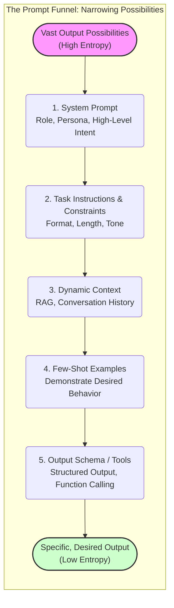

# GenAI & LLM Fundamentals

:::info[The Material Property]
You don't need to know how to build an engine to drive a car, but you do need to know that cars can't fly. This section defines the "physics" of Large Language Models so you can build safely.
:::

## Overview

In this guide, we treat Large Language Models (LLMs) as a **raw material** for building software. Like any material (wood, steel, code), it has specific properties:

- **Strengths**: Infinite patience, pattern matching, translation, synthesis.
- **Weaknesses**: Hallucination, lack of agency, probabilistic drift, context limits.

If you fight these properties, you will fail.
If you design around them, you will succeed.

---

## The Three Laws of LLMs: Navigating the Probabilistic Engine

Understanding these fundamental properties of LLMs is paramount for effective and safe development. They dictate what is possible, what is challenging, and where guardrails are most needed.

### 1. It is a Prediction Engine, Not a Knowledge Base or Reasoner

The model does not "know" the answer in a human sense; it predicts the most likely next token based on statistical patterns learned from its vast training data. It excels at pattern matching, completion, and transformation, not logical deduction or factual recall from an internal database.

-   **Implication**: It can sound incredibly confident while being completely wrong or generating plausible-sounding nonsense (hallucinations). **Always verify critical outputs.** Its confidence level is not a proxy for accuracy.
-   **Actionable Insight**: Treat LLM output as a highly persuasive draft, not gospel. Implement strong evaluation and human-in-the-loop verification for critical applications.

### 2. It Has No Agency, Intent, or Common Sense

The model does not "want" to help you, understand your unspoken desires, or possess common-sense reasoning. It merely completes the statistical pattern presented in the prompt. It lacks consciousness, goals, and the ability to "think" beyond its token-prediction mechanism.

-   **Implication**: If your instructions are ambiguous or incomplete, the model will "fill in the blanks" probabilistically, often leading to undesirable or unexpected behavior. It won't ask clarifying questions unless explicitly prompted to.
-   **Actionable Insight**: Be explicit, precise, and exhaustive in your instructions. Define success and failure conditions. Use structured prompts, few-shot examples, and clear constraints to guide its behavior.

### 3. Context Is Finite and Imperfectly Utilized

The model only "knows" what is explicitly provided in its immediate context window (your prompt, history, retrieved documents) plus its frozen training weights. It has no memory outside the current interaction unless you explicitly manage it. Furthermore, it doesn't process all parts of the context equally; crucial information can be "lost in the middle" or at the ends of long contexts.

-   **Implication**: It does not know your private codebase, your team's style, or what you decided in a meeting yesterday unless you provide that information *in the current prompt*. Longer contexts incur higher costs and latency and can degrade performance if not managed well.
-   **Actionable Insight**: Be mindful of token limits and context positioning. Prioritize essential information. Employ Retrieval Augmented Generation (RAG) to dynamically inject relevant, authoritative context. Avoid "dumping" large, unorganized texts into the prompt.

---

## Visual: The Probability Funnel - Guiding LLM Behavior

The art of effective prompting and system design with LLMs is fundamentally about narrowing the model's vast probabilistic output space to achieve a desired, predictable outcome. Think of it as guiding a powerful, general-purpose engine towards a specific, safe destination.

Without clear instructions, the model picks from the "Wide Output Possibilities" pool, leading to generic, often unhelpful, or even incorrect results. Each step in the funnel acts as a "constraint filter," forcing the model to pick from an increasingly smaller, more relevant set of probabilities, ultimately leading to the "Specific, Desired Output."

---

## Key Mental Models for Building with LLMs

Beyond the three laws, adopting these mental models will significantly improve your ability to design robust GenAI applications.

1.  **The LLM as a Highly Capable, but Unreliable Intern**: It's incredibly fast and can do many tasks, but it needs explicit, detailed instructions, supervision, and its work needs to be checked thoroughly before being deployed to production. It doesn't know what it doesn't know.

2.  **The LLM as a Lossy Compressor/Decompressor**: Training data is compressed into model weights. Your prompt acts as a query to decompress relevant patterns. This process is inherently lossy and probabilistic, meaning perfect recall or logical consistency isn't guaranteed.

3.  **The LLM as a Semantic Database Query Engine**: Instead of SQL, you're querying a vast "database" of text through natural language. The quality of your "query" (prompt) and the "schema" (constraints, context) you provide dictate the relevance and accuracy of the "results."

4.  **The LLM as a State Machine (with limited state)**: Each interaction can be thought of as transitioning a limited state. You manage this state through the explicit context you provide. Without this, it's stateless between turns.

5.  **The LLM as a Transformer Function**: It transforms an input (prompt + context) into an output. Your job is to define the optimal transformation function through careful prompt engineering and system design.

---

## Chapters

- [How LLMs Work (Enough for Practice)](./01-how-llms-work-enough-for-practice.md)
- [Context Windows and Token Economics](./02-context-windows-and-token-economics.md)
- [Prompting vs Specifying](./03-prompting-vs-specifying.md)
- [Retrieval and Grounding (RAG)](./04-retrieval-and-grounding-rag.md)
- [Structured Output and Tool Use](./05-structured-output-and-tool-use.md)
- [Agents and Orchestration Basics](./06-agents-and-orchestration-basics.md)
- [Hallucinations and Failure Modes](./07-hallucinations-and-failure-modes.md)
- [Model Selection and Tradeoffs](./08-model-selection-and-tradeoffs.md)
- [GenAI Product Lifecycle (Practitioner Guide)](./10-genai-product-lifecycle.md)

---

## Last Reviewed / Last Updated

- Last reviewed: 2025-12-28
- Version: 0.1.0
