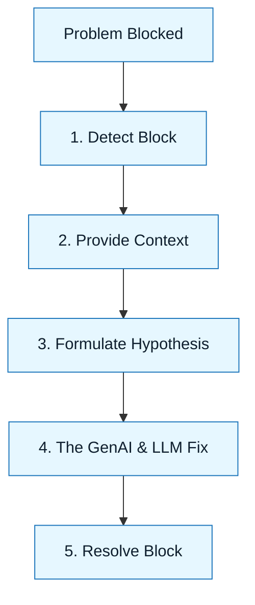

## Overview

:::info[Value Proposition]
Theory is clean. Reality is messy. These *advanced* scenarios are "game tapes" of complex GenAI & LLM execution, showing how to navigate the messy middle where high-stakes trade-offs happen, and how to apply the framework to overcome sophisticated challenges.
:::

## Overview

Applying GenAI & LLM in *complex* professional settings involves more than just following steps. It requires *deep* adaptation of the framework to real-world constraints, ambiguous information, and nuanced team dynamics. This section provides a collection of *advanced* professional scenarios, illustrating how different roles can leverage GenAI & LLM to solve *high-impact, intricate problems* effectively.

**Goal**: Provide concrete, role-based examples of GenAI & LLM in action within advanced, high-stakes contexts, highlighting practical application and sophisticated decision-making.
**Anti-pattern**: Limiting understanding to theoretical concepts without practicing application in diverse, realistic, and *complex* contexts.

---

## When to Use

| ✅ Use This Pattern When...           | 🚫 Do Not Use When...                     |
| :------------------------------------ | :---------------------------------------- |
| Learning how to apply GenAI & LLM to your specific role | You are looking for a definitive, single answer to every problem |
| Onboarding new team members to AI-assisted workflows | The scenario perfectly matches a simple Execution Pattern |
| Understanding the trade-offs and nuances of AI-assisted development | You are purely interested in the technical mechanics of LLMs |

---

## Advanced Scenarios

These scenarios delve into more complex or nuanced applications of GenAI & LLM within specific domains. They often involve higher stakes, greater technical complexity, or require more sophisticated decision-making.

-   **Greenfield React Component (Advanced Considerations)**: Building a new, reusable UI component from scratch, focusing on advanced integration patterns, performance optimization, and internationalization with AI assistance.
    -   `./01-greenfield-react-component.md`
-   **Refactoring Legacy Auth (Advanced Security & Compliance)**: Safely modernizing a critical, high-risk authentication system, with a deep dive into advanced security patterns, compliance requirements (e.g., GDPR, HIPAA), and migration strategies for very large user bases.
    -   `./02-refactoring-legacy-auth.md`

---

## Visual Summary

---

---

## How to Contribute Your Own Scenario

Have a war story? Use the `scenario-template.md` to document your own GenAI & LLM win (or interesting failure).

---

## Quick Links

- Handbook Method: [Overview](/docs/01-handbook-method/01-overview)
- Main Scenarios Index: [Index](/docs/03-professional-scenarios/00-scenarios-index)
- Scenario Template: [Template](/docs/06-templates/scenario-template)

## Next Step

Explore [Advanced Greenfield React Component](/docs/03-professional-scenarios/00-scenarios-index) or other [Professional Scenarios](/docs/03-professional-scenarios/00-scenarios-index).
