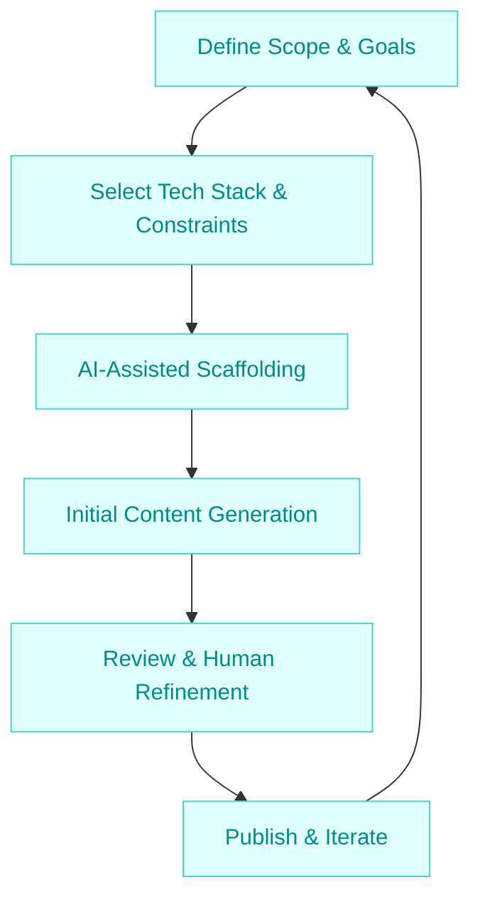

:::info[Value Proposition]
Streamline the setup and initial content generation for a documentation website, leveraging Generative AI (GenAI) and Large Language Models (LLM) to accelerate boilerplate creation, structure definition, and even draft initial content based on project context. This frees up human effort for refinement and complex content creation.
:::

## Overview

Establishing a new documentation site often involves repetitive tasks: choosing a static site generator, configuring themes, setting up navigation, and populating initial pages. AI/LLM can significantly expedite these steps by generating configuration files, scaffolding directory structures, and even drafting content outlines or basic articles based on provided prompts and existing project data (e.g., `README.md`, code comments). This scenario guides through an AI-assisted docs site setup, ensuring a consistent and maintainable foundation.

**Goal**: Quickly set up a functional, well-structured documentation site with initial content, ready for human refinement and expansion, using AI/LLM to automate boilerplate and draft generation.
**Anti-pattern**: Manually configuring every aspect of the docs site, leading to slow setup, inconsistent structure, and delayed content delivery, especially for projects with existing technical information.

---

## When to Use

| ✅ Use This Pattern When...                                 | 🚫 Do Not Use When...                                  |
| :--------------------------------------------------------- | :----------------------------------------------------- |
| Starting a new project and needing documentation quickly   | The docs site is already mature and only requires minor content updates |
| Migrating an existing collection of unstructured documents to a structured site | You need highly specialized, domain-expert-level content that AI cannot yet generate reliably |
| You have existing project metadata (e.g., `README.md`, code comments, API specs) to seed initial content | The primary goal is to perform deep stylistic changes or complex theme customizations |

---

## The Docs Site Setup Loop (6 Steps)

This iterative process outlines an AI-assisted approach to setting up a documentation site.

| Step                      | Focus                                 | Key Output                           | Risks if Skipped              |
| :------------------------ | :------------------------------------ | :----------------------------------- | :---------------------------- |
| **1. Define Scope & Goals** | Determine docs purpose, audience, key topics | Documentation Plan, Site Map         | Misaligned content, unfocused site |
| **2. Select Tech Stack & Constraints** | Choose SSG, theme, styling, content source | Tech Stack Selection, Constraint Spec| Incompatible tools, maintenance issues |
| **3. AI-Assisted Scaffolding** | Generate basic site structure, config files | Project Structure, Config Files      | Manual boilerplate, inconsistent setup |
| **4. Initial Content Generation** | Draft key pages, navigation, placeholders | Draft Articles, Navigation Files     | Empty pages, slow content creation |
| **5. Review & Human Refinement** | Edit AI-generated content, add details, custom styling | Polished Content, Custom Styling     | Generic content, AI hallucinations |
| **6. Publish & Iterate**  | Deploy site, gather feedback, continuous improvement | Live Docs Site, Feedback Loop        | Outdated information, poor user adoption |

---

## Visual Summary of the Loop

---

## Why This Process is Critical for Professional Work

-   **Rapid Time-to-Documentation**: Get a functional docs site online much faster, enabling early feedback.
-   **Consistency & Structure**: AI-generated scaffolding ensures a uniform structure and style from the outset.
-   **Reduced Manual Effort**: Automates repetitive setup tasks and initial content drafting, allowing human experts to focus on quality and complexity.
-   **Baseline Content**: Provides a solid starting point, overcoming the "blank page" syndrome for content creators.
-   **Scalability**: A well-structured, AI-assisted approach can more easily scale for large projects or growing content needs.

---

## Common Pitfalls

| Pitfall                   | Impact                                   | Correction                                     |
| :------------------------ | :--------------------------------------- | :--------------------------------------------- |
| **Vague AI Prompts**      | AI generates irrelevant or unhelpful content/structure. | Provide highly specific prompts, including desired headings, sections, and source material. |
| **Over-reliance on AI for factual accuracy** | AI-generated content may contain hallucinations or inaccuracies. | Human review and fact-checking are indispensable; use AI for drafting, not definitive statements. |
| **Ignoring existing content/style guides** | AI generates content inconsistent with brand voice or existing technical style. | Feed AI existing documentation, style guides, and glossaries as context for generation. |
| **Lack of clear site navigation/taxonomy** | Users can't find information, leading to frustration. | Define a clear site map and navigation structure (table of contents, sidebars) early in the Constraint Spec. |

---

## Quick Links

- Handbook Method: [Overview](/docs/01-handbook-method/01-overview)
- Write Docs: [Execution Pattern](/docs/02-execution-patterns/08-write-docs)
- Constraint Spec: [Handbook Method](/docs/01-handbook-method/constraint-spec)

## Next Step

Learn how to create [Runbooks and Ops Docs](/docs/03-professional-scenarios/00-scenarios-index) with AI assistance.