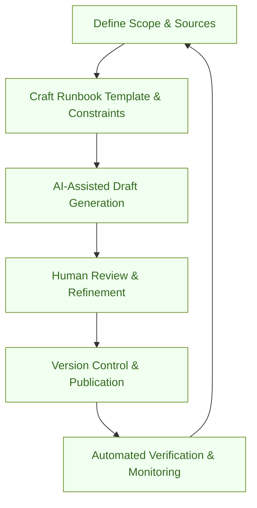

:::info[Value Proposition]
Automate the generation and maintenance of crucial runbooks and operational documentation using Generative AI (GenAI) and Large Language Models (LLM). This ensures documentation is always up-to-date, consistent, and immediately accessible during critical incidents, reducing human error and mean time to resolution (MTTR).
:::

## Overview

Operational documentation, particularly runbooks, is vital for maintaining system stability and responding effectively to incidents. However, keeping these documents current with rapidly evolving systems is a significant challenge. This scenario demonstrates how AI/LLM can analyze various sources—codebases, logs, monitoring alerts, and past incident reports—to automatically draft, update, and verify runbooks, ensuring that operations teams always have accurate and actionable guidance.

**Goal**: Maintain a comprehensive and up-to-date suite of runbooks and operational documentation with minimal manual effort, significantly improving incident response times and system reliability.
**Anti-pattern**: Relying on manually maintained, often outdated, runbooks that lead to confusion, incorrect actions, and prolonged outages during incidents.

---

## When to Use

| ✅ Use This Pattern When...                                 | 🚫 Do Not Use When...                                  |
| :--------------------------------------------------------- | :----------------------------------------------------- |
| You have complex systems requiring detailed incident response procedures | You need highly nuanced, human-driven decisions that require creativity beyond AI's current capabilities |
| Existing runbooks are frequently outdated or incomplete    | The system is static and rarely changes, making manual updates trivial |
| On-call teams spend significant time diagnosing known issues | You require a purely human-authored, deeply empathetic narrative for non-technical audiences |
| You want to standardize runbook formats and content across teams | You are only documenting a very simple, single-step operational task |

---

## The AI-Assisted Runbook Generation Loop (6 Steps)

This iterative process outlines how AI/LLM can be integrated into the runbook lifecycle.

| Step                      | Focus                                 | Key Output                           | Risks if Skipped              |
| :------------------------ | :------------------------------------ | :----------------------------------- | :---------------------------- |
| **1. Define Scope & Sources** | Identify systems, services, data sources for runbook generation | Runbook Scope, Data Source Map       | Generating irrelevant/incomplete docs |
| **2. Craft Runbook Template & Constraints** | Define desired runbook structure, tone, required sections | Runbook Template, Constraint Spec    | Inconsistent, unusable runbooks |
| **3. AI-Assisted Draft Generation** | AI analyzes sources to draft new or update existing runbooks | Draft Runbooks                     | AI hallucinations, factual errors |
| **4. Human Review & Refinement** | Subject Matter Experts review, correct, and add context | Verified Runbooks                    | Propagation of AI errors, missed nuances |
| **5. Version Control & Publication** | Store runbooks in VCS, publish to accessible platform | Published Runbooks                   | Outdated information, difficult access |
| **6. Automated Verification & Monitoring** | AI regularly checks runbooks against system state, alerts on drift | Runbook Drift Alerts, Health Checks  | Outdated instructions, security risks |

---

## Visual Summary of the Loop

---

## Why This Process is Critical for Professional Work

-   **Reduced MTTR**: Fast access to accurate runbooks significantly cuts down incident resolution time.
-   **Improved Reliability**: Consistent, up-to-date procedures lead to more predictable system behavior.
-   **Reduced Cognitive Load**: On-call engineers can focus on critical thinking rather than deciphering outdated docs.
-   **Knowledge Democratization**: AI can extract and formalize operational knowledge from various sources, making it accessible.
-   **Compliance & Audit Trail**: Automated generation and verification provide a robust audit trail for operational procedures.

---

## Common Pitfalls

| Pitfall                   | Impact                                   | Correction                                     |
| :------------------------ | :--------------------------------------- | :--------------------------------------------- |
| **AI hallucinations in critical steps** | Incorrect procedures leading to system damage or prolonged outages. | Human review (especially by SMEs) is paramount for all generated runbooks; start with low-risk systems. |
| **Incomplete data sources for AI** | Runbooks lack vital context or steps due to missing information. | Ensure AI has access to all relevant data: code, configuration, logs, monitoring alerts, past incident reports. |
| **Ignoring human-readable narrative** | Runbooks become overly technical, difficult to understand quickly under pressure. | Craft a clear runbook template (Constraint Spec) that emphasizes clear language, bullet points, and actionable steps. |
| **Lack of automated verification** | Runbooks drift from system reality without detection. | Implement automated checks that compare runbook instructions with current system state or expected outputs. |

---

## Quick Links

- Handbook Method: [Overview](/docs/01-handbook-method/01-overview)
- Write Docs: [Execution Pattern](/docs/02-execution-patterns/08-write-docs)
- Debug with Evidence: [Execution Pattern](/docs/02-execution-patterns/06-debug-with-evidence)
- Incident Response: [Platform & Ops Scenario](/docs/03-professional-scenarios/00-scenarios-index)

## Next Step

Learn how AI can assist with [Onboarding and Learning Paths](/docs/03-professional-scenarios/00-scenarios-index).