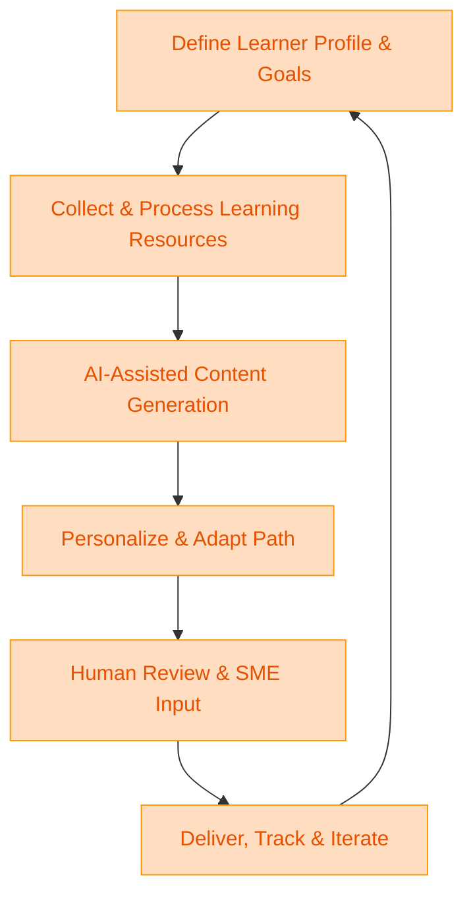

:::info[Value Proposition]
Leverage Generative AI (GenAI) and Large Language Models (LLM) to create personalized, adaptive, and highly efficient onboarding experiences and continuous learning paths for employees. This accelerates ramp-up time for new hires, facilitates skill development for existing staff, and ensures consistent knowledge transfer across the organization.
:::

## Overview

Effective onboarding and continuous learning are critical for employee success and organizational productivity. However, creating tailored learning paths for diverse roles and skill sets can be time-consuming. AI/LLM can transform this by generating customized training materials, identifying knowledge gaps, and dynamically adapting content to individual learning styles and progress. This scenario explores how to use AI to build a scalable and engaging learning ecosystem.

**Goal**: Significantly reduce the time and resources required to bring new employees up to speed and to upskill existing teams, while ensuring a high quality and personalized learning experience.
**Anti-pattern**: Relying on generic, one-size-fits-all training materials that fail to engage learners or address specific knowledge needs, leading to slow ramp-up times and skill inconsistencies.

---

## When to Use

| ✅ Use This Pattern When...                                 | 🚫 Do Not Use When...                                  |
| :--------------------------------------------------------- | :----------------------------------------------------- |
| Onboarding new employees to complex roles or large codebases | Training requires highly sensitive, confidential, or proprietary information that cannot be safely exposed to AI |
| Upskilling existing teams on new technologies or internal tools | The primary learning objective is complex interpersonal skills or emotional intelligence best taught through human interaction |
| Creating learning paths tailored to individual performance gaps | You need to certify individuals for roles requiring regulatory compliance or legal expertise solely through AI-generated content |
| You have a large volume of existing documentation, code, or internal resources that can inform learning content | The learning content is static and rarely changes, making manual updates sufficient |

---

## The AI-Assisted Onboarding/Learning Path Loop (6 Steps)

This iterative process integrates AI/LLM into the design and delivery of learning experiences.

| Step                      | Focus                                 | Key Output                           | Risks if Skipped              |
| :------------------------ | :------------------------------------ | :----------------------------------- | :---------------------------- |
| **1. Define Learner Profile & Goals** | Understand target audience, required skills, learning objectives | Learner Personas, Skill Matrix       | Irrelevant/ineffective learning content |
| **2. Collect & Process Learning Resources** | Gather existing docs, code, videos, expert interviews | Curated Knowledge Base           | AI generating incorrect or outdated info |
| **3. AI-Assisted Content Generation** | Draft modules, exercises, quizzes, summaries, FAQs | Draft Learning Modules, Assessments  | Generic or hallucinated content |
| **4. Personalize & Adapt Path** | AI suggests optimal learning sequence, content based on learner | Personalized Learning Paths        | Learners disengaged, irrelevant content |
| **5. Human Review & Subject Matter Expert (SME) Input** | SMEs validate accuracy, add nuanced insights, provide feedback | Validated Learning Content           | AI errors propagate, missed critical context |
| **6. Deliver, Track & Iterate** | Deploy platform, monitor progress, gather feedback for AI refinement | Learning Platform, Feedback Loop     | Stagnant content, ineffective learning |

---

## Visual Summary of the Loop

---

## Why This Process is Critical for Professional Work

-   **Faster Time-to-Productivity**: New hires become productive quicker, reducing organizational overhead.
-   **Skill Development at Scale**: Enables continuous upskilling of entire teams on new technologies or processes.
-   **Consistent Knowledge Transfer**: Ensures all employees receive consistent, high-quality information.
-   **Personalized Learning**: Adapts to individual needs, improving engagement and retention.
-   **Reduced Training Costs**: Automates content creation and curation, freeing up human trainers for high-value interactions.

---

## Common Pitfalls

| Pitfall                   | Impact                                   | Correction                                     |
| :------------------------ | :--------------------------------------- | :--------------------------------------------- |
| **AI generating inaccurate or outdated information** | Learners acquire incorrect knowledge, leading to errors in work. | Robust SME review is critical. Establish a feedback loop for AI content; consider retrieval-augmented generation (RAG) on trusted sources. |
| **Lack of personalization leading to disengagement** | Generic content fails to motivate or address specific learner needs. | Clearly define learner personas and initial skill assessments for AI to use as personalization parameters. |
| **Over-reliance on AI for complex concepts** | AI may simplify or misrepresent complex topics, leading to shallow understanding. | Reserve AI for drafting and foundational content; human SMEs should handle complex explanations and critical thinking exercises. |
| **Privacy concerns with learner data** | AI systems collecting sensitive personal or performance data without consent. | Implement strict data privacy policies; anonymize data where possible; ensure compliance with data protection regulations. |

---

## Quick Links

- Handbook Method: [Overview](/docs/01-handbook-method/01-overview)
- Prompt Engineering: [Handbook Method](/docs/01-handbook-method/prompt-engineering)
- Write Docs: [Execution Pattern](/docs/02-execution-patterns/08-write-docs)

## Next Step

Explore how to leverage AI for [Release Notes and Change Comms](/docs/03-professional-scenarios/00-scenarios-index).