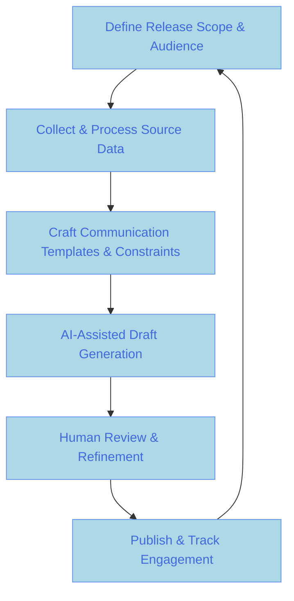

:::info[Value Proposition]
Automate and enhance the creation of release notes, changelogs, and internal/external change communications using Generative AI (GenAI) and Large Language Models (LLM). This ensures timely, consistent, and audience-tailored messages, reducing manual effort and improving stakeholder awareness of product updates and changes.
:::

## Overview

Crafting clear, concise, and engaging release notes and change communications for diverse audiences (e.g., end-users, developers, support staff) can be a time-consuming bottleneck. This scenario demonstrates how AI/LLM can analyze various sources—such as git commit messages, Jira/issue tracker tickets, feature specifications, and even user feedback—to automatically draft, summarize, and adapt release-related content. This allows teams to focus on strategic messaging and human refinement.

**Goal**: Expedite the creation of high-quality, audience-specific release notes and change communications, ensuring all stakeholders are informed effectively and consistently about product changes.
**Anti-pattern**: Manually sifting through tickets and commits to write release notes, leading to delays, inconsistencies, missed details, and messages that don't resonate with the intended audience.

---

## When to Use

| ✅ Use This Pattern When...                                 | 🚫 Do Not Use When...                                  |
| :--------------------------------------------------------- | :----------------------------------------------------- |
| Releasing new features, bug fixes, or significant updates  | The change is highly sensitive or requires nuanced, non-factual human judgment (e.g., apology letters) |
| Needing to communicate changes to multiple, distinct audiences (e.g., technical vs. non-technical) | You need to generate creative marketing copy that AI cannot produce with desired tone/impact |
| You have structured inputs like git commits, Jira tickets, or documented feature specs | The source material is vague, contradictory, or requires significant human interpretation before drafting |
| You want to ensure consistency in tone, format, and terminology across all communications | The volume of changes is extremely small, making manual generation trivial |

---

## The AI-Assisted Release Notes Generation Loop (6 Steps)

This iterative process integrates AI/LLM into the workflow for producing release-related communications.

| Step                      | Focus                                 | Key Output                           | Risks if Skipped              |
| :------------------------ | :------------------------------------ | :----------------------------------- | :---------------------------- |
| **1. Define Release Scope & Audience** | Identify changes, target audience(s), communication channels | Release Summary, Audience Profiles   | Irrelevant communications, missed details |
| **2. Collect & Process Source Data** | Gather git commits, tickets, specs, documentation updates | Consolidated Change Data           | Missing changes, inaccurate info |
| **3. Craft Communication Templates & Constraints** | Define structure, tone, sections for different comms types | Template Specs, Style Guide          | Inconsistent messaging, brand dilution |
| **4. AI-Assisted Draft Generation** | AI analyzes data, generates drafts for each audience | Draft Release Notes, Changelogs, Emails | Hallucinations, factual errors, incorrect tone |
| **5. Human Review & Refinement** | Subject Matter Experts/Comms teams edit for accuracy, tone, impact | Polished Communications            | Unclear messaging, negative stakeholder perception |
| **6. Publish & Track Engagement** | Distribute communications, monitor effectiveness | Published Comms, Engagement Metrics  | Unread messages, unaddressed concerns |

---

## Visual Summary of the Loop

---

## Why This Process is Critical for Professional Work

-   **Efficiency**: Dramatically reduces the manual effort and time spent on writing release notes and change communications.
-   **Consistency**: Ensures all messages adhere to brand guidelines, tone, and format, regardless of who writes them.
-   **Accuracy**: AI can meticulously extract details from source data, reducing the chance of missing important changes.
-   **Audience Tailoring**: Easily generate different versions of communications optimized for technical users, business stakeholders, or end-users.
-   **Improved Stakeholder Engagement**: Timely and relevant updates keep everyone informed and aligned with product evolution.

---

## Common Pitfalls

| Pitfall                   | Impact                                   | Correction                                     |
| :------------------------ | :--------------------------------------- | :--------------------------------------------- |
| **AI generating inaccurate or misleading information** | Confusion, customer dissatisfaction, loss of trust. | Robust human review is essential. Implement a fact-checking stage for AI-generated content. |
| **Inconsistent tone or style with brand voice** | Communications feel generic or off-brand. | Provide AI with a clear style guide and examples of past successful communications for fine-tuning. |
| **Missing critical changes or features** | Stakeholders are unaware of important updates. | Ensure AI has access to *all* relevant source data (e.g., all git commits, all linked tickets for a release). |
| **Over-summarization leading to lack of detail** | Technical audiences lack sufficient information. | Define prompt constraints for desired level of detail for each audience type (e.g., "technical" vs. "high-level summary"). |

---

## Quick Links

- Handbook Method: [Overview](/docs/01-handbook-method/01-overview)
- Write Docs: [Execution Pattern](/docs/02-execution-patterns/08-write-docs)
- Prompt Engineering: [Handbook Method](/docs/01-handbook-method/prompt-engineering)

## Next Step

Return to the [Main Scenarios Index](/docs/03-professional-scenarios/00-scenarios-index) to explore other professional challenges.