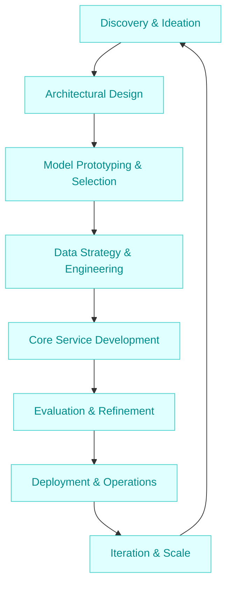

:::info[Value Proposition]
Provide a structured, end-to-end methodology for designing, developing, and deploying a new Generative AI (GenAI) or Large Language Model (LLM) powered service from scratch. This ensures foundational robustness, scalability, and alignment with business objectives.
:::

## Overview

Developing a greenfield AI/LLM service presents unique opportunities and challenges. Unlike integrating AI into existing systems, a greenfield project allows for optimal architectural choices, technology stack selection, and a strong emphasis on AI-first design principles. This scenario guides through the comprehensive lifecycle of building such a service, ensuring responsible AI practices and efficient resource utilization from inception.

**Goal**: Successfully launch a high-quality, scalable, and impactful greenfield AI/LLM service that addresses a specific user need or business problem.
**Anti-pattern**: Rushing into model selection or development without clear problem definition, architectural planning, and robust evaluation strategies, leading to costly reworks or project failure.

---

## When to Use

| ✅ Use This Pattern When...                                 | 🚫 Do Not Use When...                                  |
| :--------------------------------------------------------- | :----------------------------------------------------- |
| You are starting a completely new AI/LLM initiative        | You are integrating an AI feature into an existing mature application |
| There is no existing infrastructure or codebase to leverage | The primary goal is to refactor or improve an existing AI component |
| You have the flexibility to define the entire solution stack | The project scope is limited to a small, isolated feature enhancement |

---

## The Greenfield Service Development Loop (8 Steps)

This iterative process covers the key phases of building a new AI/LLM service, emphasizing a balanced approach between innovation and engineering discipline.

| Step                      | Focus                                 | Key Output                           | Risks if Skipped              |
| :------------------------ | :------------------------------------ | :----------------------------------- | :---------------------------- |
| **1. Discovery & Ideation** | Define problem, user needs, value proposition | Problem Statement, Initial Use Cases | Building the wrong product    |
| **2. Architectural Design** | High-level system design, tech stack choices | System Architecture, Tech Stack      | Scalability, maintainability issues |
| **3. Model Prototyping & Selection** | Experiment with models, establish performance baseline | Chosen Model, Baseline Metrics       | Suboptimal model performance  |
| **4. Data Strategy & Engineering** | Plan data acquisition, processing, and storage | Data Pipeline Design, Annotated Data | Data quality issues, bias     |
| **5. Core Service Development** | Build core logic, APIs, and integrations | Functional MVP, API Endpoints        | Delays, feature creep         |
| **6. Evaluation & Refinement** | Rigorous testing, A/B testing, user feedback | Verified Performance, Refined UX     | Poor user experience, model issues |
| **7. Deployment & Operations** | Set up infrastructure, monitoring, CI/CD | Production Environment, Observability | Downtime, operational overhead |
| **8. Iteration & Scale**   | Monitor, collect feedback, plan next features | Backlog, Performance Improvements    | Stagnation, missed opportunities |

---

## Visual Summary of the Loop

---

## Why This Process is Critical for Professional Work

-   **Strategic Alignment**: Ensures the new service is deeply aligned with organizational goals and user value from the outset.
-   **Risk Mitigation**: Proactive identification and mitigation of technical, ethical, and operational risks inherent in AI systems.
-   **Scalability & Maintainability**: Establishes a robust architectural foundation that can grow and evolve with future demands.
-   **Data-Driven Decisions**: Emphasizes the importance of data quality, management, and continuous evaluation for optimal AI performance.
-   **Operational Excellence**: Integrates deployment, monitoring, and feedback loops for reliable and performant production systems.

---

## Common Pitfalls

| Pitfall                   | Impact                                   | Correction                                     |
| :------------------------ | :--------------------------------------- | :--------------------------------------------- |
| **Undefined Problem Space** | Building a solution without a clear need, lack of adoption. | Invest heavily in Discovery & Ideation; validate problem/solution with users early. |
| **Premature Optimization/Scaling** | Over-engineering, delays, wasted resources. | Start with an MVP, focus on core value, scale only when justified by usage/demand. |
| **Ignoring Data Strategy** | Poor model performance, bias, regulatory compliance issues. | Prioritize data governance, quality, and lifecycle management from day one. |
| **Lack of MLOps Discipline** | Manual deployments, unreliable models, difficulty debugging in production. | Establish CI/CD, automated testing, model versioning, and robust monitoring. |
| **Over-reliance on Off-the-Shelf Models** | Limited customization, suboptimal performance, vendor lock-in. | Understand model limitations; explore fine-tuning or custom model development where appropriate. |

---

## Quick Links

- Handbook Method: [Overview](/docs/01-handbook-method/01-overview)
- Design an API: [Execution Pattern](/docs/02-execution-patterns/03-design-an-api)
- Model Selection: [Handbook Method](/docs/01-handbook-method/03-model-selection)

## Next Step

Consider the process of [Feature Addition](/docs/03-professional-scenarios/00-scenarios-index) to an existing service or system.
