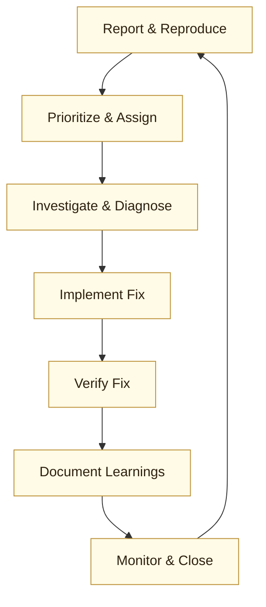

:::info[Value Proposition]
Establish a consistent and effective process for identifying, prioritizing, and resolving bugs in Generative AI applications. This ensures stability, reliability, and continuous improvement of AI-powered features.
:::

## Overview

Bugs in Generative AI (GenAI) applications can manifest in various ways, from subtle model drifts and unexpected outputs (hallucinations) to integration failures and performance bottlenecks. A structured bug triage and fix process is crucial for maintaining the quality and trustworthiness of AI systems. This scenario outlines a systematic approach, adapting traditional software development practices to the unique challenges posed by AI.

**Goal**: Efficiently diagnose, prioritize, and resolve bugs in GenAI applications to maintain high-quality user experiences and system integrity.
**Anti-pattern**: Reacting to every bug in an ad-hoc manner, leading to inconsistent fixes, missed regressions, and a reactive development cycle.

---

## When to Use

| ✅ Use This Pattern When...                                 | 🚫 Do Not Use When...                                  |
| :--------------------------------------------------------- | :----------------------------------------------------- |
| You encounter unexpected or incorrect AI model behavior    | You are developing a completely new feature (use a feature development pattern) |
| A GenAI feature is underperforming or failing              | The issue is a known limitation that cannot be fixed (document it) |
| Users report issues related to AI outputs or integrations  | You are simply monitoring system health without an identified problem |

---

## The Bug Triage & Fix Loop (7 Steps)

This iterative process helps manage the lifecycle of a bug, from its initial report to its verified resolution.

| Step                      | Focus                                 | Key Output                           | Risks if Skipped              |
| :------------------------ | :------------------------------------ | :----------------------------------- | :---------------------------- |
| **1. Report & Reproduce** | Capture details, confirm existence      | Clear Bug Report, Reproduction Steps | Misunderstanding the problem  |
| **2. Prioritize & Assign**| Assess impact and urgency             | Priority Level, Assigned Owner       | Delaying critical fixes       |
| **3. Investigate & Diagnose** | Root cause analysis                   | Diagnosis, Potential Solutions       | Fixing symptoms, not causes   |
| **4. Implement Fix**      | Develop and test the solution         | Code Changes, Unit/Integration Tests | Introducing new bugs          |
| **5. Verify Fix**         | Confirm resolution, prevent regression  | Passing Tests, Verified Resolution   | Unstable releases, recurring bugs |
| **6. Document Learnings** | Record insights for future prevention | Knowledge Base Update, Post-Mortem   | Repeating past mistakes       |
| **7. Monitor & Close**    | Observe in production, formally close | Stable System, Closed Ticket         | Undetected regressions, premature closure |

---

## Visual Summary of the Loop

---

## Why This Process is Critical for Professional Work

-   **System Stability**: Ensures that critical GenAI features remain functional and reliable, minimizing downtime and user frustration.
-   **Resource Optimization**: Directs efforts towards the most impactful bugs, preventing wasted time on less critical issues.
-   **Knowledge Growth**: Promotes a culture of learning from failures, feeding insights back into development to prevent similar bugs.
-   **Trust & Credibility**: Demonstrates a commitment to quality and responsiveness, building user trust in the AI system.
-   **Accountability**: Clearly defines roles and responsibilities at each stage, ensuring ownership and follow-through.

---

## Common Pitfalls

| Pitfall                   | Impact                                   | Correction                                     |
| :------------------------ | :--------------------------------------- | :--------------------------------------------- |
| **Incomplete Bug Reports** | Difficulty reproducing, misdiagnosis.    | Enforce detailed bug report templates (e.g., reproduction steps, expected vs. actual behavior). |
| **Skipping Root Cause Analysis** | Fixing symptoms, leading to recurring bugs or new issues. | Emphasize thorough investigation and use debugging tools, logs, and model explainability techniques. |
| **Lack of Automated Testing** | Regressions go unnoticed, fixes introduce new problems. | Invest in robust unit, integration, and end-to-end tests for AI logic and integrations. |
| **Ignoring Model Drift**   | Gradual degradation of AI performance, subtle incorrect outputs. | Implement continuous monitoring for model performance metrics and set up alerts for deviations. |
| **Poor Documentation of Fixes** | Lost institutional knowledge, inability to prevent future similar bugs. | Maintain a knowledge base of resolved issues, their causes, and solutions. |

---

## Quick Links

- Handbook Method: [Overview](/docs/01-handbook-method/01-overview)
- Debug with Evidence: [Execution Pattern](/docs/02-execution-patterns/06-debug-with-evidence)
- Review & Interrogation: [Handbook Method](/docs/01-handbook-method/review-and-interrogation)

## Next Step

Explore other [Professional Scenarios](/docs/03-professional-scenarios/00-scenarios-index) or delve into [Debugging with Evidence](/docs/02-execution-patterns/06-debug-with-evidence).
