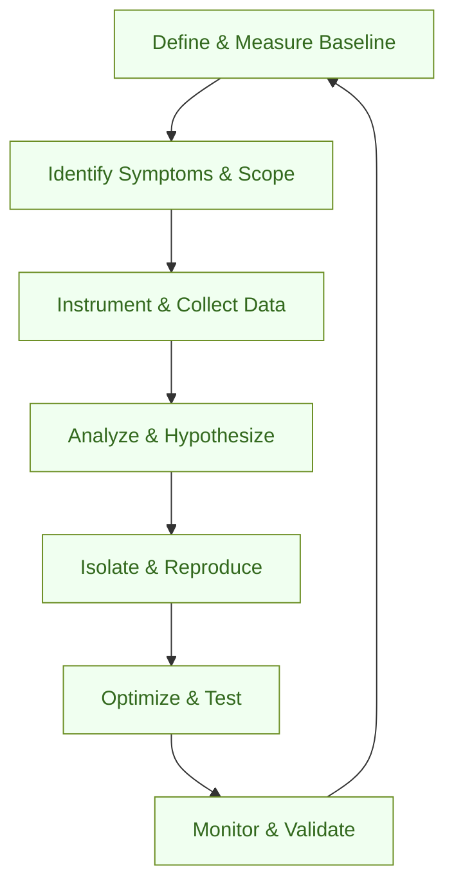

:::info[Value Proposition]
Provide a structured, data-driven methodology for identifying, diagnosing, and resolving performance bottlenecks in Generative AI (GenAI) and Large Language Model (LLM) powered applications. This ensures optimal response times, efficient resource utilization, and a superior user experience.
:::

## Overview

Performance issues in AI/LLM applications can stem from various sources: slow model inference, inefficient data processing, suboptimal hardware utilization, network latency, or poorly optimized application code. A systematic investigation process is crucial to pinpoint the root cause and apply effective optimizations. This scenario adapts general performance debugging techniques to the specific challenges posed by AI/LLM workloads.

**Goal**: Achieve target performance metrics (e.g., latency, throughput, resource consumption) for AI/LLM features and applications, ensuring a smooth and responsive user experience.
**Anti-pattern**: Guessing at performance problems, applying random optimizations without measurement, or focusing solely on model speed without considering the end-to-end system.

---

## When to Use

| ✅ Use This Pattern When...                                 | 🚫 Do Not Use When...                                  |
| :--------------------------------------------------------- | :----------------------------------------------------- |
| User reports of slow AI feature responses                  | The issue is clearly a functional bug unrelated to speed |
| System metrics show high latency or low throughput         | You are still in the early prototyping phase where performance is not yet critical |
| Resource consumption (CPU, GPU, memory) is unexpectedly high | The performance degradation is caused by external, unmanaged dependencies |
| You need to meet specific SLA/SLO requirements for AI services | The system is already meeting all performance targets |

---

## The Performance Investigation Loop (7 Steps)

This iterative process guides the diagnosis and resolution of performance issues in AI/LLM systems.

| Step                      | Focus                                 | Key Output                           | Risks if Skipped              |
| :------------------------ | :------------------------------------ | :----------------------------------- | :---------------------------- |
| **1. Define & Measure Baseline** | Establish current performance metrics, define target SLOs | Current Metrics, Target SLOs         | Optimizing without a clear goal |
| **2. Identify Symptoms & Scope** | Observe performance degradation, narrow down affected areas | Symptom Description, Scope Definition | Chasing non-existent problems |
| **3. Instrument & Collect Data** | Add logging, tracing, profiling tools to gather relevant data | Performance Traces, System Metrics   | Insufficient data for diagnosis |
| **4. Analyze & Hypothesize** | Review collected data, form hypotheses about root causes | Root Cause Hypotheses, Evidence      | Misdiagnosis, wasted effort   |
| **5. Isolate & Reproduce** | Create minimal test cases to reliably reproduce bottleneck | Reproducible Test Case             | Fixing non-reproducible issues |
| **6. Optimize & Test**    | Implement changes, measure impact, ensure no regressions | Optimized Code/Config, Verified Gains | Introducing new performance issues |
| **7. Monitor & Validate** | Deploy changes, continuously monitor in production, validate fix | Stable Performance, Ongoing Metrics  | Unnoticed re-introductions of issues |

---

## Visual Summary of the Loop

---

## Why This Process is Critical for Professional Work

-   **User Satisfaction**: Fast and responsive AI applications directly contribute to a positive user experience and higher engagement.
-   **Cost Efficiency**: Optimizing resource usage (especially expensive GPUs) can significantly reduce operational costs for AI/LLM services.
-   **Scalability**: Well-performing systems can handle higher loads and more users without degradation, enabling business growth.
-   **Competitive Advantage**: Superior performance can differentiate an AI product in the market.
-   **Reliability**: Understanding and managing performance ensures that the system consistently meets its service level objectives (SLOs).

---

## Common Pitfalls

| Pitfall                   | Impact                                   | Correction                                     |
| :------------------------ | :--------------------------------------- | :--------------------------------------------- |
| **Premature Optimization** | Wasted time optimizing non-bottlenecks, introduces complexity. | Always measure first; focus on areas identified by profiling. |
| **Lack of Profiling Tools** | Guessing at root causes, extended diagnosis time. | Invest in robust profiling, tracing, and monitoring tools (e.g., cProfile, Nsight Systems, Prometheus, Grafana). |
| **Ignoring Data Pipeline Performance** | Slow data ingestion/processing bottlenecks the entire AI workflow. | Profile the entire data pipeline, from input to model inference to output. |
| **Suboptimal Model Deployment** | Inefficient serving of AI models (e.g., lack of batching, quantization). | Explore model optimization techniques (e.g., ONNX, TensorRT, quantization), efficient serving frameworks. |
| **Not Accounting for Distributed System Complexity** | Performance issues in one microservice or component affect the whole. | Use distributed tracing and logging to understand inter-service communication and dependencies. |

---

## Quick Links

- Handbook Method: [Overview](/docs/01-handbook-method/01-overview)
- Debug with Evidence: [Execution Pattern](/docs/02-execution-patterns/06-debug-with-evidence)
- Evaluation: [Handbook Method](/docs/01-handbook-method/evaluation)

## Next Step

Revisit the [Handbook Method Overview](/docs/01-handbook-method/01-overview) or explore other [Professional Scenarios](/docs/03-professional-scenarios/00-scenarios-index).
