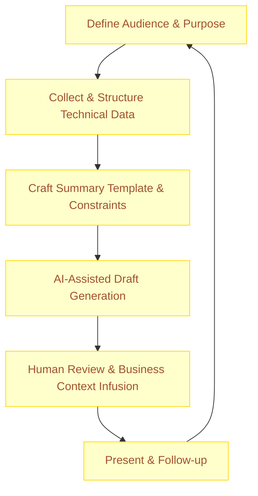

:::info[Value Proposition]
Bridge the communication gap between technical teams and non-technical leadership by leveraging Generative AI (GenAI) and Large Language Models (LLM) to translate complex technical realities (e.g., technical debt, incident post-mortems, architectural decisions) into clear, concise, and business-focused executive summaries. This fosters better understanding, alignment, and informed decision-making at all levels.
:::

## Overview

Technical teams often struggle to communicate the impact of their work, challenges, or decisions to executive leadership in a way that resonates with business objectives. This can lead to misaligned priorities, underfunded initiatives, or a lack of appreciation for technical efforts. This scenario demonstrates how AI/LLM can be an invaluable tool for distilling verbose technical reports, complex data, and engineering discussions into digestible executive summaries, highlighting business implications, risks, and strategic opportunities.

**Goal**: Transform detailed technical information into a clear, actionable executive summary that enables leadership to make informed strategic decisions, understand technical constraints, and support engineering initiatives.
**Anti-pattern**: Presenting raw technical data or overly detailed explanations to leadership, leading to confusion, disengagement, and a perception that engineering is not aligned with business goals.

---

## When to Use

| ✅ Use This Pattern When...                                 | 🚫 Do Not Use When...                                  |
| :--------------------------------------------------------- | :----------------------------------------------------- |
| Reporting on the impact of technical debt on business goals | The technical information is simple enough to be summarized manually without risk of misinterpretation |
| Summarizing incident post-mortems for executive review     | The communication requires a deep, empathetic human touch or involves highly sensitive political messaging |
| Explaining complex architectural changes and their strategic value | The summary must be purely factual and AI's potential for subtle inaccuracies is unacceptable (use AI for drafting, human for final fact-check) |
| Translating engineering metrics (e.g., DORA metrics) into business outcomes | You are delivering bad news that requires delicate, personal phrasing and direct human interaction |

---

## The AI-Assisted Executive Summary Generation Loop (6 Steps)

This iterative process leverages AI for efficient and impactful communication with leadership.

| Step                      | Focus                                 | Key Output                           | Risks if Skipped              |
| :------------------------ | :------------------------------------ | :----------------------------------- | :---------------------------- |
| **1. Define Audience & Purpose** | Understand executive's priorities, decision-making context | Executive Profile, Communication Goal| Irrelevant summary, missed key points |
| **2. Collect & Structure Technical Data** | Gather reports, metrics, architectural diagrams, incident timelines | Structured Technical Input           | AI generating superficial or incorrect summaries |
| **3. Craft Summary Template & Constraints** | Define desired sections (e.g., "Key Takeaways," "Business Impact," "Recommendations") | Template Spec, Tone Constraints      | Inconsistent messaging, lacking business focus |
| **4. AI-Assisted Draft Generation** | AI distills technical data into an executive summary draft | Draft Executive Summary            | Hallucinations, misinterpretations of data |
| **5. Human Review & Business Context Infusion** | Leaders/SMEs review for accuracy, add strategic context, refine messaging | Polished Executive Summary           | Technical inaccuracies, lack of business relevance |
| **6. Present & Follow-up** | Deliver summary, engage in discussion, track decision/action | Informed Decisions, Action Items     | Misunderstanding, no clear outcomes |

---

## Visual Summary of the Loop

---

## Why This Process is Critical for Professional Work

-   **Strategic Alignment**: Ensures leadership understands the 'why' behind technical efforts, aligning them with business strategy.
-   **Informed Decision-Making**: Provides executives with concise, relevant information to make better strategic choices.
-   **Enhanced Communication**: Bridges the technical-business communication gap, fostering mutual understanding and trust.
-   **Efficiency**: Saves significant time for both technical leaders drafting summaries and executives consuming them.
-   **Empowerment**: Enables technical teams to effectively advocate for resources and initiatives by clearly articulating business value.

---

## Common Pitfalls

| Pitfall                   | Impact                                   | Correction                                     |
| :------------------------ | :--------------------------------------- | :--------------------------------------------- |
| **AI misinterpreting technical nuances** | Summary contains factual errors or misrepresents technical realities. | Strong human review by technical experts and final sign-off are non-negotiable. Provide AI with a glossary of terms. |
| **Summary lacks business context** | Executives don't see the relevance; summary becomes another technical report. | Explicitly feed AI business objectives and strategic priorities. Human review must infuse strategic context. |
| **Over-generalization or vagueness** | Summary is too high-level to be actionable. | Prompt AI to include key metrics, specific examples, and quantifiable impacts where available. |
| **Ignoring sensitive political implications** | AI-generated summary inadvertently causes internal conflict or misrepresentation. | Human review must include assessment of political landscape and careful phrasing of sensitive topics. |

---

## Quick Links

- Handbook Method: [Overview](/docs/01-handbook-method/01-overview)
- Review & Interrogation: [Handbook Method](/docs/01-handbook-method/review-and-interrogation)
- Risks Production Challenges: [Handbook Method](/docs/01-handbook-method/risks-production-challenges)

## Next Step

Explore how to leverage AI for [Risk Register and Mitigations](/docs/03-professional-scenarios/00-scenarios-index).