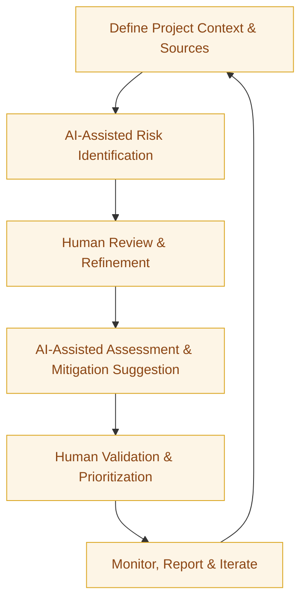

:::info[Value Proposition]
Enhance project risk management by leveraging Generative AI (GenAI) and Large Language Models (LLM) to assist in identifying, assessing, documenting, and proposing mitigation strategies for project risks, with a particular focus on those unique to AI/LLM initiatives. This leads to more comprehensive risk registers, proactive mitigation, and ultimately, higher project success rates.
:::

## Overview

Risk management is a cornerstone of successful project delivery. However, identifying all potential risks, especially in complex and rapidly evolving domains like AI/LLM, can be challenging. This scenario demonstrates how AI/LLM can augment human expertise by analyzing project documentation, technical specifications, and even industry reports to proactively surface risks, categorize them, and suggest intelligent mitigation strategies. This allows teams and leadership to maintain a robust and dynamic risk register.

**Goal**: Develop and maintain a comprehensive, up-to-date risk register with actionable mitigation plans, facilitating proactive decision-making and minimizing negative impacts on project scope, schedule, and quality.
**Anti-pattern**: Relying solely on anecdotal experience for risk identification, resulting in a superficial risk register that misses critical threats, especially those emerging from novel AI/LLM technologies.

---

## When to Use

| ✅ Use This Pattern When...                                 | 🚫 Do Not Use When...                                  |
| :--------------------------------------------------------- | :----------------------------------------------------- |
| Initiating new AI/LLM projects or features                 | Risk assessment is a simple, straightforward process for well-understood, mature projects |
| Conducting regular risk reviews for ongoing initiatives    | You need to assign accountability for risks to AI (human ownership is non-negotiable) |
| Documenting and managing risks for compliance or regulatory purposes | The project involves highly sensitive, classified information that cannot be shared with external AI models |
| Needing to identify novel risks associated with AI/LLM deployments (e.g., model drift, bias, hallucination) | The primary goal is to solely generate standard, generic risk templates without deep analysis |

---

## The AI-Assisted Risk Register & Mitigation Loop (6 Steps)

This iterative process integrates AI/LLM to bolster traditional risk management practices.

| Step                      | Focus                                 | Key Output                           | Risks if Skipped              |
| :------------------------ | :------------------------------------ | :----------------------------------- | :---------------------------- |
| **1. Define Project Context & Sources** | Understand project scope, objectives, relevant documentation for AI analysis | Project Brief, Data Sources          | AI generating irrelevant risks |
| **2. AI-Assisted Risk Identification** | AI analyzes project data, brainstorms potential risks (technical, operational, ethical, market) | Draft Risk List                      | Missing critical or novel risks |
| **3. Human Review & Refinement** | SMEs validate AI-generated risks, add context, categorize, remove duplicates | Refined Risk List                    | Propagation of AI errors, missed nuances |
| **4. AI-Assisted Assessment & Mitigation Suggestion** | AI assesses likelihood/impact, suggests mitigation actions | Risk Register with Mitigations       | Suboptimal or unrealistic mitigations |
| **5. Human Validation & Prioritization** | Leadership/SMEs validate assessments, prioritize risks, finalize actions | Prioritized Risk Register            | Misallocation of resources for mitigation |
| **6. Monitor, Report & Iterate** | AI monitors for trigger events, assists in status updates, re-assessment | Dynamic Risk Register, Status Reports| Stale risks, missed emerging threats |

---

## Visual Summary of the Loop

---

## Why This Process is Critical for Professional Work

-   **Comprehensive Risk Coverage**: AI can help identify a broader range of risks, including subtle or novel ones specific to AI/LLM technologies.
-   **Proactive Mitigation**: Early and thorough identification enables proactive planning, reducing the impact of unforeseen events.
-   **Informed Decision-Making**: Leadership gains a clearer understanding of potential project threats and available mitigation strategies.
-   **Efficiency**: Automates initial risk brainstorming and documentation, freeing up human experts for deeper analysis and strategic planning.
-   **Compliance & Governance**: Ensures that project risks, especially ethical and regulatory ones in AI, are systematically addressed and documented.

---

## Common Pitfalls

| Pitfall                   | Impact                                   | Correction                                     |
| :------------------------ | :--------------------------------------- | :--------------------------------------------- |
| **AI generating generic or obvious risks** | Risk register lacks actionable insights for the specific project. | Provide AI with highly specific project details, technical specs, and past project data for context. |
| **Over-reliance on AI for ethical risk assessment** | AI may not fully grasp societal or ethical nuances, leading to blind spots. | Ethical AI experts and diverse human teams are crucial for validating and enriching AI-identified ethical risks. |
| **Underestimating AI-specific risks** | Failing to identify unique risks like model drift, data bias, or adversarial attacks. | Explicitly prompt AI to consider these categories; integrate Responsible AI frameworks into risk assessment. |
| **AI suggesting unrealistic mitigations** | Mitigation plans are unfeasible, costly, or ineffective. | Human SMEs must validate all proposed mitigations for practicality, cost-effectiveness, and real-world impact. |

---

## Quick Links

- Handbook Method: [Overview](/docs/01-handbook-method/01-overview)
- Risks Production Challenges: [Handbook Method](/docs/01-handbook-method/risks-production-challenges)
- Threat Model Lite: [Responsible AI](/docs/05-responsible-ai/threat-model-lite)
- Governance and Accountability: [Responsible AI](/docs/05-responsible-ai/governance-and-accountability)

## Next Step

Explore how to leverage AI for [Roadmap and Trade-offs](/docs/03-professional-scenarios/00-scenarios-index).