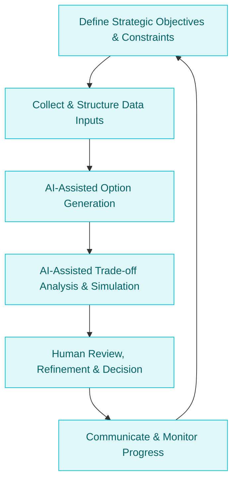

:::info[Value Proposition]
Empower strategic planning and decision-making by leveraging Generative AI (GenAI) and Large Language Models (LLM) to assist in analyzing complex options, simulating potential impacts, and visualizing various roadmap scenarios and their inherent trade-offs. This facilitates data-driven conversations, stakeholder alignment, and the ability to adapt quickly to changing market conditions.
:::

## Overview

Roadmap planning involves balancing competing priorities, limited resources, and uncertain futures. Identifying optimal paths and transparently communicating trade-offs to stakeholders is crucial. This scenario demonstrates how AI/LLM can act as a powerful co-pilot for leaders, product managers, and strategists. By feeding AI market data, internal capabilities, customer feedback, and strategic objectives, it can generate alternative roadmap options, highlight their pros and cons, and even simulate potential outcomes, enabling more informed and agile decision-making.

**Goal**: Develop clear, data-informed roadmaps that articulate strategic choices and inherent trade-offs, fostering stakeholder alignment and enabling dynamic adaptation to new information.
**Anti-pattern**: Creating static, inflexible roadmaps based on gut feelings or limited data, leading to missed opportunities, misaligned efforts, and an inability to respond to market shifts.

---

## When to Use

| ✅ Use This Pattern When...                                 | 🚫 Do Not Use When...                                  |
| :--------------------------------------------------------- | :----------------------------------------------------- |
| Planning quarterly or annual product/initiative roadmaps   | The decision involves highly sensitive, unshareable internal politics or confidential negotiations |
| Evaluating multiple strategic options with complex interdependencies | The primary goal is to generate simple project timelines without deep analysis or trade-off consideration |
| Communicating strategic choices and their rationale to diverse stakeholders | The AI is expected to *make* the final strategic decision (human leadership is non-negotiable) |
| Needing to quickly adapt roadmaps in response to market changes or new data | The data required for analysis is scarce, unreliable, or impossible to structure for AI input |

---

## The AI-Assisted Roadmap & Trade-off Loop (6 Steps)

This iterative process integrates AI/LLM into strategic planning and decision-making.

| Step                      | Focus                                 | Key Output                           | Risks if Skipped              |
| :------------------------ | :------------------------------------ | :----------------------------------- | :---------------------------- |
| **1. Define Strategic Objectives & Constraints** | Clarify goals, available resources, ethical boundaries | Strategic Brief, Constraint Spec     | AI generating misaligned options |
| **2. Collect & Structure Data Inputs** | Gather market research, customer feedback, internal capabilities, competitor analysis | Curated Data Lake/Inputs             | AI making decisions based on incomplete/biased data |
| **3. AI-Assisted Option Generation** | AI generates multiple strategic roadmap options, features, initiatives | Alternative Roadmaps                 | AI generating generic or unfeasible options |
| **4. AI-Assisted Trade-off Analysis & Simulation** | AI analyzes pros/cons of options, simulates potential impacts (cost, time, market) | Trade-off Matrix, Impact Forecasts   | AI misinterpreting complex interactions |
| **5. Human Review, Refinement & Decision** | Leaders/SMEs evaluate AI output, apply human judgment, make final decisions | Chosen Roadmap, Decision Rationale   | Over-reliance on AI, missing human intuition |
| **6. Communicate & Monitor Progress** | Share roadmap, track key metrics, re-evaluate as conditions change | Public/Internal Roadmap, KPI Dashboards | Misaligned stakeholders, stagnant plans |

---

## Visual Summary of the Loop

---

## Why This Process is Critical for Professional Work

-   **Enhanced Decision Quality**: AI's ability to process vast amounts of data and explore numerous scenarios leads to more robust and informed decisions.
-   **Faster Strategic Iteration**: Accelerates the planning cycle, allowing organizations to adapt roadmaps more dynamically to market shifts.
-   **Objective Trade-off Analysis**: Provides a more data-driven and less emotional basis for evaluating difficult choices between strategic options.
-   **Improved Stakeholder Alignment**: Transparently generated options and analysis foster greater understanding and buy-in from diverse stakeholders.
-   **Reduced Bias**: AI can help surface blind spots or biases inherent in purely human-driven strategic planning.

---

## Common Pitfalls

| Pitfall                   | Impact                                   | Correction                                     |
| :------------------------ | :--------------------------------------- | :--------------------------------------------- |
| **AI generating unfeasible or irrelevant options** | Wasted time reviewing and discarding AI suggestions. | Provide clear constraints on resources, technology, and market feasibility; fine-tune AI on past successful strategies. |
| **Over-reliance on AI for subjective judgments** | Roadmaps lack vision, creativity, or human intuition. | Human leaders define the vision and values; AI assists with the logical exploration of how to achieve them. |
| **Data quality issues leading to flawed analysis** | AI's analysis is based on incorrect, incomplete, or biased data, leading to poor decisions. | Implement rigorous data governance for all inputs; ensure data is clean, relevant, and representative. |
| **Inability to explain AI-generated rationale** | Stakeholders distrust recommendations they don't understand. | Use AI to generate explanations for its suggestions; focus human review on interpreting and communicating the rationale. |

---

## Quick Links

- Handbook Method: [Overview](/docs/01-handbook-method/01-overview)
- Risks Production Challenges: [Handbook Method](/docs/01-handbook-method/risks-production-challenges)
- Intent Spec: [Handbook Method](/docs/01-handbook-method/intent-spec)
- Constraint Spec: [Handbook Method](/docs/01-handbook-method/constraint-spec)

## Next Step

Return to the [Main Scenarios Index](/docs/03-professional-scenarios/00-scenarios-index) to explore other professional challenges.