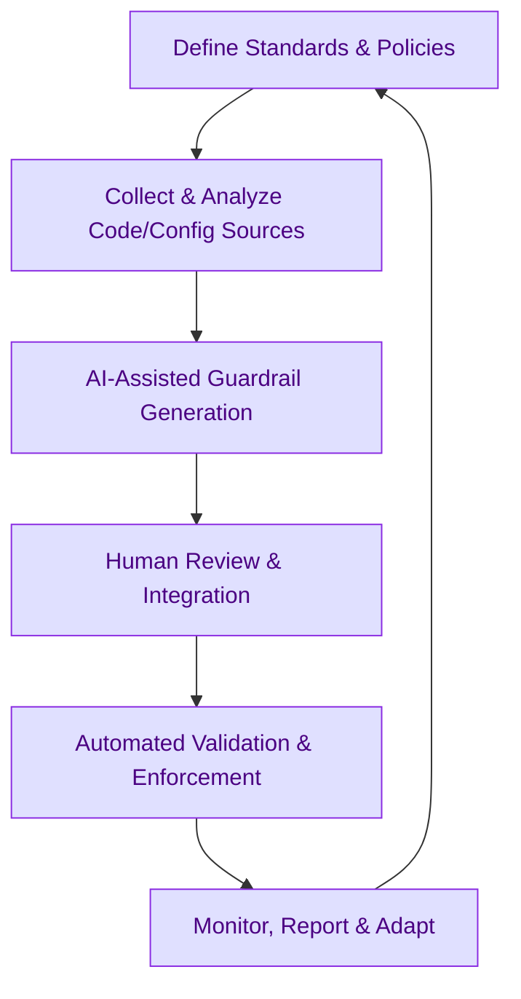

:::info[Value Proposition]
Enhance the reliability, security, and efficiency of CI/CD pipelines by leveraging Generative AI (GenAI) and Large Language Models (LLM) to define, implement, and monitor automated guardrails. This proactive approach ensures code quality, compliance, and operational best practices are enforced from development to deployment, minimizing human error and accelerating safe software delivery.
:::

## Overview

CI/CD pipelines are the backbone of modern software delivery, automating everything from code compilation and testing to deployment. Implementing robust guardrails within these pipelines is critical for maintaining quality, security, and compliance. This scenario demonstrates how AI/LLM can assist platform and DevOps teams in generating, validating, and continually improving these guardrails by analyzing code, configuration, and security policies. AI can help catch subtle misconfigurations or deviations before they reach production.

**Goal**: Establish a highly automated and secure CI/CD pipeline with intelligent guardrails that proactively prevent common issues, enforce best practices, and adapt to evolving technical and regulatory requirements.
**Anti-pattern**: Relying on manual code reviews for every change or defining guardrails as static, inflexible rules that don't scale or adapt to new threats and development patterns.

---

## When to Use

| ✅ Use This Pattern When...                                 | 🚫 Do Not Use When...                                  |
| :--------------------------------------------------------- | :----------------------------------------------------- |
| Designing new CI/CD pipelines or enhancing existing ones   | The organization has highly bespoke, non-standardized tooling that AI cannot easily interface with |
| Needing to enforce coding standards, security policies, or compliance rules across multiple teams | The primary goal is to generate marketing material (use a communications scenario) |
| Automating code reviews for common issues (e.g., style, basic security vulnerabilities) | AI is expected to replace human security experts for critical vulnerability assessment |
| Detecting potential misconfigurations in Infrastructure as Code (IaC) | The CI/CD pipeline is extremely simple and already fully optimized manually |

---

## The AI-Assisted CI Pipeline & Guardrails Loop (6 Steps)

This iterative process integrates AI/LLM into the definition and enforcement of CI/CD guardrails.

| Step                      | Focus                                 | Key Output                           | Risks if Skipped              |
| :------------------------ | :------------------------------------ | :----------------------------------- | :---------------------------- |
| **1. Define Standards & Policies** | Specify coding standards, security rules, compliance mandates | Style Guide, Security Policy, Compliance Matrix | Inconsistent quality, security vulnerabilities |
| **2. Collect & Analyze Code/Config Sources** | Gather code, IaC, existing pipeline definitions for AI analysis | Source Code Corpus, Configuration Map| AI generating irrelevant or incorrect guardrails |
| **3. AI-Assisted Guardrail Generation** | AI drafts rules, linters, static analysis configurations based on policies | Draft Guardrail Rules, Pipeline Steps| Ineffective guardrails, false positives |
| **4. Human Review & Integration** | DevOps/Security Engineers review, refine, integrate guardrails into pipeline | Integrated Guardrails, Pipeline Logic| Manual errors, overlooked critical rules |
| **5. Automated Validation & Enforcement** | Pipelines run AI-generated/reviewed guardrails, block non-compliant changes | Enforcement Reports, Blocked Builds  | Non-compliant code reaching production |
| **6. Monitor, Report & Adapt** | AI monitors guardrail effectiveness, suggests improvements based on patterns | Guardrail Performance Metrics, Alerts| Stale rules, missed evolving threats |

---

## Visual Summary of the Loop

---

## Why This Process is Critical for Professional Work

-   **Proactive Quality Assurance**: Catches issues early in the development lifecycle, reducing cost and effort of fixes.
-   **Enhanced Security**: Enforces security best practices automatically, reducing the attack surface and vulnerability exposure.
-   **Compliance Adherence**: Ensures regulatory and internal compliance standards are met across all code and infrastructure.
-   **Accelerated Delivery**: Builds developer confidence through automated checks, enabling faster and safer deployments.
-   **Standardization**: Promotes consistent code quality and operational practices across different teams and projects.

---

## Common Pitfalls

| Pitfall                   | Impact                                   | Correction                                     |
| :------------------------ | :--------------------------------------- | :--------------------------------------------- |
| **AI generating overly restrictive or noisy rules** | Developers circumvent rules, CI/CD becomes a bottleneck, "alert fatigue". | Start with a few high-impact guardrails, gradually expand. Human review must prioritize developer experience. |
| **False positives/negatives in AI-generated checks** | Trust in automated checks erodes, real issues are missed. | Fine-tune AI models with feedback from human reviews; combine AI checks with other static analysis tools. |
| **Ignoring legacy code or existing exceptions** | Blanket rules break existing functionality, causing frustration. | AI should analyze existing code to learn patterns and suggest context-aware rules or appropriate exceptions. |
| **Lack of transparent reporting on guardrail actions** | Developers don't understand why their builds are failing. | AI-generated feedback messages in the pipeline should be clear, actionable, and link to documentation. |

---

## Quick Links

- Handbook Method: [Overview](/docs/01-handbook-method/01-overview)
- CI/CD Pipeline Migration: [Platform & Ops Scenario](/docs/03-professional-scenarios/00-scenarios-index)
- Responsible AI: [Threat Model Lite](/docs/05-responsible-ai/threat-model-lite)

## Next Step

Explore how AI can assist with [Infra as Code Changes](/docs/03-professional-scenarios/00-scenarios-index).