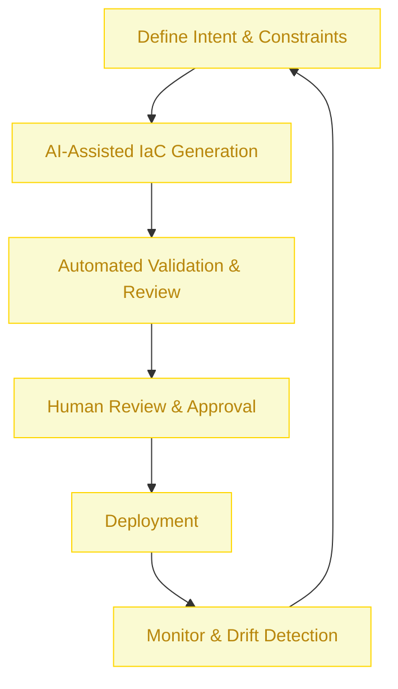

:::info[Value Proposition]
Safely and efficiently manage changes to Infrastructure as Code (IaC) configurations using Generative AI (GenAI) and Large Language Models (LLM). This accelerates the generation of new infrastructure components, validates proposed changes against best practices and security policies, and helps prevent costly misconfigurations or security vulnerabilities in cloud environments.
:::

## Overview

Managing Infrastructure as Code (IaC) is critical for cloud environments, but manual reviews of large or complex changes can be time-consuming and prone to human error, potentially leading to security gaps, cost overruns, or service disruptions. This scenario demonstrates how AI/LLM can augment DevOps and platform engineering teams by generating IaC configurations, analyzing pull requests for potential issues, and suggesting remediations, thus maintaining the integrity and security of infrastructure deployments.

**Goal**: Implement IaC changes with increased speed, accuracy, and adherence to security/compliance policies, significantly reducing the risk of infrastructure-related incidents and optimizing cloud resource utilization.
**Anti-pattern**: Manually drafting complex IaC configurations or relying solely on human review for highly detailed changes, leading to slow delivery, inconsistent deployments, and overlooked vulnerabilities.

---

## When to Use

| ✅ Use This Pattern When...                                 | 🚫 Do Not Use When...                                  |
| :--------------------------------------------------------- | :----------------------------------------------------- |
| Generating new infrastructure modules or components from high-level requirements | The IaC change is trivial (e.g., updating a tag) and fully automated by existing tools |
| Validating IaC pull requests for security vulnerabilities, compliance deviations, or cost implications | The AI is expected to *approve* infrastructure changes without human oversight (human review is critical) |
| Migrating infrastructure between cloud providers or IaC tools (e.g., CloudFormation to Terraform) | The infrastructure involves highly sensitive, classified data that cannot be exposed to external AI models |
| Needing to quickly prototype infrastructure for new projects or environments | You are performing a "big bang" migration that requires deep human architectural planning beyond AI's current capabilities |

---

## The AI-Assisted IaC Change Management Loop (6 Steps)

This iterative process integrates AI/LLM into the lifecycle of Infrastructure as Code changes.

| Step                      | Focus                                 | Key Output                           | Risks if Skipped              |
| :------------------------ | :------------------------------------ | :----------------------------------- | :---------------------------- |
| **1. Define Intent & Constraints** | Specify desired infrastructure, security policies, cost limits | Infrastructure Intent Spec, Constraint Spec | Misaligned infrastructure, security gaps |
| **2. AI-Assisted IaC Generation** | AI drafts Terraform/CloudFormation code based on intent and constraints | Draft IaC Configuration              | Inefficient or insecure code, hallucinations |
| **3. Automated Validation & Review** | IaC linter, static analysis tools, and AI review proposed changes | Validation Report, AI Review Comments| Deploying misconfigurations, vulnerabilities |
| **4. Human Review & Approval** | Engineers review AI-generated code and validation reports, make adjustments | Approved IaC Changes                 | Blindly trusting AI, missed critical issues |
| **5. Deployment**         | Apply IaC changes through established CI/CD pipelines | Updated Cloud Infrastructure         | Service disruptions, unmanaged resources |
| **6. Monitor & Drift Detection** | Monitor deployed infrastructure for configuration drift or new vulnerabilities | Drift Reports, Security Alerts       | Uncontrolled infrastructure, compliance gaps |

---

## Visual Summary of the Loop

---

## Why This Process is Critical for Professional Work

-   **Increased Speed & Efficiency**: Accelerates the generation and deployment of infrastructure, speeding up development cycles.
-   **Improved Security & Compliance**: Proactively identifies and mitigates security risks and compliance violations in IaC.
-   **Reduced Human Error**: Automates validation and checks, minimizing costly manual mistakes in infrastructure management.
-   **Cost Optimization**: Helps identify and prevent the deployment of over-provisioned or unoptimized resources.
-   **Consistency & Standardization**: Ensures IaC adheres to organizational best practices and architectural patterns.

---

## Common Pitfalls

| Pitfall                   | Impact                                   | Correction                                     |
| :------------------------ | :--------------------------------------- | :--------------------------------------------- |
| **AI generating insecure or non-compliant IaC** | Cloud environment exposed to vulnerabilities, regulatory fines. | Human security review is paramount. Integrate AI with existing security tooling (e.g., `checkov`, `tfsec`). |
| **AI misinterpreting intent, leading to incorrect IaC** | Deploying infrastructure that doesn't meet requirements or breaks existing systems. | Provide highly specific Intent and Constraint Specs. Use AI for drafting, not definitive generation without human validation. |
| **Ignoring the blast radius of IaC changes** | Changes impact production services unintentionally. | Implement dry runs (`terraform plan`), robust testing, and staged deployments. AI can help simulate impact. |
| **Over-reliance on AI for cost optimization** | AI may suggest optimizations that compromise performance or reliability. | Human engineers must balance cost efficiency with performance, reliability, and security requirements. |

---

## Quick Links

- Handbook Method: [Overview](/docs/01-handbook-method/01-overview)
- CI/CD Pipeline & Guardrails: [Platform & Ops Scenario](/docs/03-professional-scenarios/00-scenarios-index)
- Constraint Spec: [Handbook Method](/docs/01-handbook-method/constraint-spec)
- Threat Model Lite: [Responsible AI](/docs/05-responsible-ai/threat-model-lite)

## Next Step

Explore how AI can assist with [Incident Response](/docs/03-professional-scenarios/00-scenarios-index).