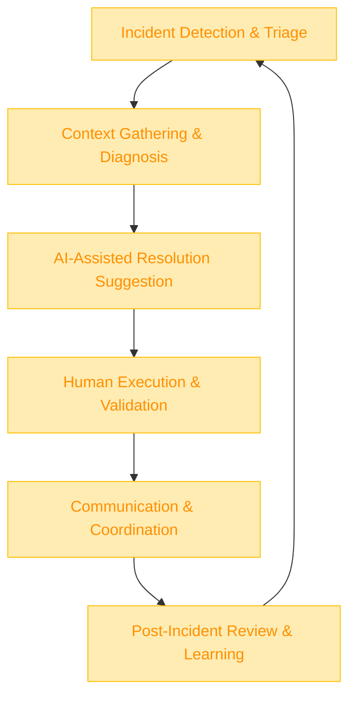

:::info[Value Proposition]
Expedite incident detection, diagnosis, communication, and resolution by leveraging Generative AI (GenAI) and Large Language Models (LLM) to assist on-call teams. This reduces Mean Time To Detect (MTTD) and Mean Time To Recover (MTTR), minimizes service impact, and improves the overall resilience of complex systems.
:::

## Overview

Incident response is a high-stakes, time-sensitive process where every minute counts. On-call engineers often face alert fatigue, a deluge of logs, and pressure to quickly diagnose and fix issues in unfamiliar parts of the system. This scenario demonstrates how AI/LLM can act as an intelligent assistant throughout the incident lifecycle, from correlating alerts and summarizing logs to suggesting runbook steps and drafting communication updates. This empowers human responders to focus on critical thinking and complex problem-solving.

**Goal**: Minimize the impact of incidents by accelerating diagnosis and resolution, improving communication, and automating routine tasks for on-call teams using AI/LLM.
**Anti-pattern**: Overwhelming on-call teams with raw data, irrelevant alerts, and manual processes, leading to burnout, delayed responses, and prolonged outages.

---

## When to Use

| ✅ Use This Pattern When...                                 | 🚫 Do Not Use When...                                  |
| :--------------------------------------------------------- | :----------------------------------------------------- |
| Existing systems generate a high volume of alerts or logs  | The incident requires highly sensitive, classified information that cannot be processed by AI |
| On-call teams struggle with alert fatigue or information overload | The AI is expected to take autonomous action in production systems without human oversight |
| You want to standardize incident communication (internal/external) | The incident involves legal or ethical nuances that AI cannot fully comprehend or advise on |
| Needing to quickly summarize complex log data or historical incident reports | You are developing highly experimental systems where AI assistance might introduce more confusion than clarity |

---

## The AI-Assisted Incident Response Loop (6 Steps)

This iterative process integrates AI/LLM to support human incident responders.

| Step                      | Focus                                 | Key Output                           | Risks if Skipped              |
| :------------------------ | :------------------------------------ | :----------------------------------- | :---------------------------- |
| **1. Incident Detection & Triage** | AI correlates alerts, identifies patterns, categorizes severity | Consolidated Alerts, Initial Diagnosis | Missed critical incidents, false positives |
| **2. Context Gathering & Diagnosis** | AI summarizes relevant logs, metrics, runbook sections | Summarized Context, Potential Root Causes | Providing irrelevant or misleading information |
| **3. AI-Assisted Resolution Suggestion** | AI proposes runbook steps, known fixes, rollback options | Suggested Actions, Runbook Excerpts  | AI suggesting incorrect or harmful actions |
| **4. Human Execution & Validation** | Incident responders execute actions, validate impact, provide feedback to AI | Resolved Incident, Action Log        | Blindly trusting AI, human errors |
| **5. Communication & Coordination** | AI drafts internal/external updates based on incident status | Draft Communications               | Inaccurate or inappropriate messages |
| **6. Post-Incident Review & Learning** | AI summarizes incident timeline, identifies patterns for prevention | Post-Mortem Draft, Improvement Ideas | Missed learning opportunities, recurring incidents |

---

## Visual Summary of the Loop

---

## Why This Process is Critical for Professional Work

-   **Reduced MTTR/MTTD**: Accelerates every phase of incident response, leading to faster service recovery.
-   **Improved Accuracy**: AI can process and correlate vast amounts of data more effectively than humans under pressure.
-   **Reduced Alert Fatigue**: Intelligent filtering and summarization by AI allow human responders to focus on critical alerts.
-   **Standardized Responses**: AI can ensure adherence to established runbooks and communication protocols.
-   **Enhanced Learning**: AI assists in post-incident analysis, identifying patterns and suggesting preventive measures.

---

## Common Pitfalls

| Pitfall                   | Impact                                   | Correction                                     |
| :------------------------ | :--------------------------------------- | :--------------------------------------------- |
| **AI hallucinations or misinterpretations in diagnosis** | Following incorrect advice, worsening the incident. | Human oversight is paramount. AI suggestions must always be validated by an experienced responder. |
| **Over-reliance on AI for critical decisions** | Lack of human critical thinking in complex or novel incidents. | AI is an assistant; human responders retain ultimate decision-making authority and responsibility. |
| **Incomplete or biased training data for AI** | AI models perform poorly on new or unusual incident types. | Continuously feed AI with diverse incident data, including edge cases and novel failure modes. |
| **AI generating inappropriate communications** | Misleading stakeholders, causing panic or confusion. | All AI-drafted communications must undergo human review for tone, accuracy, and audience appropriateness. |

---

## Quick Links

- Handbook Method: [Overview](/docs/01-handbook-method/01-overview)
- Runbooks & Ops Docs: [Docs & Enablement Scenario](/docs/03-professional-scenarios/00-scenarios-index)
- Debug with Evidence: [Execution Pattern](/docs/02-execution-patterns/06-debug-with-evidence)

## Next Step

Explore how AI can assist with [Security Review Prep](/docs/03-professional-scenarios/00-scenarios-index).