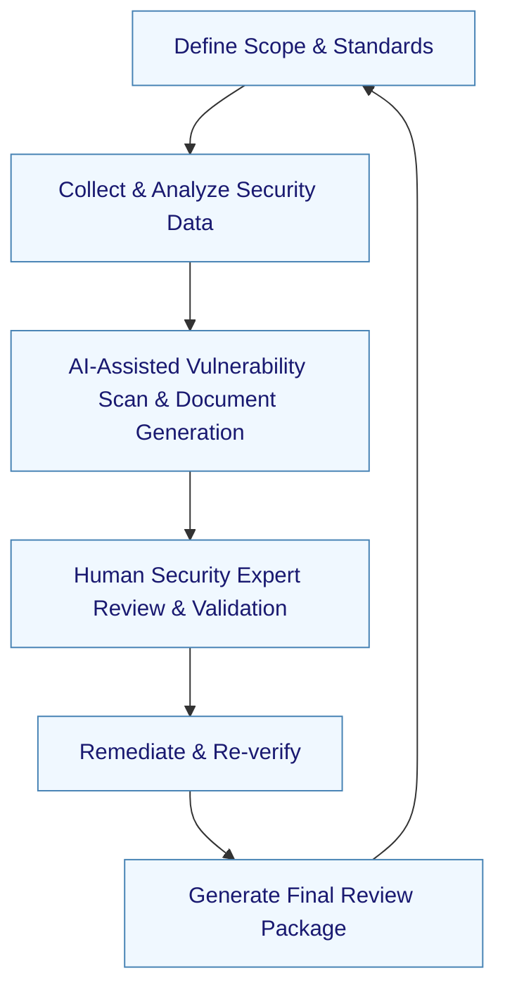

:::info[Value Proposition]
Streamline and enhance the preparation for security reviews and audits by leveraging Generative AI (GenAI) and Large Language Models (LLM). This assists in identifying potential vulnerabilities, generating compliance reports, drafting documentation (e.g., threat models, data flow diagrams), and ensuring a thorough, efficient, and proactive approach to security assurance.
:::

## Overview

Security reviews and audits are essential for validating the robustness of systems and ensuring compliance with industry standards and regulations. However, the preparation can be labor-intensive, requiring deep dives into code, architecture, and policy documents. This scenario demonstrates how AI/LLM can act as an intelligent assistant, automating parts of the preparation process by analyzing codebases, security policies, and architectural designs to flag potential issues, generate required documentation, and suggest remediation steps, freeing up security experts for critical analysis and strategic decision-making.

**Goal**: Significantly reduce the time and effort required to prepare for security reviews and audits, leading to fewer findings, faster approvals, and a stronger overall security posture.
**Anti-pattern**: Relying on manual, last-minute preparation that often results in overlooked vulnerabilities, incomplete documentation, and delays in security certifications or project launches.

---

## When to Use

| ✅ Use This Pattern When...                                 | 🚫 Do Not Use When...                                  |
| :--------------------------------------------------------- | :----------------------------------------------------- |
| Preparing for regular internal security audits or penetration tests | The AI is expected to *conduct* the security audit itself (human auditors are crucial) |
| Needing to generate or update documentation like threat models, data flow diagrams, or compliance matrices | The system involves highly classified or top-secret information that cannot be exposed to any AI model |
| Performing a pre-release security check for new features or applications | The security review is purely operational (e.g., physical access control) and not code/architecture related |
| You have a large codebase or complex architecture that is difficult to manually assess for all potential vulnerabilities | The AI is expected to replace human security experts for critical vulnerability assessment and strategic recommendations |

---

## The AI-Assisted Security Review Prep Loop (6 Steps)

This iterative process integrates AI/LLM into the security review preparation workflow.

| Step                      | Focus                                 | Key Output                           | Risks if Skipped              |
| :------------------------ | :------------------------------------ | :----------------------------------- | :---------------------------- |
| **1. Define Scope & Standards** | Specify systems, codebases, compliance standards for review | Review Scope, Compliance Checklist   | Overlooking critical systems, misaligned review |
| **2. Collect & Analyze Security Data** | Gather code, configs, architectural designs, security policies for AI analysis | Security Data Corpus               | AI generating irrelevant or incorrect findings |
| **3. AI-Assisted Vulnerability Scan & Document Generation** | AI identifies potential vulnerabilities, drafts threat models, data flow diagrams | Draft Vulnerability Report, Security Docs | AI hallucinations, false positives/negatives |
| **4. Human Security Expert Review & Validation** | Security team reviews AI findings, validates, adds context, prioritizes remediations | Verified Findings, Remediation Plan  | Blindly trusting AI, missed critical vulnerabilities |
| **5. Remediate & Re-verify** | Implement fixes, AI assists in verifying remediation effectiveness | Secured Systems, Clean Reports       | Re-introducing vulnerabilities, ineffective fixes |
| **6. Generate Final Review Package** | AI compiles reports, documentation, evidence for auditors | Audit Package, Compliance Matrix     | Incomplete documentation, delays in audit |

---

## Visual Summary of the Loop

---

## Why This Process is Critical for Professional Work

-   **Proactive Vulnerability Identification**: AI helps uncover potential security flaws earlier in the development lifecycle.
-   **Reduced Preparation Time**: Automates the generation of documentation and initial scans, freeing up security teams.
-   **Enhanced Compliance**: Ensures adherence to security standards and regulations through systematic checks and report generation.
-   **Improved Accuracy**: AI can process large volumes of data (code, configs) more consistently than manual methods.
-   **Stronger Security Posture**: A more thorough and frequent review process leads to more secure systems and applications.

---

## Common Pitfalls

| Pitfall                   | Impact                                   | Correction                                     |
| :------------------------ | :--------------------------------------- | :--------------------------------------------- |
| **AI generating false positives or irrelevant findings** | Security teams waste time chasing non-issues, leading to alert fatigue. | Fine-tune AI models with security expert feedback; integrate AI with existing, trusted security tools. |
| **Over-reliance on AI for critical security decisions** | AI may miss nuanced attack vectors or strategic security gaps. | Human security experts must lead the strategic review, threat modeling, and final remediation decisions. |
| **Ignoring the context of specific security risks** | Generic AI findings may not apply to the unique threat landscape of a system. | Provide AI with context such as business logic, data sensitivity, and past incident reports for more relevant analysis. |
| **Exposing sensitive data to external AI models** | Risk of data leakage or compliance violations. | Use AI models deployed securely within the organizational boundary or anonymize sensitive data before feeding to AI. |

---

## Quick Links

- Handbook Method: [Overview](/docs/01-handbook-method/01-overview)
- Threat Model Lite: [Responsible AI](/docs/05-responsible-ai/threat-model-lite)
- Governance and Accountability: [Responsible AI](/docs/05-responsible-ai/governance-and-accountability)
- Infra as Code Changes: [Platform & Ops Scenario](/docs/03-professional-scenarios/00-scenarios-index)

## Next Step

Return to the [Main Scenarios Index](/docs/03-professional-scenarios/00-scenarios-index) to explore other professional challenges.