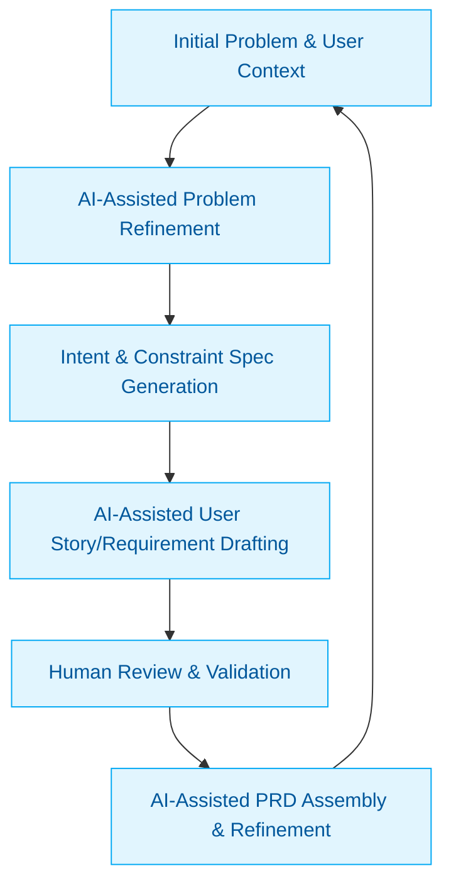

:::info[Value Proposition]
Bridge the gap between initial problem discovery and a concrete Product Requirements Document (PRD) by leveraging Generative AI (GenAI) and Large Language Models (LLM). This accelerates the clarification of user needs, validates problem statements, and transforms vague ideas into structured, actionable requirements, setting the foundation for successful product development.
:::

## Overview

Product discovery often starts with ambiguous problems or broad user needs. Transforming these into a clear, concise problem statement and then into a detailed PRD requires significant effort in research, analysis, and synthesis. This scenario demonstrates how AI/LLM can act as a powerful co-creator and analytical engine, assisting product managers and UX designers in refining problem definitions, generating user stories, identifying key metrics, and outlining potential solutions, thus expediting the crucial early stages of product development.

**Goal**: Convert an initial, loosely defined problem or user need into a well-structured and comprehensive PRD, validated against user pain points and business objectives, with AI/LLM assistance.
**Anti-pattern**: Jumping directly to solution brainstorming without thoroughly understanding and framing the problem, leading to misaligned features, wasted development effort, and products that fail to meet user needs.

---

## When to Use

| ✅ Use This Pattern When...                                 | 🚫 Do Not Use When...                                  |
| :--------------------------------------------------------- | :----------------------------------------------------- |
| Beginning a new product discovery phase with a nascent idea | The problem is extremely well-defined, and a PRD can be drafted directly from existing, clear specifications |
| Struggling to articulate a clear problem statement or user pain points from qualitative research | AI is expected to *invent* a problem or user need without any human input or data |
| Needing to quickly iterate on problem definitions or explore multiple angles of a user challenge | The project involves highly sensitive or confidential information that cannot be shared with external AI models |
| You have a wealth of user research data (interviews, surveys, feedback) that needs synthesis | The final PRD requires deep legal or highly technical precision that AI can only draft, not finalize without human expertise |

---

## The AI-Assisted Problem Framing to PRD Loop (6 Steps)

This iterative process integrates AI/LLM into the initial product definition and PRD creation.

| Step                      | Focus                                 | Key Output                           | Risks if Skipped              |
| :------------------------ | :------------------------------------ | :----------------------------------- | :---------------------------- |
| **1. Initial Problem & User Context** | Capture raw ideas, known user pain points, business goals | Initial Brief, User Personas         | AI generating irrelevant solutions |
| **2. AI-Assisted Problem Refinement** | AI analyzes input, clarifies problem statement, identifies assumptions | Refined Problem Statement            | AI misinterpreting user needs, superficial analysis |
| **3. Intent & Constraint Spec Generation** | Define desired outcomes, success metrics, technical/business boundaries | Intent Spec, Constraint Spec         | Building the wrong thing, scope creep |
| **4. AI-Assisted User Story/Requirement Drafting** | AI generates user stories, functional/non-functional requirements | Draft User Stories, Requirements     | Generic or incomplete requirements |
| **5. Human Review & Validation** | Product Managers/UX review, validate against research, prioritize | Validated Requirements, Prioritized Backlog | Missing critical details, unfeasible solutions |
| **6. AI-Assisted PRD Assembly & Refinement** | AI compiles, structures, and refines the full PRD document | Comprehensive PRD                  | Inconsistent document, formatting issues |

---

## Visual Summary of the Loop

---

## Why This Process is Critical for Professional Work

-   **Accelerated Discovery**: Speeds up the often slow and ambiguous early stages of product development.
-   **Enhanced Clarity**: Forces a rigorous approach to problem definition, leading to clearer requirements.
-   **Improved Alignment**: Ensures that solutions are tightly coupled to validated user needs and business objectives.
-   **Reduced Risk of Rework**: Catches fundamental misunderstandings early, before significant development investment.
-   **Comprehensive PRDs**: AI assists in ensuring all necessary components of a PRD are considered and drafted.

---

## Common Pitfalls

| Pitfall                   | Impact                                   | Correction                                     |
| :------------------------ | :--------------------------------------- | :--------------------------------------------- |
| **AI misinterpreting nuanced user needs** | PRD reflects generic solutions, not solving the real problem. | Human UX research and validation are paramount. AI synthesizes, humans interpret and refine. |
| **Generating solutions without understanding constraints** | PRD includes unfeasible or costly requirements. | Provide AI with a detailed Constraint Spec (technical, business, legal) early in the process. |
| **Over-reliance on AI for creative problem-solving** | PRD lacks innovative solutions or unique value propositions. | Use AI for exploration and analysis; human product managers drive creative problem-solving and strategic vision. |
| **Ignoring stakeholder alignment early in the process** | PRD faces resistance or changes late in the cycle. | Regularly involve key stakeholders in human review steps; use AI to draft summaries for different audiences. |

---

## Quick Links

- Handbook Method: [Overview](/docs/01-handbook-method/01-overview)
- Discovery Brief: [Handbook Method](/docs/01-handbook-method/discovery-brief)
- Intent Spec: [Handbook Method](/docs/01-handbook-method/intent-spec)
- Constraint Spec: [Handbook Method](/docs/01-handbook-method/constraint-spec)
- Writing a PRD: [Professional Scenario](/docs/03-professional-scenarios/00-scenarios-index)

## Next Step

Explore how to translate your PRD into [User Stories](/docs/03-professional-scenarios/00-scenarios-index).