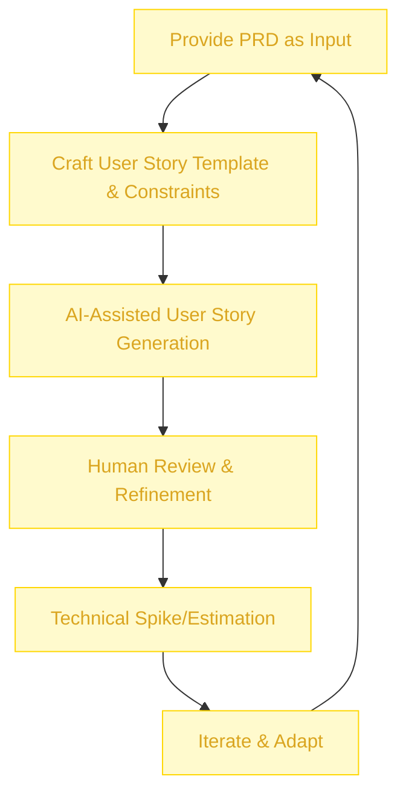

:::info[Value Proposition]
Accelerate the breakdown of Product Requirements Documents (PRDs) into clear, concise, and actionable user stories using Generative AI (GenAI) and Large Language Models (LLM). This ensures comprehensive coverage of requirements, facilitates agile planning, and bridges the communication gap between product teams and development.
:::

## Overview

Translating a high-level PRD into a detailed set of user stories that are ready for engineering execution can be a time-consuming and often subjective process. This scenario demonstrates how AI/LLM can assist product owners and business analysts in systematically dissecting PRD sections (e.g., features, functional requirements, non-functional requirements) to generate well-formed user stories, including acceptance criteria. This streamlines backlog grooming, improves consistency, and frees up human effort for deeper strategic thinking and stakeholder engagement.

**Goal**: Convert a comprehensive PRD into a granular set of user stories, each with clear acceptance criteria, that accurately reflect the PRD's intent and are ready for development teams to estimate and implement.
**Anti-pattern**: Manually breaking down PRDs without a structured approach, leading to incomplete user stories, ambiguous acceptance criteria, and a higher risk of misinterpretation during development.

---

## When to Use

| ✅ Use This Pattern When...                                 | 🚫 Do Not Use When...                                  |
| :--------------------------------------------------------- | :----------------------------------------------------- |
| You have a finalized PRD and need to generate user stories for agile sprints | The PRD is still in draft form or highly ambiguous, requiring human judgment to clarify core intent |
| Needing to ensure comprehensive coverage of all PRD requirements in user stories | You need to generate creative or innovative solutions (AI is good at breaking down, less so at pure invention) |
| Automating the creation of multiple user stories for different personas or edge cases | The user stories require deep emotional intelligence or highly subjective interpretation of user behavior |
| You want to standardize the format and quality of user stories across your organization | The PRD is extremely short and simple, making manual conversion trivial |

---

## The AI-Assisted PRD to User Stories Loop (6 Steps)

This iterative process integrates AI/LLM into the conversion of PRDs to user stories.

| Step                      | Focus                                 | Key Output                           | Risks if Skipped              |
| :------------------------ | :------------------------------------ | :----------------------------------- | :---------------------------- |
| **1. Provide PRD as Input** | Supply the AI with the complete and finalized PRD document | Structured PRD Input                 | AI generating irrelevant or incorrect stories |
| **2. Craft User Story Template & Constraints** | Define desired user story format (e.g., "As a..., I want..., so that..."), acceptance criteria style | User Story Template, Constraint Spec | Inconsistent or un actionable user stories |
| **3. AI-Assisted User Story Generation** | AI analyzes PRD sections, generates draft user stories & acceptance criteria | Draft User Stories, Acceptance Criteria | Generic stories, missed edge cases |
| **4. Human Review & Refinement** | Product Owners/BAs review AI-generated stories for accuracy, completeness, clarity | Polished User Stories, Prioritized Backlog | Blindly trusting AI, missed critical details |
| **5. Technical Spike/Estimation** | Development team reviews stories, estimates effort, identifies dependencies | Story Estimates, Technical Spikes    | Unrealistic estimates, technical debt |
| **6. Iterate & Adapt**    | Incorporate feedback, update stories as PRD or context evolves | Refined Backlog, Updated Stories     | Stale requirements, misaligned development |

---

## Visual Summary of the Loop

---

## Why This Process is Critical for Professional Work

-   **Efficiency**: Dramatically reduces the manual effort and time spent on breaking down PRDs into user stories.
-   **Consistency**: Ensures all user stories adhere to a standard format and quality, improving readability and understanding.
-   **Comprehensive Coverage**: AI can help ensure all aspects of the PRD are translated into corresponding user stories, reducing gaps.
-   **Faster Agile Planning**: Accelerates backlog grooming and sprint planning, enabling development teams to get started sooner.
-   **Improved Communication**: Provides a clear and standardized format that is easily understood by both product and engineering teams.

---

## Common Pitfalls

| Pitfall                   | Impact                                   | Correction                                     |
| :------------------------ | :--------------------------------------- | :--------------------------------------------- |
| **AI generating overly simplistic or generic user stories** | User stories lack sufficient detail for development. | Provide AI with examples of good, detailed user stories and explicitly prompt for depth, edge cases, and acceptance criteria. |
| **AI missing nuanced intent or implicit requirements** | Critical business logic or user needs are not captured in stories. | Human product owners/BAs must perform thorough reviews, especially focusing on edge cases and unspoken assumptions. |
| **Over-reliance on AI for acceptance criteria** | Acceptance criteria are too basic or miss testable scenarios. | Provide AI with a clear Acceptance Criteria Template (e.g., Gherkin syntax) and examples of comprehensive tests. |
| **User stories become too technical, losing user focus** | Developers focus on implementation details rather than user value. | Explicitly prompt AI to keep user stories focused on the "who," "what," and "why" from the user's perspective. |

---

## Quick Links

- Handbook Method: [Overview](/docs/01-handbook-method/01-overview)
- Writing a PRD: [Professional Scenario](/docs/03-professional-scenarios/00-scenarios-index)
- Intent Spec: [Handbook Method](/docs/01-handbook-method/intent-spec)
- Acceptance Criteria: [Handbook Method](/docs/01-handbook-method/acceptance-criteria)

## Next Step

Learn how to derive [User Stories to Acceptance Tests](/docs/03-professional-scenarios/00-scenarios-index).