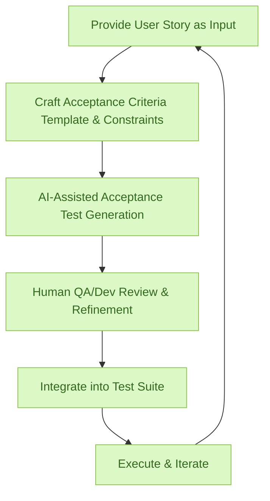

:::info[Value Proposition]
Automate the critical step of translating user stories into precise, testable acceptance criteria and executable test cases using Generative AI (GenAI) and Large Language Models (LLM). This ensures comprehensive test coverage, reduces ambiguity, and significantly accelerates the QA process, leading to higher quality software delivery.
:::

## Overview

A well-defined user story needs equally well-defined acceptance criteria to guide development and testing. Manually crafting these criteria, especially in formats like Gherkin (Given/When/Then), can be time-consuming and prone to human error, potentially leading to missed scenarios or unclear test boundaries. This scenario demonstrates how AI/LLM can act as a powerful test case generator, analyzing user stories and context to produce granular, executable acceptance tests, thereby enhancing the collaboration between product, development, and QA teams.

**Goal**: Transform user stories into a comprehensive set of testable acceptance criteria, ideally in a structured format like Gherkin, that accurately reflect the user story's intent and are ready for automated or manual testing.
**Anti-pattern**: User stories without clear acceptance criteria, leading to developers making assumptions, testers struggling to validate features, and a high incidence of "it works on my machine" disputes.

---

## When to Use

| ✅ Use This Pattern When...                                 | 🚫 Do Not Use When...                                  |
| :--------------------------------------------------------- | :----------------------------------------------------- |
| You have clear user stories and need to generate detailed acceptance criteria | The user story is vague or requires significant human interpretation before test case generation |
| Needing to ensure comprehensive test coverage for all aspects of a feature | The AI is expected to *design* the testing strategy itself (human QA is crucial for strategy) |
| Automating the creation of Gherkin-style test cases from user stories | The acceptance criteria involve highly complex business rules that AI struggles to infer correctly |
| You want to standardize the format and quality of acceptance criteria across your teams | The user story is extremely simple and only requires one or two obvious acceptance criteria |

---

## The AI-Assisted User Stories to Acceptance Tests Loop (6 Steps)

This iterative process integrates AI/LLM into the test case generation workflow.

| Step                      | Focus                                 | Key Output                           | Risks if Skipped              |
| :------------------------ | :------------------------------------ | :----------------------------------- | :---------------------------- |
| **1. Provide User Story as Input** | Supply the AI with a well-defined user story (and related context, if any) | Structured User Story Input          | AI generating irrelevant or incorrect tests |
| **2. Craft Acceptance Criteria Template & Constraints** | Define desired format (e.g., Gherkin), level of detail, edge case inclusion | Template Spec, Constraint Spec       | Inconsistent or untestable criteria |
| **3. AI-Assisted Acceptance Test Generation** | AI analyzes user story, generates draft acceptance criteria/tests | Draft Acceptance Tests             | Generic tests, missed edge cases, hallucinations |
| **4. Human QA/Dev Review & Refinement** | QA/Devs review AI-generated tests for accuracy, completeness, feasibility | Polished Acceptance Tests            | Blindly trusting AI, missed critical test cases |
| **5. Integrate into Test Suite** | Incorporate validated acceptance tests into automated or manual test plans | Updated Test Suite, Test Plan        | Test gaps, redundant tests |
| **6. Execute & Iterate**  | Run tests, gather results, update tests as user story or context evolves | Test Results, Refined Tests          | Stale tests, misaligned testing efforts |

---

## Visual Summary of the Loop

---

## Why This Process is Critical for Professional Work

-   **Enhanced Test Coverage**: AI can ensure a more exhaustive set of acceptance criteria, reducing gaps in testing.
-   **Reduced Ambiguity**: Translates user stories into unambiguous, executable test cases, clarifying expectations for all teams.
-   **Accelerated QA Process**: Significantly speeds up the creation of test plans and test cases, especially for complex features.
-   **Improved Collaboration**: Provides a common language (e.g., Gherkin) for product, development, and QA teams.
-   **Higher Software Quality**: Leads to more robust testing and, consequently, higher quality software releases.

---

## Common Pitfalls

| Pitfall                   | Impact                                   | Correction                                     |
| :------------------------ | :--------------------------------------- | :--------------------------------------------- |
| **AI generating incomplete or incorrect acceptance criteria** | Critical scenarios are missed, leading to bugs in production. | Human QA/Dev review is paramount. Provide AI with examples of high-quality acceptance criteria and edge cases. |
| **Over-reliance on AI for complex test logic** | AI may struggle with highly intricate business rules or system interactions. | Use AI for foundational test cases; human QA/Devs focus on complex, integration, and performance testing. |
| **Generating redundant or trivial test cases** | Wasted testing effort, increased maintenance burden for test suite. | Prompt AI to prioritize unique and high-impact test cases; incorporate deduplication in the review process. |
| **Acceptance criteria become too technical/implementation-specific** | Tests become brittle, requiring frequent updates with code changes. | Prompt AI to focus on observable system behavior from the user's perspective, not internal implementation details. |

---

## Quick Links

- Handbook Method: [Overview](/docs/01-handbook-method/01-overview)
- Write Tests: [Execution Pattern](/docs/02-execution-patterns/07-write-tests)
- Acceptance Criteria: [Handbook Method](/docs/01-handbook-method/acceptance-criteria)
- PRD to User Stories: [Product & UX Scenario](/docs/03-professional-scenarios/00-scenarios-index)

## Next Step

Explore [Experiment Design and Metrics](/docs/03-professional-scenarios/00-scenarios-index) for data-driven product decisions.