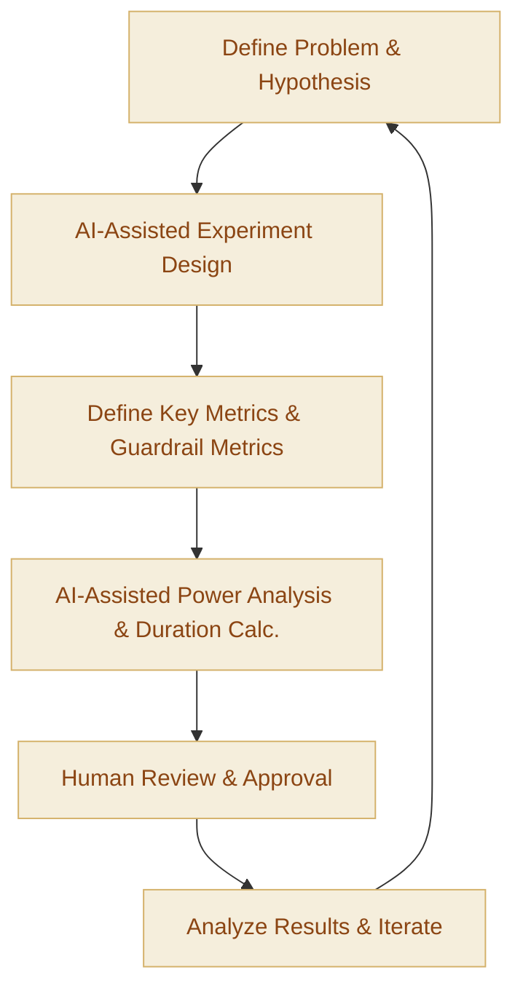

:::info[Value Proposition]
Enhance the rigor and efficiency of product experimentation (e.g., A/B testing) by leveraging Generative AI (GenAI) and Large Language Models (LLM) to assist in experiment design, defining clear success metrics, and analyzing results. This accelerates data-driven decision-making, optimizes feature development, and ensures a robust understanding of user behavior and product impact.
:::

## Overview

Designing effective experiments and identifying the right metrics to measure success are crucial for data-driven product development. However, this process can be complex, requiring statistical knowledge, a deep understanding of user behavior, and careful consideration of potential biases. This scenario demonstrates how AI/LLM can augment product managers and data scientists by suggesting experiment variations, articulating clear hypotheses, generating statistical power calculations, and even drafting analysis plans, thereby improving the quality and speed of experimentation.

**Goal**: Design well-structured product experiments with clear hypotheses and appropriate metrics, and interpret their results accurately to inform product strategy and feature development.
**Anti-pattern**: Running A/B tests without clear hypotheses or sufficient statistical power, leading to inconclusive results, misinterpretations, or decisions based on noisy data.

---

## When to Use

| ✅ Use This Pattern When...                                 | 🚫 Do Not Use When...                                  |
| :--------------------------------------------------------- | :----------------------------------------------------- |
| Launching a new feature or making a significant change to an existing one | The change is trivial and its impact is self-evident, not requiring formal experimentation |
| Needing to validate a hypothesis about user behavior or business impact | The AI is expected to *make* the final product decision without human judgment or ethical consideration |
| Designing complex multivariate tests or A/B/n experiments | The experiment involves highly sensitive user data that cannot be exposed to external AI models |
| Needing to define clear, measurable success metrics for a product initiative | The AI is expected to replace human data scientists for complex statistical analysis or model building |

---

## The AI-Assisted Experiment Design & Metrics Loop (6 Steps)

This iterative process integrates AI/LLM into the experimentation workflow.

| Step                      | Focus                                 | Key Output                           | Risks if Skipped              |
| :------------------------ | :------------------------------------ | :----------------------------------- | :---------------------------- |
| **1. Define Problem & Hypothesis** | Clearly state the problem, formulate testable hypotheses | Problem Statement, Hypotheses        | Running experiments without clear goals |
| **2. AI-Assisted Experiment Design** | AI suggests experiment types (A/B, multivariate), variations, segmentation | Draft Experiment Plan                | Biased designs, inconclusive results |
| **3. Define Key Metrics & Guardrail Metrics** | Identify primary success metrics, secondary metrics, and negative guardrail metrics | Metric Definitions, Thresholds       | Measuring wrong things, unintended negative impacts |
| **4. AI-Assisted Power Analysis & Duration Calc.** | AI estimates required sample size, experiment duration, potential risks | Power Analysis Report, Risk Assessment | Inconclusive results, wasting resources |
| **5. Human Review & Approval** | Product Managers/Data Scientists review design, confirm validity, get approval | Final Experiment Plan                | Flawed designs, ethical issues |
| **6. Analyze Results & Iterate**  | AI assists in interpreting data, suggests next steps, and identifies learning | Experiment Report, Iteration Ideas   | Misinterpreting results, failing to learn |

---

## Visual Summary of the Loop

---

## Why This Process is Critical for Professional Work

-   **Data-Driven Decisions**: Ensures product changes are validated by empirical evidence rather than assumptions or intuition.
-   **Optimized Feature Development**: Identifies which features truly move the needle, preventing wasted development effort on ineffective changes.
-   **Risk Mitigation**: Helps uncover unintended negative impacts of changes before full rollout, protecting user experience and business metrics.
-   **Accelerated Learning**: Facilitates faster learning cycles by efficiently generating and analyzing experiment designs.
-   **Improved Statistical Rigor**: AI can assist in applying correct statistical methods, leading to more reliable conclusions.

---

## Common Pitfalls

| Pitfall                   | Impact                                   | Correction                                     |
| :------------------------ | :--------------------------------------- | :--------------------------------------------- |
| **AI suggesting biased experiment designs** | Results are skewed, leading to incorrect product decisions. | Human data scientists must critically review AI-generated designs for bias and confounding variables. |
| **Defining unclear or vanity metrics** | Experiments yield meaningless results, failing to inform strategy. | Provide AI with clear business objectives and customer value; human review for metric relevance and actionability. |
| **Underpowered experiments** | Experiments run too short or with too few users, leading to inconclusive results. | Strictly adhere to AI-generated power analysis requirements for sample size and duration. |
| **Misinterpreting AI-generated analysis** | Drawing incorrect conclusions from experiment results. | Human data scientists must interpret AI analysis, considering business context, ethical implications, and statistical nuances. |

---

## Quick Links

- Handbook Method: [Overview](/docs/01-handbook-method/01-overview)
- Evaluation: [Handbook Method](/docs/01-handbook-method/evaluation)
- Constraint Spec: [Handbook Method](/docs/01-handbook-method/constraint-spec)
- Quality Rubric Template: [Template](/docs/06-templates/quality-rubric-template)

## Next Step

Return to the [Main Scenarios Index](/docs/03-professional-scenarios/00-scenarios-index) to explore other professional challenges.