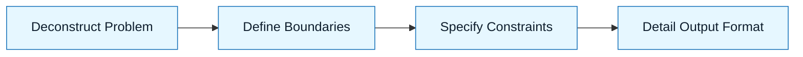

# Pattern: Scope a Task

:::info[Value Proposition]
Use this pattern to clearly define the boundaries and expectations of a task for an AI agent or LLM. Proper scoping prevents scope creep, reduces hallucinations, and improves the quality of AI-generated outputs.
:::

## Overview

Effective task scoping is crucial for successful AI-assisted development. Without a clear definition of what needs to be done, what constraints apply, and what the desired output looks like, AI models tend to produce generic, incomplete, or incorrect results. This pattern guides you in breaking down complex problems into manageable, well-defined tasks.

**Goal**: Transform a high-level objective into a precise, actionable task for an AI.
**Anti-pattern**: "Build me an app." (Result: Vague, unguided, and ultimately unusable output).

---

## When to Use

| ✅ Use This Pattern When...           | 🚫 Do Not Use When...                     |
| :------------------------------------ | :---------------------------------------- |
| Starting any new feature development | The task is purely informational |
| Delegating a complex coding problem   | The task requires human-specific creativity or empathy |
| Debugging a specific module           | The task involves sensitive or private data without proper safeguards |

---

## Prerequisites

:::warning[Before you start]
You must have a clear **Intent Spec** and at least a preliminary idea of the **Constraint Spec**.
:::

- **Artifacts**: Initial Intent Spec, high-level understanding of project constraints.
- **Context**: A general understanding of the problem domain and desired outcome.

---

## The Pattern (Step-by-Step)

### Step 1: Deconstruct the Problem

Break down the overall objective into smaller, logical sub-components. Identify inputs, outputs, and intermediate steps.

> **Practical Insight**: Think like a compiler or an interpreter. What exact pieces of information does the AI need to process? What format should the output take?

### Step 2: Define Boundaries (In-Scope/Out-of-Scope)

Explicitly state what the AI should focus on and, just as importantly, what it should *not* attempt to do. This minimizes over-generation and prevents the AI from venturing into unintended areas.

> "Focus solely on the backend API logic; do not generate any frontend code."

### Step 3: Specify Constraints

Translate system requirements, architectural patterns, and coding standards into explicit constraints. This includes language versions, frameworks, error handling, logging, and security considerations.

> "Ensure all generated code adheres to TypeScript 5.x, uses Express.js for routing, and includes Joi for input validation as per the `Constraint Spec`."

### Step 4: Detail Desired Output Format

Be prescriptive about the output. Do you need a code snippet, a full file, a design document, or a test suite? Specify file names, directory structures, and even specific comment styles.

> "Generate a single `userRoutes.ts` file containing the Express.js routes. The file should be placed in `src/api/routes/`."



### Practical Example: Scoping a User Registration API Endpoint

**Objective**: Create a new user registration endpoint.

**Task Definition for AI:**

```markdown
**Intent:** Implement a new user registration API endpoint.

**In-Scope:**
-   Backend logic for user creation (POST /register).
-   Input validation for username, email, and password.
-   Hashing of passwords before storage.
-   Returning a JWT token upon successful registration.
-   Error handling for duplicate email/username and invalid input.

**Out-of-Scope:**
-   Frontend integration.
-   Database schema migration (assume schema exists).
-   Authentication for existing users (login endpoint).
-   Email verification or 2FA implementation.

**Constraints:**
-   **Language/Framework**: TypeScript 5.x, Node.js, Express.js.
-   **Database**: PostgreSQL (assume `user` table with `id`, `username`, `email`, `password_hash` columns).
-   **Validation**: Joi library.
-   **Password Hashing**: bcrypt library.
-   **JWT**: jsonwebtoken library.
-   **Code Structure**: Use `src/controllers/userController.ts` for logic, `src/routes/userRoutes.ts` for routes.
-   **Error Handling**: Return HTTP status codes (400 for bad input, 409 for conflict, 500 for server errors) and a JSON error object `{ message: string }`.

**Desired Output:**
-   `src/controllers/userController.ts` with `registerUser` function.
-   `src/routes/userRoutes.ts` with the POST `/register` route.
-   Include necessary import statements.
-   Add JSDoc comments to functions explaining parameters and return values.
```

---

## Common Pitfalls

| Pitfall                   | Impact                               | Correction                                          |
| :------------------------ | :----------------------------------- | :-------------------------------------------------- |
| **Vague Instructions**    | AI makes assumptions, leading to rework. | Be explicit about every detail.                     |
| **Underspecified Constraints** | AI generates code that doesn't fit your project. | Provide clear technical boundaries (libraries, versions, patterns). |
| **Over-Scoping**          | AI attempts too much, resulting in incomplete or buggy code. | Break down into smaller, atomic tasks. Focus on one logical unit. |

:::danger[Critical Risk]
Never assume the AI understands implicit context or unstated requirements. Always be explicit.
:::
