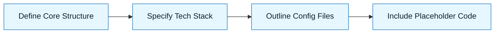

# Pattern: Scaffold a Repo

:::info[Value Proposition]
Use this pattern to rapidly set up the basic structure of a new repository or project, including file organization, initial configuration, and boilerplate code, leveraging AI to adhere to best practices and project standards from the outset.
:::

## Overview

Starting a new project often involves repetitive setup tasks: creating directories, adding configuration files, setting up build scripts, and basic CI/CD. This pattern streamlines that process by having an AI generate the initial scaffolding based on a well-defined set of requirements and constraints. This ensures consistency and accelerates development.

**Goal**: Generate a ready-to-develop repository structure with minimal manual intervention.
**Anti-pattern**: Manually creating every file and folder, leading to inconsistencies and overlooked best practices.

---

## When to Use

| ✅ Use This Pattern When...           | 🚫 Do Not Use When...                     |
| :------------------------------------ | :---------------------------------------- |
| Starting any new project or microservice | You are modifying an existing, mature repository's core structure |
| Experimenting with a new technology stack | The project has highly unusual or non-standard organizational needs |
| Ensuring consistent project setup across a team | You only need a single file or a small code snippet |

---

## Prerequisites

:::warning[Before you start]
A comprehensive **Constraint Spec** and an **Intent Spec** for the project's core purpose are essential.
:::

- **Artifacts**: Intent Spec (high-level project goal), detailed Constraint Spec (tech stack, coding standards, directory conventions, desired tooling).
- **Context**: Understanding of the target environment (e.g., cloud provider, deployment strategy) and any specific security or compliance requirements.

---

## The Pattern (Step-by-Step)

### Step 1: Define the Core Structure

Begin by specifying the top-level directories and critical files (e.g., `package.json`, `README.md`, `Dockerfile`, `.gitignore`). Think about the logical separation of concerns.

> **Practical Insight**: Provide a skeletal directory structure up-front if you have strong opinions. This guides the AI significantly. E.g., "Create `src/`, `tests/`, `config/`, and `docs/` directories."

### Step 2: Specify Technology Stack and Tooling

Clearly list all technologies, frameworks, libraries, and development tools required. Include version numbers where critical. This directly informs dependencies and configuration.

> "The project should use Node.js 20.x, TypeScript 5.x, Express.js, Jest for testing, ESLint with Airbnb config, and Prettier."

### Step 3: Outline Key Configuration Files

Instruct the AI to generate initial versions of essential configuration files based on the chosen stack and tooling.

> "Generate `package.json`, `tsconfig.json`, `.eslintrc.js`, `.prettierrc`, and a basic `Dockerfile` for a Node.js Express application."

### Step 4: Include Placeholder Code or Examples

For critical modules, ask for minimal boilerplate or "hello world" examples to verify the setup.

> "Add a basic Express server in `src/app.ts` that listens on port 3000 and has a `/health` endpoint."



### Practical Example: Scaffolding a Node.js TypeScript Express API

**Objective**: Scaffold a new Node.js TypeScript API project.

**Task Definition for AI:**

```markdown
**Intent:** Create a new Node.js TypeScript API project boilerplate.

**In-Scope:**
-   Basic directory structure: `src/`, `dist/`, `tests/`, `config/`, `scripts/`.
-   Configuration files: `package.json`, `tsconfig.json`, `.env.example`, `.gitignore`, `Dockerfile`, `docker-compose.yml` (for dev DB).
-   Development tooling setup: ESLint, Prettier, Jest.
-   A simple Express server with a single health check endpoint.
-   Basic npm scripts for `start`, `build`, `test`, `lint`.

**Out-of-Scope:**
-   Database migrations.
-   Advanced authentication/authorization.
-   Complex business logic.
-   Frontend code.

**Constraints:**
-   **Language**: TypeScript 5.2+.
-   **Runtime**: Node.js 20.x.
-   **Framework**: Express.js 4.x.
-   **Testing**: Jest.
-   **Linting/Formatting**: ESLint (Airbnb base config), Prettier.
-   **Docker**: Multi-stage `Dockerfile` for production, `docker-compose.yml` for local PostgreSQL.
-   **Directory Structure**: Adhere to a standard `src/controllers`, `src/services`, `src/routes`, `src/utils` pattern within `src/`.

**Desired Output:**
-   A fully scaffolded project directory.
-   Executable `package.json` scripts.
-   A working "hello world" Express server.
-   Placeholders for `controllers`, `services`, `routes`, `utils`.

```typescript
// Example of desired `src/app.ts` content after scaffolding
import express from 'express';
import dotenv from 'dotenv';

dotenv.config();

const app = express();
const PORT = process.env.PORT || 3000;

app.use(express.json());

app.get('/health', (req, res) => {
  res.status(200).json({ status: 'ok', uptime: process.uptime() });
});

app.listen(PORT, () => {
  console.log(`Server running on port ${PORT}`);
});
```

---

## Common Pitfalls

| Pitfall                         | Impact                                         | Correction                                        |
| :------------------------------ | :--------------------------------------------- | :------------------------------------------------ |
| **Insufficient Detail in Constraints** | AI chooses default or non-compliant configurations. | Be extremely explicit about versions, libraries, and coding standards. |
| **Over-reliance on AI for Best Practices** | AI may miss nuanced project-specific best practices. | Supplement with custom configuration snippets or direct instructions. |
| **Ignoring Security Defaults**  | AI might generate insecure default configurations (e.g., exposed ports in Docker). | Explicitly state security requirements and review generated configs. |

:::danger[Critical Risk]
Always manually review generated scaffolding, especially `.gitignore`, `Dockerfile`, and dependency lists, to prevent security vulnerabilities or unwanted files.
:::
