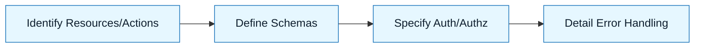

# Pattern: Design an API

:::info[Value Proposition]
Use this pattern to leverage AI for designing clear, consistent, and well-structured APIs. It helps in defining endpoints, request/response schemas, and error handling, adhering to best practices like REST or GraphQL, and ensuring interoperability.
:::

## Overview

Designing an API is a critical step in software development, dictating how different components or services communicate. AI can assist in translating high-level requirements into detailed API specifications, including defining resources, HTTP methods, data models, and authentication mechanisms, thereby accelerating development and reducing design flaws.

**Goal**: Generate a comprehensive API design specification (e.g., OpenAPI, GraphQL schema) from functional requirements.
**Anti-pattern**: Asking the AI to "create an API" without defining resources, actions, or expected data, leading to a generic and often unsuitable design.

---

## When to Use

| ✅ Use This Pattern When...           | 🚫 Do Not Use When...                     |
| :------------------------------------ | :---------------------------------------- |
| Defining new service boundaries       | The API is trivial and well-understood    |
| Expanding existing API capabilities   | The API requires highly specialized, non-standard protocols |
| Ensuring API consistency across a large system | The API has already been fully specified and implemented |

---

## Prerequisites

:::warning[Before you start]
You must have a clear **Intent Spec** outlining the API's purpose and a **Constraint Spec** detailing technical requirements.
:::

- **Artifacts**: Intent Spec (API purpose, main entities/resources), Constraint Spec (preferred API style - REST/GraphQL, authentication, error handling conventions, data types).
- **Context**: Understanding of the system's architecture and existing APIs to ensure integration.

---

## The Pattern (Step-by-Step)

### Step 1: Identify Resources and Actions

List the primary entities (resources) your API will manage and the actions (operations) that can be performed on them. This forms the core of your API.

> **Practical Insight**: Think nouns (resources) and verbs (actions). For a "User" resource, common actions are `create`, `read`, `update`, `delete`. Map these to HTTP methods for REST or mutations/queries for GraphQL.

### Step 2: Define Request and Response Schemas

For each endpoint/operation, specify the expected input (request body, query parameters, headers) and the output (successful response, error responses). Use a schema definition language like JSON Schema or GraphQL SDL.

> "For the `POST /users` endpoint, define a request body schema for user creation (username, email, password) and a response schema for a newly created user (id, username, email, createdAt)."

### Step 3: Specify Authentication and Authorization

Clearly outline how users or other services will authenticate with the API and what authorization rules apply to each endpoint or resource.

> "Authentication will be JWT-based. `POST /users` requires no authentication. `GET /users/{id}` requires an authenticated user and authorization to view their own profile or admin privileges."

### Step 4: Detail Error Handling

Define a consistent error response structure for various error types (validation errors, not found, unauthorized, internal server errors) and their corresponding HTTP status codes.

> "All errors should return a JSON object like `{ 'code': 'USER_NOT_FOUND', 'message': 'User with ID {id} not found' }` with appropriate HTTP status codes (e.g., 404, 400, 401, 500)."



### Practical Example: Designing a Simple Blog API (RESTful)

**Objective**: Design a RESTful API for a simple blog with posts and comments.

**Task Definition for AI:**

```markdown
**Intent:** Design a RESTful API for managing blog posts and their comments.

**In-Scope:**
-   **Resources**: `Post`, `Comment`.
-   **Actions for Post**: Create, Read (single, list), Update, Delete.
-   **Actions for Comment**: Create, Read (single, list by post), Delete.

**Out-of-Scope:**
-   User authentication/authorization (assume public read, authenticated write for simplicity).
-   Image uploads.
-   Search functionality beyond basic filtering.

**Constraints:**
-   **API Style**: RESTful.
-   **Data Format**: JSON for requests and responses.
-   **HTTP Methods**: Use standard methods (GET, POST, PUT, DELETE).
-   **Status Codes**: Use standard HTTP status codes (200, 201, 204, 400, 401, 403, 404, 500).
-   **Error Structure**: `{ "error": "Error message", "code": "ERROR_CODE" }`.
-   **Pagination**: Use `_limit` and `_start` query parameters.

**Desired Output:**
-   OpenAPI (Swagger) 3.0 specification in YAML format, detailing:
    -   Endpoints for `/posts` and `/posts/{postId}/comments`.
    -   Request and response schemas for `Post` and `Comment` objects.
    -   Example requests and responses.
    -   Basic error responses.

```yaml
# Example snippet of desired OpenAPI output
openapi: 3.0.0
info:
  title: Simple Blog API
  version: 1.0.0
paths:
  /posts:
    get:
      summary: Retrieve a list of blog posts
      parameters:
        - in: query
          name: _limit
          schema:
            type: integer
            default: 10
        - in: query
          name: _start
          schema:
            type: integer
            default: 0
      responses:
        '200':
          description: A list of posts
          content:
            application/json:
              schema:
                type: array
                items:
                  $ref: '#/components/schemas/Post'
    post:
      summary: Create a new blog post
      requestBody:
        required: true
        content:
          application/json:
            schema:
              $ref: '#/components/schemas/NewPost'
      responses:
        '201':
          description: Post created successfully
          content:
            application/json:
              schema:
                $ref: '#/components/schemas/Post'
components:
  schemas:
    Post:
      type: object
      properties:
        id:
          type: string
        title:
          type: string
        content:
          type: string
        author:
          type: string
        createdAt:
          type: string
          format: date-time
    NewPost:
      type: object
      properties:
        title:
          type: string
        content:
          type: string
        author:
          type: string
      required:
        - title
        - content
        - author
```

---

## Common Pitfalls

| Pitfall                       | Impact                                   | Correction                                     |
| :---------------------------- | :--------------------------------------- | :--------------------------------------------- |
| **Inconsistent Naming**       | Hard to understand and use the API.      | Define clear naming conventions for resources, fields, and endpoints. |
| **Lack of Versioning Strategy** | Breaks client applications with changes. | Establish a clear versioning strategy (e.g., `/v1/`, header-based). |
| **Insufficient Error Detail** | Debugging becomes difficult for consumers. | Provide specific error codes and messages for common failure scenarios. |

:::danger[Critical Risk]
Always involve human review for API designs, especially for security, data privacy, and long-term maintainability. AI-generated designs should be treated as a strong starting point, not a final product.
:::
