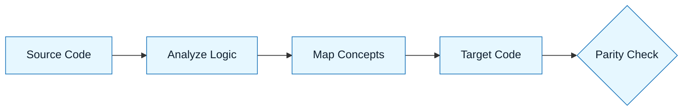

# Pattern: The Translator

:::info[Value Proposition]
Use this pattern to convert code, data, or schemas from one format to another with high fidelity. It treats translation as a structural mapping problem, not a creative writing task.
:::

## Overview

AI is excellent at translation (e.g., Python to Go, SQL to JSON), but it often hallucinates idiomatic differences or tries to translate line-by-line, resulting in non-idiomatic code.

**Goal**: Port logic and structure while respecting the destination language's idioms.
**Anti-pattern**: "Rewrite this in Rust." (Result: Pythonic Rust that fights the borrow checker).

---

## When to Use

| ✅ Use This Pattern When...             | 🚫 Do Not Use When...                     |
| :-------------------------------------- | :---------------------------------------- |
| Porting a class from Java to TypeScript | You don't know the target language at all |
| Converting SQL schemas to Pydantic/Zod  | The source code is buggy (fix it first)   |
| Migrating CI pipelines (Jenkins to GHA) | You want to refactor logic simultaneously |

---

## Prerequisites

:::warning[Before you start]
You must have a **Constraint Spec** for the _target_ language. If you don't define the target style, the AI will write "accented" code (e.g., Java-style Python).
:::

- **Input**: Source file(s).
- **Target**: Definition of the destination format/language.

---

## The Pattern (Step-by-Step)

### Step 1: Source Analysis (The "AST")

Don't translate yet. Ask the AI to describe the _structure_ and _intent_ of the source.

> "Analyze `User.java`. List the public methods, the state invariants, and any side effects. Do not generate code."

### Step 2: The Mapping Strategy

Ask the AI to map concepts from Source to Target.

> "We are porting this to TypeScript. How should we handle the Java `AbstractFactory` pattern in idiomatic TypeScript? Propose a mapping."

_Why? This catches 'False Friends'—concepts that look similar but behave differently._

### Step 3: The Translation

Execute the translation using the agreed mapping.

> "Generate the TypeScript code. Use the mapping from Step 2. Adhere to the Constraint Spec (Functional style, no classes)."

### Step 4: Parity Check

Ask the AI to verify its own work.

> "Compare the Java source and the TypeScript output. List any logic that was lost or changed."

---

## Example Scenario

- **Context**: Migrating a raw SQL schema to Pydantic models.
- **Input**: `CREATE TABLE users (id SERIAL PRIMARY KEY, metadata JSONB);`
- **Mapping**: `SERIAL` -> `int`, `JSONB` -> `Dict[str, Any]`.
- **Output**: `class User(BaseModel): id: int, metadata: Dict[str, Any]`

---

## Common Pitfalls

| Pitfall                   | Impact                                            | Correction                                      |
| :------------------------ | :------------------------------------------------ | :---------------------------------------------- |
| **Line-by-Line Porting**  | Unidiomatic code (e.g., `for` loops in SQL).      | Ask for "Idiomatic translation," not "Rewrite". |
| **Library Hallucination** | Inventing a target library to match a source one. | Constraint: "Only use standard library."        |

:::danger[Critical Risk]
Regex and Date formats rarely translate 1:1. Always write unit tests for these specific edge cases in the new language.
:::

---

## Last Reviewed / Last Updated

- Last reviewed: 2025-12-20
- Version: 0.1.0
