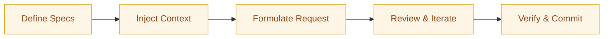

:::info[Value Proposition]
Establish a flexible, tool-agnostic workflow for interacting with various CLI (Command Line Interface) copilots. This ensures consistency in task delegation, context injection, and review processes, regardless of the underlying AI agent, maximizing productivity and minimizing vendor lock-in.
:::

## Overview

CLI copilots are powerful AI agents that operate directly within your terminal, often with access to your local filesystem and shell. While each copilot may have unique commands and interaction patterns, the underlying principles of effective AI-assisted development remain constant. This document outlines a generic workflow that can be applied across different CLI copilots, allowing you to leverage their capabilities while maintaining adherence to GenAI & LLM Handbook practices.

**Goal**: Provide a standardized approach for delegating coding tasks to CLI copilots, ensuring predictable outcomes and efficient human-AI collaboration.
**Anti-pattern**: Learning a new workflow for every CLI copilot, leading to fragmentation, inconsistent results, and an inability to transfer best practices between tools.

---

## When to Use

| Good fit (use when...)                                 | Avoid (not a fit when...)                                  |
| :--------------------------------------------------------- | :----------------------------------------------------- |
| Evaluating different CLI copilots for your workflow        | The task is a one-off, trivial change that can be done manually faster |
| Integrating AI agents into automated scripts or CI/CD pipelines | You require a highly visual, interactive debugging session |
| Wanting to switch between CLI copilots without re-learning core principles | You are working on highly sensitive data that requires strict isolation (consider local inference models) |
| Automating repetitive code modifications, refactorings, or test generation | The task requires complex, multi-modal human interaction beyond current CLI agent capabilities |

---

## The Agnostic CLI Copilot Workflow

This workflow emphasizes a consistent approach regardless of the specific CLI agent you are using.

### 1. Preparation: Define Intent, Constraints, and Delegation

Before invoking any CLI copilot, ensure you have a clear understanding of the task and its boundaries.

-   **Intent Spec**: What is the goal? What problem are we solving?
-   **Constraint Spec**: What are the non-negotiable rules (language, style, security)?
-   **Delegation Contract**: What are the AI's permissions and prohibitions?

### 2. Context Injection: Provide Necessary Information

The copilot needs to "see" the relevant files and specifications.

-   Use the copilot's mechanism to add files to its context (e.g., Aider's `/add` command, Continue's context window).
-   Explicitly mention your Intent and Constraint Specs in your prompt.

### 3. Generation Request: Precise Prompting

Formulate your request to the copilot, combining Intent and Constraints.

-   Be explicit about the desired output format (e.g., "Output only the modified code blocks").
-   Refer to your specs (e.g., "Implement feature X as per `IntentSpec.md` and `ConstraintSpec.md`").

### 4. Review and Iterate: Human-in-the-Loop

The copilot will propose changes. Your role is to critically review and guide.

-   **Review the Plan**: Most copilots will propose a plan of action. Ensure it aligns with your expectations.
-   **Examine Diffs**: Carefully inspect the proposed code changes (diffs).
-   **Interrogate**: Ask questions about the copilot's choices, request clarifications, or suggest alternatives.
-   **Refine**: If the output is not satisfactory, update your prompt or specs and re-initiate the generation.

### 5. Verification: Ensure Correctness and Compliance

Before committing, verify the copilot's work.

-   Run existing tests (unit, integration).
-   Perform manual checks or targeted tests.
-   Ensure compliance with all security and quality guardrails.

---

## Common Pitfalls

| Pitfall                   | Impact                                   | Correction                                     |
| :------------------------ | :--------------------------------------- | :--------------------------------------------- |
| **Vague Prompting**       | Inconsistent or irrelevant AI output.    | Always use structured prompts referencing clear Intent and Constraint Specs. |
| **Ignoring Context Limits** | AI struggles with large codebases, hallucinations. | Prune context aggressively; only provide what's directly relevant. |
| **Skipping Diff Review**  | Uncontrolled changes, introducing bugs.  | Always critically review AI-generated diffs before accepting. |
| **Tool Lock-in Mindset**  | Difficulty switching copilots, rigid workflows. | Adopt a tool-agnostic mindset, focus on the underlying GenAI & LLM Handbook principles. |

---

## Quick Links

- Tooling Index: [Index](/docs/04-tooling-and-frameworks/00-tooling-index)
- CLI Agents: [Tooling Guide](/docs/04-tooling-and-frameworks/02-cli-agents)
- Delegation Contract Template: [Template](/docs/06-templates/delegation-contract-template)

## Next Step

Dive into specific CLI copilots, starting with [Codex CLI](/docs/04-tooling-and-frameworks/01-cli-copilots/01-codex-cli).
