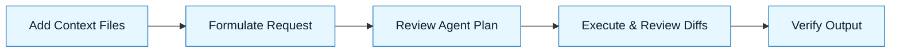

:::info[Value Proposition]
CLI agents (like Aider) enable autonomous, iterative execution of tasks directly within your code editor. They streamline repetitive coding tasks, refactorings, and test generation by operating on local files, making them ideal for integrating with existing developer workflows.
:::

## Overview

CLI (Command Line Interface) agents are AI tools that you interact with directly through your terminal, often within your code editor. Unlike web-based LLM interfaces, they can read and write to your local filesystem, execute shell commands, and interact with your version control system. In GenAI & LLM Handbook, we use them to execute **Generation Requests** autonomously, allowing the AI to act as a "junior engineer" on your local machine.

**Goal**: Automate repetitive coding tasks and accelerate development cycles by delegating execution to a local AI agent.
**Anti-pattern**: Using CLI agents without proper constraints or a clear definition of desired output, leading to uncontrolled changes or unwanted file modifications.

---

## When to Use

| Good fit (use when...)           | Avoid (not a fit when...)                     |
| :------------------------------------ | :---------------------------------------- |
| Generating boilerplate code           | The task requires highly subjective design choices or complex human judgment |
| Performing mechanical refactorings    | You are debugging a live production issue and need immediate human oversight |
| Writing tests or documentation        | You are unsure about the changes the AI might make to your codebase |

---

## Prerequisites

:::warning[Before you start]
You **MUST** have a clear **Intent Spec**, **Constraint Spec**, and **Delegation Contract** for the task you're delegating to the CLI agent.
:::

-   **Artifacts**: A working CLI agent installed and configured (e.g., Aider, Continue, open-interpreter).
-   **Context**: Familiarity with your agent's command structure and how to provide it with context (e.g., adding files, using chat history).

---

---

## The Pattern (Step-by-Step)

### Step 1: Define the Task and Context Files

Identify the specific task for the agent and add all relevant files (Intent Spec, Constraint Spec, code to be modified/read) to its context.

> **Practical Insight**: Add only the files absolutely necessary for the agent to complete its task. More files mean more tokens and a higher chance of distraction.

Example for Aider:
`/add docs/01-handbook-method/02-intent-spec.md`
`/add docs/01-handbook-method/03-constraint-spec.md`
`/add src/components/MyComponent.tsx`

### Step 2: Formulate the Generation Request

Combine your Intent, Constraints, and Delegation Contract into a precise prompt for the agent.

> "Implement a new React hook `useAuth` as described in `Intent Spec.md` and `Constraint Spec.md`. The hook should reside in `src/hooks/useAuth.ts`. You are only permitted to create or modify files in `src/hooks/`. Do not introduce any new npm packages. Ensure it handles token refreshing. Do not write any tests; I will do that separately."

### Step 3: Review the Agent's Plan

Most CLI agents will propose a plan before executing. Always review this plan.

> "Review the agent's proposed plan. Does it align with your Intent and Constraints? Does it touch any files it shouldn't?"

### Step 4: Execute in Small Steps & Review Diffs

Allow the agent to execute in small, manageable chunks. Review the diffs carefully after each step.

> "Let the agent generate the code. Review the generated diff. If it looks good, accept it. If not, refine your prompt."

### Step 5: Verify (Tests, Manual Checks)

After the agent completes its task, run tests or perform manual checks to ensure the output meets acceptance criteria.

> "Run unit tests for `useAuth.ts`. Does the hook behave as expected?"



---

---

## Best Practices for CLI GenAI & LLM Handbook

-   **Start Small**: Delegate single, well-defined tasks initially.
-   **Clear Boundaries**: Always provide explicit Constraints and Delegation Contracts.
-   **Iterative Refinement**: Treat agent output as a draft. You'll likely need to refine prompts.
-   **Version Control**: Always commit your changes frequently, and use `git diff` to review agent changes before committing.
-   **Local Operations**: Keep sensitive code and data local to your machine by using local LLMs if possible.

---

---

## Practical Example: Using Aider to Refactor a Function

**Objective**: Refactor a complex `calculatePrice` function in `src/utils/pricing.ts` to be more modular.

**Aider Interaction (Example):**

```bash
# Start aider, adding relevant files
aider src/utils/pricing.ts docs/01-handbook-method/02-intent-spec.md docs/01-handbook-method/03-constraint-spec.md

# Provide the Generation Request
> My Intent Spec is to refactor the `calculatePrice` function in `src/utils/pricing.ts` to improve readability and maintainability by extracting sub-calculations into smaller, pure functions. The Constraint Spec requires using TypeScript, maintaining all existing functionality, and not introducing new dependencies. Please propose a plan.

# Agent's Plan (review and accept)
# Agent will propose changes...

> Okay, proceed with the plan.

# Agent performs changes, presents diff
# Review diff carefully, then /commit

> Now, run the existing unit tests for `pricing.ts` to verify no regressions.

# Agent runs tests (if configured) or you run them manually.
```

---

---

## Common Pitfalls

| Pitfall                   | Impact                                   | Correction                                     |
| :------------------------ | :--------------------------------------- | :--------------------------------------------- |
| **Over-Delegation**       | Agent makes uncontrolled or unwanted changes. | Be precise with Generation Requests and Delegation Contracts. |
| **Ignoring Diffs**        | Unintended changes or bugs are introduced. | Always review agent-generated diffs carefully before accepting. |
| **Lack of Context**       | Agent generates irrelevant or incompatible code. | Provide all necessary context files (specs, existing code) with `/add`. |

---

## Quick Links

- Tooling Index: [Index](/docs/04-tooling-and-frameworks/00-tooling-index)
- IDE Setup: Cursor: [Tooling Guide](/docs/04-tooling-and-frameworks/01-ide-setup-cursor)
- Delegation Contract Template: [Template](/docs/06-templates/delegation-contract-template)

## Next Step

Explore [LLM Frameworks](/docs/04-tooling-and-frameworks/02-llm-frameworks/00-frameworks-overview) for building custom AI applications.